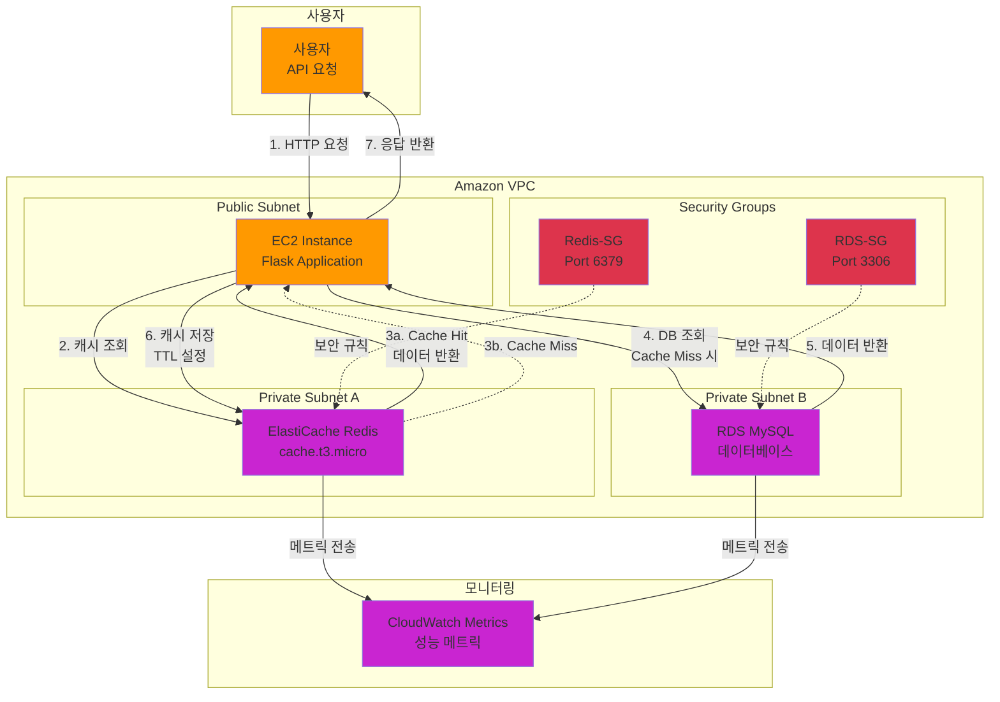

# Week 10-1: Amazon ElastiCache 기반 API 응답 캐싱 시스템 아키텍처

## 📊 전체 아키텍처 다이어그램



## 🔄 워크플로우 상세

### Phase 1: 캐시 조회 (Cache Lookup)

#### 1단계: 사용자 API 요청
```
사용자 → Flask 애플리케이션 (EC2)
```

**요청 예시**:
```bash
curl http://ec2-instance-ip:5000/user/1
```

**Flask 라우트**:
```python
@app.route('/user/<int:user_id>')
def get_user(user_id):
    cache_key = f"user:{user_id}"
    # 캐시 조회 시작
```

#### 2단계: Redis 캐시 조회
```
Flask → ElastiCache Redis → 캐시 키 검색
```

**캐시 조회 코드**:
```python
# Redis에서 데이터 조회
cached_data = redis_client.get(cache_key)

if cached_data:
    # Cache Hit - 캐시에서 데이터 반환
    return jsonify({
        'source': 'cache',
        'data': json.loads(cached_data),
        'response_time_ms': 2.15
    })
```

**Redis 명령어**:
```redis
GET user:1
```

**Cache Hit 시 응답**:
```json
{
  "source": "cache",
  "data": {
    "id": 1,
    "name": "김철수",
    "email": "kim@example.com",
    "age": 28,
    "city": "Seoul"
  },
  "response_time_ms": 2.15
}
```

**성능**:
- **응답 시간**: 1-5ms
- **네트워크 지연**: VPC 내부 통신 (< 1ms)
- **Redis 처리**: 메모리 조회 (< 1ms)


### Phase 2: 캐시 미스 및 데이터베이스 조회 (Cache Miss & DB Query)

#### 3단계: Cache Miss 감지
```
Redis → Flask: 캐시에 데이터 없음
```

**Cache Miss 조건**:
- 캐시 키가 존재하지 않음
- TTL 만료로 데이터 삭제됨
- 캐시가 비워짐 (FLUSHALL 명령어)

**Cache Miss 처리**:
```python
# cached_data가 None인 경우
if not cached_data:
    # Cache Miss - DB 조회 필요
    print(f"Cache Miss for key: {cache_key}")
```

#### 4단계: RDS MySQL 데이터베이스 조회
```
Flask → RDS MySQL → SQL 쿼리 실행
```

**데이터베이스 조회 코드**:
```python
# MySQL 연결
connection = pymysql.connect(
    host=os.getenv('DB_HOST'),
    user=os.getenv('DB_USER'),
    password=os.getenv('DB_PASSWORD'),
    database=os.getenv('DB_NAME')
)

# 사용자 조회
cursor = connection.cursor(pymysql.cursors.DictCursor)
cursor.execute("SELECT * FROM users WHERE id = %s", (user_id,))
user_data = cursor.fetchone()
```

**SQL 쿼리**:
```sql
SELECT * FROM users WHERE id = 1;
```

**데이터베이스 응답**:
```json
{
  "id": 1,
  "name": "김철수",
  "email": "kim@example.com",
  "age": 28,
  "city": "Seoul",
  "created_at": "2024-01-15 10:30:00"
}
```

**성능**:
- **응답 시간**: 30-100ms
- **네트워크 지연**: VPC 내부 통신 (1-5ms)
- **DB 쿼리 실행**: 인덱스 조회 (10-50ms)
- **데이터 전송**: 결과 반환 (5-20ms)

#### 5단계: 데이터베이스 결과 반환
```
RDS MySQL → Flask: 쿼리 결과 전송
```

**결과 처리**:
```python
if user_data:
    # 데이터 존재
    print(f"User found in database: {user_data['id']}")
else:
    # 데이터 없음
    return jsonify({'error': 'User not found'}), 404
```

### Phase 3: 캐시 저장 및 응답 (Cache Storage & Response)

#### 6단계: Redis에 데이터 저장
```
Flask → Redis: 캐시 저장 (TTL 설정)
```

**캐시 저장 코드**:
```python
# Redis에 데이터 저장 (TTL 1시간)
redis_client.setex(
    cache_key,           # 키: user:1
    3600,                # TTL: 3600초 (1시간)
    json.dumps(user_data, default=str)  # 값: JSON 문자열
)
```

**Redis 명령어**:
```redis
SETEX user:1 3600 '{"id":1,"name":"김철수","email":"kim@example.com","age":28,"city":"Seoul"}'
```

**TTL 확인**:
```redis
TTL user:1
# 출력: 3600 (초 단위 남은 시간)
```

**캐시 저장 전략**:
- **TTL 설정**: 데이터 특성에 따라 조정
  - 자주 변경되는 데이터: 짧은 TTL (5-15분)
  - 거의 변경되지 않는 데이터: 긴 TTL (1-24시간)
  - 정적 데이터: 매우 긴 TTL (1주일 이상)

**TTL 예시**:
```python
# 사용자 프로필: 1시간
redis_client.setex(f"user:{user_id}", 3600, data)

# 인기 상품: 5분
redis_client.setex(f"trending:products", 300, data)

# 설정 데이터: 24시간
redis_client.setex(f"config:settings", 86400, data)
```

#### 7단계: 사용자에게 응답 반환
```
Flask → 사용자: HTTP 응답
```

**응답 데이터**:
```json
{
  "source": "database",
  "data": {
    "id": 1,
    "name": "김철수",
    "email": "kim@example.com",
    "age": 28,
    "city": "Seoul"
  },
  "response_time_ms": 45.32
}
```

**응답 헤더**:
```http
HTTP/1.1 200 OK
Content-Type: application/json
X-Cache-Status: MISS
X-Response-Time: 45.32ms
```


**성능 비교**:
- **Cache Hit**: 1-5ms (매우 빠름)
- **Cache Miss + DB**: 30-100ms (느림)
- **성능 향상**: 약 10-50배

---

## 🏗️ 주요 구성 요소

### 1. EC2 Instance (Flask Application)

**역할**: API 서버 및 캐시 로직 처리

**주요 기능**:
- HTTP 요청 수신 및 처리
- Redis 캐시 조회 및 저장
- RDS MySQL 데이터베이스 쿼리
- JSON 응답 생성

**Flask 애플리케이션 구조**:
```python
from flask import Flask, jsonify
import redis
import pymysql
import os

app = Flask(__name__)

# Redis 연결
redis_client = redis.Redis(
    host=os.getenv('REDIS_HOST'),
    port=6379,
    decode_responses=True
)

# MySQL 연결 풀
db_config = {
    'host': os.getenv('DB_HOST'),
    'user': os.getenv('DB_USER'),
    'password': os.getenv('DB_PASSWORD'),
    'database': os.getenv('DB_NAME')
}

@app.route('/user/<int:user_id>')
def get_user(user_id):
    # Cache-Aside 패턴 구현
    cache_key = f"user:{user_id}"
    
    # 1. 캐시 조회
    cached_data = redis_client.get(cache_key)
    if cached_data:
        return jsonify({'source': 'cache', 'data': json.loads(cached_data)})
    
    # 2. DB 조회
    connection = pymysql.connect(**db_config)
    cursor = connection.cursor(pymysql.cursors.DictCursor)
    cursor.execute("SELECT * FROM users WHERE id = %s", (user_id,))
    user_data = cursor.fetchone()
    cursor.close()
    connection.close()
    
    if not user_data:
        return jsonify({'error': 'User not found'}), 404
    
    # 3. 캐시 저장
    redis_client.setex(cache_key, 3600, json.dumps(user_data, default=str))
    
    return jsonify({'source': 'database', 'data': user_data})
```

**환경 변수**:
```bash
REDIS_HOST=elasticache-endpoint.cache.amazonaws.com
DB_HOST=rds-endpoint.ap-northeast-2.rds.amazonaws.com
DB_USER=admin
DB_PASSWORD=secure-password
DB_NAME=labdb
```

**인스턴스 타입**: t2.micro (프리 티어)
**운영 체제**: Amazon Linux 2
**Python 버전**: 3.9+

### 2. ElastiCache Redis

**역할**: 인메모리 캐시 스토어

**주요 기능**:
- 빠른 데이터 조회 (메모리 기반)
- TTL 기반 자동 만료
- 키-값 저장소
- 원자적 연산 지원

**Redis 명령어**:
```redis
# 데이터 저장 (TTL 포함)
SETEX user:1 3600 '{"id":1,"name":"김철수"}'

# 데이터 조회
GET user:1

# TTL 확인
TTL user:1

# 데이터 삭제
DEL user:1

# 모든 키 조회 (개발용만)
KEYS user:*

# 캐시 통계
INFO stats
```

**노드 타입**: cache.t3.micro
**엔진 버전**: Redis 7.0
**포트**: 6379
**암호화**: 전송 중 암호화 (TLS)

**Redis 메트릭**:
- **CacheHits**: 캐시 적중 횟수
- **CacheMisses**: 캐시 미스 횟수
- **CPUUtilization**: CPU 사용률
- **NetworkBytesIn/Out**: 네트워크 트래픽
- **CurrConnections**: 현재 연결 수

### 3. RDS MySQL

**역할**: 영구 데이터 저장소

**주요 기능**:
- 사용자 데이터 영구 저장
- SQL 쿼리 처리
- 트랜잭션 지원
- 자동 백업

**데이터베이스 스키마**:
```sql
CREATE TABLE users (
    id INT PRIMARY KEY AUTO_INCREMENT,
    name VARCHAR(100) NOT NULL,
    email VARCHAR(255) UNIQUE NOT NULL,
    age INT,
    city VARCHAR(100),
    created_at TIMESTAMP DEFAULT CURRENT_TIMESTAMP,
    updated_at TIMESTAMP DEFAULT CURRENT_TIMESTAMP ON UPDATE CURRENT_TIMESTAMP,
    INDEX idx_email (email),
    INDEX idx_city (city)
);

-- 샘플 데이터
INSERT INTO users (name, email, age, city) VALUES
('김철수', 'kim@example.com', 28, 'Seoul'),
('이영희', 'lee@example.com', 32, 'Busan'),
('박민수', 'park@example.com', 25, 'Incheon');
```

**인스턴스 타입**: db.t3.micro
**엔진**: MySQL 8.0
**스토리지**: 20GB gp2
**백업 보존**: 7일

### 4. Security Groups

#### Redis-SG (Redis 보안 그룹)

**인바운드 규칙**:
```
Type: Custom TCP
Protocol: TCP
Port: 6379
Source: EC2-SG (EC2 보안 그룹)
Description: Allow Redis access from EC2
```

**아웃바운드 규칙**:
```
Type: All traffic
Protocol: All
Port: All
Destination: 0.0.0.0/0
```

#### RDS-SG (RDS 보안 그룹)

**인바운드 규칙**:
```
Type: MySQL/Aurora
Protocol: TCP
Port: 3306
Source: EC2-SG (EC2 보안 그룹)
Description: Allow MySQL access from EC2
```

**아웃바운드 규칙**:
```
Type: All traffic
Protocol: All
Port: All
Destination: 0.0.0.0/0
```

---

## 🎯 Cache-Aside 패턴의 핵심 장점

### 1. 성능 향상

**응답 시간 비교**:
```
캐시 적중 시:
- Redis 조회: 1-5ms
- 총 응답 시간: 1-5ms

캐시 미스 시:
- Redis 조회: 1-5ms (미스)
- DB 쿼리: 30-100ms
- Redis 저장: 1-5ms
- 총 응답 시간: 32-110ms

성능 향상: 약 10-50배
```

**실제 시나리오**:
- **캐시 적중률 80%**: 평균 응답 시간 = 0.8 × 3ms + 0.2 × 50ms = 12.4ms
- **캐시 없음**: 평균 응답 시간 = 50ms
- **개선율**: 약 4배 빠름

### 2. 데이터베이스 부하 감소

**DB 쿼리 감소**:
```
캐시 적중률 80% 가정:
- 초당 요청: 1000 req/s
- 캐시 적중: 800 req/s (Redis 처리)
- 캐시 미스: 200 req/s (DB 쿼리)

DB 부하 감소: 80%
```

**비용 절감**:
- DB 인스턴스 크기 축소 가능
- Read Replica 수 감소
- IOPS 비용 절감

### 3. 확장성 (Scalability)

**수평 확장**:
- Redis 클러스터 모드로 확장
- 여러 샤드로 데이터 분산
- 읽기 복제본 추가

**수직 확장**:
- 더 큰 노드 타입으로 업그레이드
- 메모리 증가로 더 많은 데이터 캐싱

### 4. 가용성 (Availability)

**캐시 장애 시**:
- 애플리케이션은 계속 동작 (DB로 폴백)
- 성능 저하는 있지만 서비스 중단 없음

**DB 장애 시**:
- 캐시된 데이터는 계속 제공 가능
- 새로운 데이터만 영향 받음

---

## 🔄 캐싱 전략 비교

### 1. Cache-Aside (Lazy Loading)

**특징**:
- 애플리케이션이 캐시 관리
- 요청 시에만 캐시에 로드
- 가장 일반적인 패턴

**장점**:
- 필요한 데이터만 캐싱 (메모리 효율적)
- 캐시 장애 시에도 서비스 가능
- 구현이 간단

**단점**:
- 첫 요청은 느림 (Cache Miss)
- 캐시 워밍업 필요
- 데이터 일관성 관리 필요

**사용 사례**:
- 읽기 중심 워크로드
- 자주 변경되지 않는 데이터
- 사용자 프로필, 상품 정보

### 2. Write-Through

**특징**:
- 데이터 쓰기 시 캐시와 DB 동시 업데이트
- 항상 최신 데이터 유지

**장점**:
- 데이터 일관성 보장
- 읽기 성능 우수

**단점**:
- 쓰기 성능 저하 (두 곳에 저장)
- 사용하지 않는 데이터도 캐싱
- 구현 복잡도 증가

**사용 사례**:
- 쓰기 후 즉시 읽기가 필요한 경우
- 데이터 일관성이 중요한 경우
- 금융 거래, 재고 관리

### 3. Write-Behind (Write-Back)

**특징**:
- 캐시에만 먼저 쓰고 나중에 DB 동기화
- 비동기 쓰기

**장점**:
- 쓰기 성능 매우 우수
- DB 부하 최소화
- 배치 처리 가능

**단점**:
- 데이터 손실 위험 (캐시 장애 시)
- 구현 복잡도 매우 높음
- 데이터 일관성 관리 어려움

**사용 사례**:
- 쓰기 집약적 워크로드
- 로그 수집, 분석 데이터
- 일시적 데이터 손실 허용 가능한 경우

### 전략 비교표

| 특성 | Cache-Aside | Write-Through | Write-Behind |
|------|-------------|---------------|--------------|
| **읽기 성능** | 우수 | 매우 우수 | 우수 |
| **쓰기 성능** | 우수 | 보통 | 매우 우수 |
| **데이터 일관성** | 보통 | 우수 | 낮음 |
| **구현 복잡도** | 낮음 | 보통 | 높음 |
| **메모리 효율** | 우수 | 보통 | 보통 |
| **장애 복구** | 쉬움 | 보통 | 어려움 |
| **사용 빈도** | 매우 높음 | 보통 | 낮음 |

---

## 💰 비용 최적화

### 시나리오 1: 소규모 애플리케이션

**구성**:
- EC2: t2.micro (프리 티어)
- ElastiCache: cache.t3.micro (1개 노드)
- RDS: db.t3.micro (Single-AZ)

**월간 비용 (ap-northeast-2)**:
```
EC2 t2.micro: $0 (프리 티어 12개월)
ElastiCache cache.t3.micro: $12.41
  - 시간당: $0.017
  - 월간: $0.017 × 730시간 = $12.41

RDS db.t3.micro: $14.60
  - 시간당: $0.020
  - 월간: $0.020 × 730시간 = $14.60

총 비용: $27.01/월
```

**비용 절감 팁**:
- 프리 티어 최대 활용
- Reserved Instances 구매 (1년 약정 시 40% 절감)
- 개발/테스트 환경은 필요 시에만 실행

### 시나리오 2: 중규모 프로덕션

**구성**:
- EC2: t3.medium (2개, Auto Scaling)
- ElastiCache: cache.r6g.large (2개 노드, 복제)
- RDS: db.r6g.large (Multi-AZ)

**월간 비용 (ap-northeast-2)**:
```
EC2 t3.medium × 2: $60.74
  - 시간당: $0.0416 × 2 = $0.0832
  - 월간: $0.0832 × 730시간 = $60.74

ElastiCache cache.r6g.large × 2: $292.00
  - 시간당: $0.200 × 2 = $0.400
  - 월간: $0.400 × 730시간 = $292.00

RDS db.r6g.large (Multi-AZ): $584.00
  - 시간당: $0.400 (Multi-AZ)
  - 월간: $0.400 × 730시간 = $292.00 × 2 = $584.00

총 비용: $936.74/월
```

**ROI 분석**:
- 캐시 적중률 80% 가정
- DB 인스턴스 크기 50% 축소 가능
- 절감액: $292/월
- 실제 비용: $644.74/월

### 시나리오 3: 대규모 엔터프라이즈

**구성**:
- EC2: c5.2xlarge (10개, Auto Scaling)
- ElastiCache: cache.r6g.4xlarge (클러스터 모드, 6개 샤드)
- RDS: db.r6g.4xlarge (Multi-AZ, Read Replica 2개)

**월간 비용 (ap-northeast-2)**:
```
EC2 c5.2xlarge × 10: $1,241.00
ElastiCache 클러스터: $5,256.00
RDS 클러스터: $8,760.00

총 비용: $15,257/월
```

**비용 최적화 전략**:
- Savings Plans 적용 (30% 절감)
- 스팟 인스턴스 활용 (EC2 70% 절감)
- 캐시 적중률 90% 달성 시 DB 비용 50% 절감
- 최적화 후 비용: $9,500/월 (38% 절감)

---

## 🔐 보안 및 권한

### IAM 정책

#### EC2 인스턴스 역할 정책

```json
{
  "Version": "2012-10-17",
  "Statement": [
    {
      "Effect": "Allow",
      "Action": [
        "elasticache:DescribeCacheClusters",
        "elasticache:DescribeReplicationGroups"
      ],
      "Resource": "*"
    },
    {
      "Effect": "Allow",
      "Action": [
        "rds:DescribeDBInstances",
        "rds:DescribeDBClusters"
      ],
      "Resource": "*"
    },
    {
      "Effect": "Allow",
      "Action": [
        "cloudwatch:PutMetricData"
      ],
      "Resource": "*"
    }
  ]
}
```

### 보안 그룹 규칙

#### Redis 보안 그룹 (Redis-SG)

**인바운드 규칙**:
```
Rule 1:
  Type: Custom TCP
  Protocol: TCP
  Port: 6379
  Source: sg-xxxxx (EC2-SG)
  Description: Allow Redis access from EC2 instances
```

**아웃바운드 규칙**:
```
Rule 1:
  Type: All traffic
  Protocol: All
  Port: All
  Destination: 0.0.0.0/0
  Description: Allow all outbound traffic
```

#### RDS 보안 그룹 (RDS-SG)

**인바운드 규칙**:
```
Rule 1:
  Type: MySQL/Aurora
  Protocol: TCP
  Port: 3306
  Source: sg-xxxxx (EC2-SG)
  Description: Allow MySQL access from EC2 instances
```

### 네트워크 보안

#### VPC 구성

```
VPC CIDR: 10.0.0.0/16

서브넷 구성:
- Public Subnet: 10.0.1.0/24 (EC2)
- Private Subnet A: 10.0.2.0/24 (ElastiCache)
- Private Subnet B: 10.0.3.0/24 (RDS)
```

#### 라우팅 테이블

**Public Subnet 라우팅**:
```
Destination: 0.0.0.0/0
Target: igw-xxxxx (Internet Gateway)
```

**Private Subnet 라우팅**:
```
Destination: 0.0.0.0/0
Target: nat-xxxxx (NAT Gateway)
```

### 암호화

#### 전송 중 암호화 (In-Transit)

**ElastiCache Redis**:
```
TransitEncryptionEnabled: true
AuthToken: "secure-redis-password-min-16-chars"
```

**RDS MySQL**:
```
require_secure_transport = ON
```

#### 저장 시 암호화 (At-Rest)

**ElastiCache Redis**:
```
AtRestEncryptionEnabled: true
KmsKeyId: "arn:aws:kms:ap-northeast-2:123456789012:key/xxxxx"
```

**RDS MySQL**:
```
StorageEncrypted: true
KmsKeyId: "arn:aws:kms:ap-northeast-2:123456789012:key/xxxxx"
```

---

## 🔧 문제 해결

### 문제 1: 캐시 연결 실패

**증상**:
```python
redis.exceptions.ConnectionError: Error connecting to Redis
```

**원인**:
- 보안 그룹 규칙 누락
- 잘못된 엔드포인트 주소
- 네트워크 연결 문제

**해결 방법**:
1. 보안 그룹 확인:
```bash
aws ec2 describe-security-groups --group-ids sg-xxxxx
```

2. 엔드포인트 확인:
```bash
aws elasticache describe-cache-clusters \
  --cache-cluster-id my-redis-cluster \
  --show-cache-node-info
```

3. 연결 테스트:
```bash
# EC2에서 Redis 포트 테스트
telnet redis-endpoint.cache.amazonaws.com 6379
```

4. Python 연결 코드 수정:
```python
redis_client = redis.Redis(
    host='correct-endpoint.cache.amazonaws.com',
    port=6379,
    socket_connect_timeout=5,
    socket_timeout=5,
    retry_on_timeout=True
)
```

### 문제 2: 캐시 적중률 낮음

**증상**:
- CacheHitRate < 50%
- 응답 시간 개선 미미

**원인**:
- TTL 설정이 너무 짧음
- 캐시 키 설계 문제
- 메모리 부족으로 자주 삭제됨

**해결 방법**:
1. TTL 조정:
```python
# 너무 짧음 (5분)
redis_client.setex(key, 300, value)

# 적절함 (1시간)
redis_client.setex(key, 3600, value)
```

2. 캐시 메트릭 확인:
```bash
aws cloudwatch get-metric-statistics \
  --namespace AWS/ElastiCache \
  --metric-name CacheHitRate \
  --dimensions Name=CacheClusterId,Value=my-redis \
  --start-time 2024-01-01T00:00:00Z \
  --end-time 2024-01-02T00:00:00Z \
  --period 3600 \
  --statistics Average
```

3. 메모리 사용량 확인:
```redis
INFO memory
```

### 문제 3: 데이터 일관성 문제

**증상**:
- 캐시와 DB 데이터 불일치
- 오래된 데이터 반환

**원인**:
- 데이터 업데이트 시 캐시 무효화 누락
- TTL 설정이 너무 김

**해결 방법**:
1. 업데이트 시 캐시 무효화:
```python
def update_user(user_id, data):
    # 1. DB 업데이트
    cursor.execute("UPDATE users SET name=%s WHERE id=%s", (data['name'], user_id))
    connection.commit()
    
    # 2. 캐시 삭제 (중요!)
    cache_key = f"user:{user_id}"
    redis_client.delete(cache_key)
    
    return True
```

2. 캐시 무효화 패턴:
```python
# 패턴 1: 삭제 (권장)
redis_client.delete(cache_key)

# 패턴 2: 즉시 업데이트
redis_client.setex(cache_key, 3600, json.dumps(new_data))

# 패턴 3: TTL 단축
redis_client.expire(cache_key, 60)  # 1분 후 만료
```

### 문제 4: 메모리 부족

**증상**:
```
OOM command not allowed when used memory > 'maxmemory'
```

**원인**:
- 캐시 메모리 초과
- 삭제 정책 미설정

**해결 방법**:
1. 삭제 정책 설정:
```bash
# Redis 설정
maxmemory-policy allkeys-lru
```

2. 메모리 모니터링:
```python
info = redis_client.info('memory')
print(f"Used memory: {info['used_memory_human']}")
print(f"Max memory: {info['maxmemory_human']}")
```

3. 노드 타입 업그레이드:
```bash
aws elasticache modify-cache-cluster \
  --cache-cluster-id my-redis \
  --cache-node-type cache.r6g.large
```

### 문제 5: 성능 저하

**증상**:
- 응답 시간 증가
- CPU 사용률 높음

**원인**:
- 복잡한 Redis 명령어 사용
- 대량의 키 스캔
- 네트워크 지연

**해결 방법**:
1. 효율적인 명령어 사용:
```python
# ❌ 비효율적 - KEYS 명령어 (프로덕션 금지)
keys = redis_client.keys('user:*')

# ✅ 효율적 - SCAN 명령어
cursor = 0
while True:
    cursor, keys = redis_client.scan(cursor, match='user:*', count=100)
    # 키 처리
    if cursor == 0:
        break
```

2. 파이프라인 사용:
```python
# ❌ 비효율적 - 개별 요청
for user_id in user_ids:
    redis_client.get(f"user:{user_id}")

# ✅ 효율적 - 파이프라인
pipe = redis_client.pipeline()
for user_id in user_ids:
    pipe.get(f"user:{user_id}")
results = pipe.execute()
```

3. 연결 풀 사용:
```python
# 연결 풀 설정
pool = redis.ConnectionPool(
    host='redis-endpoint',
    port=6379,
    max_connections=50,
    decode_responses=True
)
redis_client = redis.Redis(connection_pool=pool)
```

---

## 🚀 프로덕션 개선 사항

### 1. 고가용성 (High Availability)

**Multi-AZ 복제**:
```bash
aws elasticache create-replication-group \
  --replication-group-id my-redis-cluster \
  --replication-group-description "Production Redis Cluster" \
  --engine redis \
  --cache-node-type cache.r6g.large \
  --num-cache-clusters 2 \
  --automatic-failover-enabled \
  --multi-az-enabled
```

**장점**:
- 자동 페일오버 (30-60초)
- 읽기 복제본으로 읽기 성능 향상
- 데이터 내구성 보장

### 2. 모니터링 및 알림

**CloudWatch 알람 설정**:
```python
import boto3

cloudwatch = boto3.client('cloudwatch')

# CPU 사용률 알람
cloudwatch.put_metric_alarm(
    AlarmName='Redis-High-CPU',
    ComparisonOperator='GreaterThanThreshold',
    EvaluationPeriods=2,
    MetricName='CPUUtilization',
    Namespace='AWS/ElastiCache',
    Period=300,
    Statistic='Average',
    Threshold=75.0,
    ActionsEnabled=True,
    AlarmActions=['arn:aws:sns:ap-northeast-2:123456789012:alerts'],
    Dimensions=[
        {'Name': 'CacheClusterId', 'Value': 'my-redis-cluster'}
    ]
)

# 캐시 적중률 알람
cloudwatch.put_metric_alarm(
    AlarmName='Redis-Low-Hit-Rate',
    ComparisonOperator='LessThanThreshold',
    EvaluationPeriods=3,
    MetricName='CacheHitRate',
    Namespace='AWS/ElastiCache',
    Period=300,
    Statistic='Average',
    Threshold=70.0,
    ActionsEnabled=True,
    AlarmActions=['arn:aws:sns:ap-northeast-2:123456789012:alerts']
)
```

**커스텀 메트릭**:
```python
def publish_cache_metrics(cache_hits, cache_misses):
    cloudwatch = boto3.client('cloudwatch')
    
    cloudwatch.put_metric_data(
        Namespace='CustomApp/Cache',
        MetricData=[
            {
                'MetricName': 'CacheHits',
                'Value': cache_hits,
                'Unit': 'Count'
            },
            {
                'MetricName': 'CacheMisses',
                'Value': cache_misses,
                'Unit': 'Count'
            }
        ]
    )
```

### 3. 성능 최적화

**연결 풀 최적화**:
```python
# 최적화된 연결 풀 설정
pool = redis.ConnectionPool(
    host=os.getenv('REDIS_HOST'),
    port=6379,
    max_connections=50,          # 최대 연결 수
    socket_keepalive=True,       # Keep-alive 활성화
    socket_keepalive_options={
        socket.TCP_KEEPIDLE: 60,
        socket.TCP_KEEPINTVL: 10,
        socket.TCP_KEEPCNT: 3
    },
    health_check_interval=30,    # 헬스 체크 간격
    decode_responses=True
)
```

**배치 처리**:
```python
def get_users_batch(user_ids):
    """여러 사용자를 한 번에 조회"""
    pipe = redis_client.pipeline()
    
    # 1. 캐시에서 조회
    for user_id in user_ids:
        pipe.get(f"user:{user_id}")
    
    cached_results = pipe.execute()
    
    # 2. 캐시 미스 처리
    missing_ids = [
        user_id for user_id, result in zip(user_ids, cached_results)
        if result is None
    ]
    
    if missing_ids:
        # DB에서 조회
        placeholders = ','.join(['%s'] * len(missing_ids))
        query = f"SELECT * FROM users WHERE id IN ({placeholders})"
        cursor.execute(query, missing_ids)
        db_results = cursor.fetchall()
        
        # 캐시에 저장
        pipe = redis_client.pipeline()
        for user in db_results:
            pipe.setex(f"user:{user['id']}", 3600, json.dumps(user, default=str))
        pipe.execute()
    
    return cached_results
```

### 4. 캐시 워밍업

**애플리케이션 시작 시 캐시 사전 로드**:
```python
def warm_up_cache():
    """자주 사용되는 데이터를 미리 캐시에 로드"""
    print("Starting cache warm-up...")
    
    # 인기 사용자 데이터 로드
    cursor.execute("SELECT * FROM users ORDER BY login_count DESC LIMIT 1000")
    popular_users = cursor.fetchall()
    
    pipe = redis_client.pipeline()
    for user in popular_users:
        cache_key = f"user:{user['id']}"
        pipe.setex(cache_key, 3600, json.dumps(user, default=str))
    
    pipe.execute()
    print(f"Cache warm-up completed: {len(popular_users)} users loaded")

# 애플리케이션 시작 시 실행
if __name__ == '__main__':
    warm_up_cache()
    app.run()
```

### 5. 클러스터 모드 (확장성)

**Redis 클러스터 구성**:
```bash
aws elasticache create-replication-group \
  --replication-group-id my-redis-cluster \
  --replication-group-description "Redis Cluster Mode" \
  --engine redis \
  --cache-node-type cache.r6g.large \
  --num-node-groups 3 \
  --replicas-per-node-group 1 \
  --cache-parameter-group-name default.redis7.cluster.on \
  --automatic-failover-enabled
```

**클러스터 모드 클라이언트**:
```python
from rediscluster import RedisCluster

startup_nodes = [
    {"host": "cluster-endpoint-1", "port": "6379"},
    {"host": "cluster-endpoint-2", "port": "6379"},
    {"host": "cluster-endpoint-3", "port": "6379"}
]

redis_client = RedisCluster(
    startup_nodes=startup_nodes,
    decode_responses=True,
    skip_full_coverage_check=True
)
```

---

## 📚 참고 자료

### AWS 공식 문서

1. **Amazon ElastiCache for Redis**
   - [ElastiCache 사용 설명서](https://docs.aws.amazon.com/elasticache/latest/red-ug/)
   - [Redis 모범 사례](https://docs.aws.amazon.com/elasticache/latest/red-ug/BestPractices.html)
   - [성능 최적화](https://docs.aws.amazon.com/elasticache/latest/red-ug/CacheMetrics.html)

2. **Amazon RDS for MySQL**
   - [RDS 사용 설명서](https://docs.aws.amazon.com/rds/latest/userguide/)
   - [성능 인사이트](https://docs.aws.amazon.com/rds/latest/userguide/USER_PerfInsights.html)

3. **VPC 및 네트워킹**
   - [VPC 사용 설명서](https://docs.aws.amazon.com/vpc/latest/userguide/)
   - [보안 그룹](https://docs.aws.amazon.com/vpc/latest/userguide/VPC_SecurityGroups.html)

### Redis 공식 문서

1. **Redis 명령어**
   - [Redis Commands](https://redis.io/commands/)
   - [Data Types](https://redis.io/docs/data-types/)
   - [Pipelining](https://redis.io/docs/manual/pipelining/)

2. **Redis 모범 사례**
   - [Memory Optimization](https://redis.io/docs/manual/optimization/memory-optimization/)
   - [Persistence](https://redis.io/docs/manual/persistence/)

### Python Redis 클라이언트

1. **redis-py**
   - [GitHub Repository](https://github.com/redis/redis-py)
   - [Documentation](https://redis-py.readthedocs.io/)
   - [Connection Pooling](https://redis-py.readthedocs.io/en/stable/connections.html)

2. **redis-py-cluster**
   - [GitHub Repository](https://github.com/Grokzen/redis-py-cluster)
   - [Cluster Mode Guide](https://redis-py-cluster.readthedocs.io/)

### 캐싱 패턴 및 전략

1. **Cache-Aside Pattern**
   - [Microsoft Azure - Cache-Aside](https://docs.microsoft.com/en-us/azure/architecture/patterns/cache-aside)
   - [AWS Caching Best Practices](https://aws.amazon.com/caching/best-practices/)

2. **캐싱 전략 비교**
   - [Caching Strategies](https://codeahoy.com/2017/08/11/caching-strategies-and-how-to-choose-the-right-one/)
   - [Redis Caching Patterns](https://redis.com/redis-best-practices/caching-patterns/)

---

## 🎓 학습 경로

### 초급 (Beginner)

**학습 목표**:
- ElastiCache 기본 개념 이해
- Cache-Aside 패턴 구현
- 기본 Redis 명령어 사용

**학습 순서**:
1. Redis 기본 개념 및 데이터 타입
2. ElastiCache 클러스터 생성
3. Python에서 Redis 연결
4. 간단한 캐싱 구현
5. TTL 설정 및 관리

**실습 프로젝트**:
- 사용자 프로필 캐싱 API
- 상품 정보 캐싱 시스템
- 세션 관리 구현

### 중급 (Intermediate)

**학습 목표**:
- 캐싱 전략 비교 및 선택
- 성능 최적화 기법
- 모니터링 및 문제 해결

**학습 순서**:
1. Write-Through, Write-Behind 패턴
2. 캐시 무효화 전략
3. 연결 풀 및 파이프라인
4. CloudWatch 메트릭 분석
5. 캐시 적중률 최적화

**실습 프로젝트**:
- 다중 캐싱 전략 비교 시스템
- 실시간 분석 대시보드
- 캐시 워밍업 자동화

### 고급 (Advanced)

**학습 목표**:
- 클러스터 모드 구성
- 고가용성 아키텍처 설계
- 대규모 시스템 최적화

**학습 순서**:
1. Redis 클러스터 모드
2. Multi-AZ 복제 및 페일오버
3. 샤딩 전략
4. 보안 강화 (암호화, 인증)
5. 대규모 트래픽 처리

**실습 프로젝트**:
- 글로벌 캐싱 시스템
- 실시간 리더보드
- 분산 세션 관리

---

## 📖 용어 정리

### 캐싱 관련 용어

**Cache Hit (캐시 적중)**:
- 요청한 데이터가 캐시에 존재하는 경우
- 빠른 응답 시간 (1-5ms)

**Cache Miss (캐시 미스)**:
- 요청한 데이터가 캐시에 없는 경우
- DB 조회 필요 (30-100ms)

**Cache Hit Rate (캐시 적중률)**:
- 전체 요청 중 캐시 적중 비율
- 계산식: (Cache Hits / Total Requests) × 100%
- 목표: 80% 이상

**TTL (Time To Live)**:
- 캐시 데이터의 유효 시간
- 초 단위로 설정
- 만료 시 자동 삭제

**Cache Eviction (캐시 삭제)**:
- 메모리 부족 시 오래된 데이터 삭제
- 정책: LRU, LFU, Random 등

**Cache Warming (캐시 워밍업)**:
- 애플리케이션 시작 시 자주 사용되는 데이터를 미리 캐시에 로드
- Cold Start 문제 해결

### Redis 관련 용어

**In-Memory Database**:
- 데이터를 메모리(RAM)에 저장하는 데이터베이스
- 디스크 기반보다 훨씬 빠름

**Key-Value Store**:
- 키와 값의 쌍으로 데이터 저장
- 간단하고 빠른 조회

**Replication (복제)**:
- Primary 노드의 데이터를 Replica 노드로 복사
- 읽기 성능 향상 및 고가용성

**Sharding (샤딩)**:
- 데이터를 여러 노드에 분산 저장
- 수평 확장 가능

**Cluster Mode (클러스터 모드)**:
- 여러 노드를 하나의 클러스터로 구성
- 자동 샤딩 및 페일오버

### AWS 관련 용어

**ElastiCache Node (노드)**:
- Redis 인스턴스가 실행되는 컴퓨팅 리소스
- 노드 타입으로 성능 결정

**Replication Group (복제 그룹)**:
- Primary와 Replica 노드의 집합
- 자동 페일오버 지원

**Parameter Group (파라미터 그룹)**:
- Redis 설정 값의 집합
- maxmemory-policy, timeout 등 설정

**Subnet Group (서브넷 그룹)**:
- ElastiCache 클러스터가 배치될 서브넷 집합
- Multi-AZ 구성 시 필요

---

## 📝 버전 히스토리

### Version 1.0.0 (2024-02-07)
- 초기 아키텍처 다이어그램 생성
- Cache-Aside 패턴 상세 설명
- 워크플로우 3단계 문서화
- 주요 구성 요소 설명 추가
- 보안 및 권한 섹션 작성
- 문제 해결 가이드 (5가지 문제)
- 프로덕션 개선 사항 (5가지)
- 비용 최적화 시나리오 (3가지)
- 참고 자료 및 학습 경로 추가
- 용어 정리 섹션 완성

---

**문서 작성**: 2024-02-07  
**마지막 업데이트**: 2024-02-07  
**작성자**: AWS Lab Guide Team  
**버전**: 1.0.0
