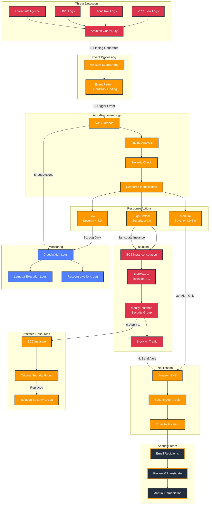

# Week 12-3: GuardDuty + Lambda 자동 대응 아키텍처

## 전체 보안 자동화 아키텍처



## 상세 워크플로우

### 1단계: 위협 탐지 (GuardDuty)
GuardDuty가 다양한 데이터 소스를 지속적으로 분석하여 위협을 탐지합니다.

**데이터 소스**:
- **VPC Flow Logs**: 네트워크 트래픽 패턴 분석
  - 비정상적인 포트 스캔
  - 알려진 악성 IP와의 통신
  - 대량 데이터 전송 패턴
  
- **CloudTrail Event Logs**: API 호출 및 관리 활동 분석
  - 비정상적인 API 호출 패턴
  - 권한 상승 시도
  - 리소스 무단 변경
  
- **DNS Logs**: DNS 쿼리 패턴 분석
  - 알려진 악성 도메인 조회
  - DGA (Domain Generation Algorithm) 패턴
  - DNS 터널링 시도
  
- **Threat Intelligence**: AWS 및 파트너 위협 인텔리전스
  - CrowdStrike 피드
  - Proofpoint 피드
  - AWS Security 자체 인텔리전스

**Finding 생성**:
- 위협이 탐지되면 Finding 생성
- 심각도 점수 할당 (0.1-10.0)
- Finding 타입 분류 (예: Recon:EC2/PortProbeUnprotectedPort)

### 2단계: 이벤트 라우팅 (EventBridge)
GuardDuty Finding이 생성되면 EventBridge가 이벤트를 감지하고 Lambda로 전달합니다.

**Event Pattern**:
```json
{
  "source": ["aws.guardduty"],
  "detail-type": ["GuardDuty Finding"]
}
```

**이벤트 구조**:
- `detail.id`: Finding 고유 ID
- `detail.type`: Finding 타입
- `detail.severity`: 심각도 점수
- `detail.resource`: 영향받는 리소스 정보
- `detail.service`: 추가 서비스 정보

### 3단계: 자동 대응 로직 (Lambda)
Lambda 함수가 Finding을 분석하고 심각도에 따라 자동 대응을 수행합니다.

**Finding 분석**:
```python
# Finding 정보 추출
finding_type = detail['type']
severity = detail['severity']
instance_id = detail['resource']['instanceDetails']['instanceId']
```

**심각도 체크**:
```python
if severity >= 7.0:      # High/Critical
    isolate_instance(instance_id)
elif severity >= 4.0:    # Medium
    send_alert_only()
else:                    # Low
    log_for_monitoring()
```

**리소스 식별**:
- EC2 인스턴스 ID 추출
- VPC ID 확인
- 현재 보안 그룹 조회

### 4단계: 대응 조치 실행

#### 4a. High/Critical Finding (심각도 ≥ 7.0)
**즉각적인 격리 조치**:

1. **격리 보안 그룹 확인/생성**:
```python
# 기존 격리 SG 확인
isolation_sg = get_isolation_sg(vpc_id)

# 없으면 생성
if not isolation_sg:
    isolation_sg = create_isolation_sg(vpc_id)
    # 모든 egress 규칙 제거 (완전 격리)
    revoke_all_egress_rules(isolation_sg)
```

2. **인스턴스 보안 그룹 교체**:
```python
ec2.modify_instance_attribute(
    InstanceId=instance_id,
    Groups=[isolation_sg_id]
)
```

3. **격리 효과**:
- ✅ 모든 인바운드 트래픽 차단
- ✅ 모든 아웃바운드 트래픽 차단
- ✅ 추가 피해 확산 방지
- ✅ 포렌식 분석을 위한 상태 보존

#### 4b. Medium Finding (심각도 4.0-6.9)
**알림만 전송**:
- 자동 격리 없음
- SNS 알림 전송
- 수동 검토 권장
- CloudWatch Logs 기록

#### 4c. Low Finding (심각도 < 4.0)
**로그 기록만**:
- 알림 없음
- CloudWatch Logs에만 기록
- 정기 검토 시 확인

### 5단계: 알림 전송 (SNS)
모든 Finding에 대해 구조화된 알림을 SNS로 전송합니다.

**알림 메시지 구조**:
```
🚨 GuardDuty Security Alert

━━━━━━━━━━━━━━━━━━━━━━━━━━━━━━━━━━
Finding Type: Recon:EC2/PortProbeUnprotectedPort
Severity: HIGH (8.0)
Title: Unprotected port on EC2 instance is being probed
━━━━━━━━━━━━━━━━━━━━━━━━━━━━━━━━━━

Description:
EC2 instance has an unprotected port that is being probed
by a known malicious host.

Affected Resource:
Instance ID: i-0123456789abcdef0

Auto-Response Action:
Instance i-0123456789abcdef0 isolated with security group sg-xxx

Timestamp: 2024-02-07T10:30:00Z
━━━━━━━━━━━━━━━━━━━━━━━━━━━━━━━━━━
```

**이메일 제목**:
- `[CRITICAL] GuardDuty Alert: ...`
- `[HIGH] GuardDuty Alert: ...`
- `[MEDIUM] GuardDuty Alert: ...`
- `[LOW] GuardDuty Alert: ...`

### 6단계: 모니터링 및 로깅 (CloudWatch)
모든 대응 조치를 CloudWatch Logs에 기록합니다.

**로그 정보**:
- Lambda 함수 실행 로그
- Finding 상세 정보
- 수행된 대응 조치
- 성공/실패 여부
- 에러 메시지 (실패 시)

**로그 예시**:
```
Received event: {"version":"0","id":"...","detail-type":"GuardDuty Finding",...}
Processing Finding: Recon:EC2/PortProbeUnprotectedPort
Severity: 8.0
Instance ID: i-0123456789abcdef0
Created isolation security group: sg-0abc123def456789
Instance i-0123456789abcdef0 isolated with security group sg-0abc123def456789
Notification sent to SNS topic: arn:aws:sns:ap-northeast-2:123456789012:GuardDuty-Security-Alerts
```

## 주요 컴포넌트 설명

### Amazon GuardDuty
- **역할**: 지능형 위협 탐지 서비스
- **기능**:
  - 머신러닝 기반 이상 탐지
  - 위협 인텔리전스 통합
  - 지속적인 모니터링 (24/7)
  - 다양한 데이터 소스 분석
- **Finding 타입**:
  - Backdoor (백도어)
  - Behavior (비정상 행동)
  - CryptoCurrency (암호화폐 채굴)
  - Pentest (침투 테스트)
  - Recon (정찰)
  - Stealth (은폐)
  - Trojan (트로이 목마)
  - UnauthorizedAccess (무단 접근)

### Amazon EventBridge
- **역할**: 이벤트 기반 아키텍처의 중심
- **기능**:
  - GuardDuty Finding 실시간 감지
  - 이벤트 필터링 및 라우팅
  - Lambda 함수 자동 트리거
  - 이벤트 변환 및 강화

### AWS Lambda
- **역할**: 자동 대응 로직 실행
- **주요 함수**:
  - `lambda_handler()`: 메인 핸들러
  - `isolate_instance()`: 인스턴스 격리
  - `get_or_create_isolation_sg()`: 격리 SG 관리
  - `send_notification()`: SNS 알림 전송
  - `get_severity_label()`: 심각도 레이블 변환
- **환경 변수**:
  - `SNS_TOPIC_ARN`: SNS 토픽 ARN
  - `ISOLATION_SG_NAME`: 격리 보안 그룹 이름

### 격리 보안 그룹 (Isolation Security Group)
- **역할**: 위협 인스턴스 완전 격리
- **특징**:
  - VPC별로 자동 생성
  - 모든 인바운드 규칙 없음
  - 모든 아웃바운드 규칙 제거
  - 재사용 가능
- **명명 규칙**: `GuardDuty-Isolation-SG`

### Amazon SNS
- **역할**: 보안 알림 전송
- **구독 프로토콜**:
  - Email (이메일)
  - SMS (문자 메시지)
  - HTTPS (웹훅)
  - Lambda (추가 처리)
  - SQS (큐잉)

### CloudWatch Logs
- **역할**: 모든 활동 기록 및 감사
- **로그 그룹**:
  - `/aws/lambda/GuardDuty-AutoResponse`
- **보존 기간**: 기본 무제한 (설정 가능)

## 보안 및 권한

### IAM 역할: GuardDuty-Lambda-AutoResponse-Role

**신뢰 정책**:
```json
{
  "Version": "2012-10-17",
  "Statement": [{
    "Effect": "Allow",
    "Principal": {
      "Service": "lambda.amazonaws.com"
    },
    "Action": "sts:AssumeRole"
  }]
}
```

**권한 정책**:

1. **AWSLambdaBasicExecutionRole** (관리형 정책):
   - CloudWatch Logs 쓰기 권한

2. **GuardDuty-AutoResponse-Policy** (인라인 정책):
```json
{
  "Version": "2012-10-17",
  "Statement": [
    {
      "Effect": "Allow",
      "Action": [
        "ec2:DescribeInstances",
        "ec2:DescribeSecurityGroups",
        "ec2:ModifyInstanceAttribute",
        "ec2:CreateSecurityGroup",
        "ec2:AuthorizeSecurityGroupIngress",
        "ec2:AuthorizeSecurityGroupEgress",
        "ec2:RevokeSecurityGroupEgress"
      ],
      "Resource": "*"
    },
    {
      "Effect": "Allow",
      "Action": ["sns:Publish"],
      "Resource": "arn:aws:sns:*:*:GuardDuty-Security-Alerts"
    },
    {
      "Effect": "Allow",
      "Action": [
        "guardduty:GetFindings",
        "guardduty:ListFindings"
      ],
      "Resource": "*"
    }
  ]
}
```

### 최소 권한 원칙 적용

**프로덕션 환경 개선**:
```json
{
  "Effect": "Allow",
  "Action": ["ec2:ModifyInstanceAttribute"],
  "Resource": "arn:aws:ec2:*:*:instance/*",
  "Condition": {
    "StringEquals": {
      "ec2:ResourceTag/Environment": "Production"
    }
  }
}
```

## 대응 시나리오 예시

### 시나리오 1: 포트 스캔 탐지 (High)

**Finding**:
- Type: `Recon:EC2/PortProbeUnprotectedPort`
- Severity: 8.0 (High)
- Description: 알려진 악성 IP에서 포트 스캔 시도

**자동 대응**:
1. ✅ 인스턴스 즉시 격리
2. ✅ 모든 네트워크 트래픽 차단
3. ✅ SNS 알림 전송
4. ✅ CloudWatch Logs 기록

**보안 팀 조치**:
- Finding 상세 분석
- 인스턴스 로그 검토
- 포렌식 분석 수행
- 필요시 인스턴스 종료 및 재생성

### 시나리오 2: 비정상 API 호출 (Medium)

**Finding**:
- Type: `Behavior:IAM/AnomalousAPICall`
- Severity: 5.0 (Medium)
- Description: 비정상적인 시간대의 API 호출

**자동 대응**:
1. ✅ SNS 알림만 전송
2. ✅ CloudWatch Logs 기록
3. ❌ 자동 격리 없음

**보안 팀 조치**:
- CloudTrail 로그 분석
- 사용자 활동 검토
- 필요시 IAM 권한 조정

### 시나리오 3: 암호화폐 채굴 탐지 (Critical)

**Finding**:
- Type: `CryptoCurrency:EC2/BitcoinTool.B!DNS`
- Severity: 9.5 (Critical)
- Description: 암호화폐 채굴 도구 사용 탐지

**자동 대응**:
1. ✅ 인스턴스 즉시 격리
2. ✅ 모든 네트워크 트래픽 차단
3. ✅ 긴급 SNS 알림 전송
4. ✅ CloudWatch Logs 기록

**보안 팀 조치**:
- 인스턴스 즉시 중지
- 스냅샷 생성 (포렌식)
- 인스턴스 종료
- 보안 감사 수행

## 프로덕션 환경 개선사항

### 1. 다단계 대응 워크플로우
```
GuardDuty Finding
    ↓
Step Functions
    ↓
1. Finding 분석
2. 승인 요청 (오탐 방지)
3. 자동 대응 실행
4. 검증 및 롤백 (필요시)
5. 보고서 생성
```

### 2. 대응 이력 관리
```python
# DynamoDB에 대응 이력 저장
dynamodb.put_item(
    TableName='GuardDuty-Response-History',
    Item={
        'finding_id': finding_id,
        'timestamp': timestamp,
        'severity': severity,
        'action_taken': action,
        'instance_id': instance_id,
        'responder': 'Lambda-AutoResponse'
    }
)
```

### 3. Finding 타입별 맞춤 대응
```python
response_map = {
    'CryptoCurrency': stop_instance,
    'Backdoor': isolate_and_snapshot,
    'UnauthorizedAccess': revoke_credentials,
    'Trojan': isolate_and_scan,
    'Recon': monitor_and_alert
}
```

### 4. 통합 보안 도구
- **AWS Security Hub**: 중앙 집중식 보안 관리
- **AWS Systems Manager**: 자동 패치 및 구성 관리
- **Amazon Inspector**: 취약점 스캔
- **AWS Config**: 규정 준수 모니터링

### 5. 알림 채널 다양화
```python
# Slack 통합
slack_webhook = os.environ['SLACK_WEBHOOK_URL']
requests.post(slack_webhook, json={
    'text': f'🚨 GuardDuty Alert: {finding_type}',
    'severity': severity_label
})

# PagerDuty 통합 (Critical만)
if severity >= 9.0:
    trigger_pagerduty_incident(finding_details)
```

## 모니터링 및 알림

### CloudWatch 메트릭
- Lambda 실행 횟수
- Lambda 실행 실패 횟수
- 격리된 인스턴스 수
- Finding 타입별 분포

### CloudWatch 알람
```python
# Lambda 실행 실패 알람
alarm = cloudwatch.put_metric_alarm(
    AlarmName='GuardDuty-Lambda-Failures',
    MetricName='Errors',
    Namespace='AWS/Lambda',
    Statistic='Sum',
    Period=300,
    EvaluationPeriods=1,
    Threshold=1,
    ComparisonOperator='GreaterThanThreshold'
)
```

## 비용 최적화

### GuardDuty 비용
- **30일 무료 평가판** 제공
- 이후 분석된 이벤트 수에 따라 과금
- **CloudTrail**: $4.80/GB (첫 500GB)
- **VPC Flow Logs**: $1.00/GB
- **DNS Logs**: $0.40/GB

### Lambda 비용
- **무료 티어**: 월 100만 요청, 40만 GB-초
- 이후: $0.20/100만 요청
- 메모리 사용량에 따라 추가 과금

### SNS 비용
- **이메일**: $2.00/100,000 알림
- **SMS**: 국가별 상이

### 절약 방법
- GuardDuty 샘플 Finding 사용 (테스트)
- Lambda 메모리 최적화
- SNS 알림 필터링 (중요도별)
- CloudWatch Logs 보존 기간 설정

## 문제 해결

### Lambda 실행 실패
**증상**: EventBridge에서 트리거되지만 Lambda 실행 실패

**원인**:
- IAM 권한 부족
- 환경 변수 누락
- 코드 오류

**해결**:
```bash
# CloudWatch Logs 확인
aws logs tail /aws/lambda/GuardDuty-AutoResponse --follow

# IAM 권한 확인
aws iam get-role-policy --role-name GuardDuty-Lambda-AutoResponse-Role \
  --policy-name GuardDuty-AutoResponse-Policy
```

### 격리 실패
**증상**: 인스턴스가 격리되지 않음

**원인**:
- EC2 권한 부족
- VPC 설정 문제
- 보안 그룹 생성 실패

**해결**:
```python
# 상세 로그 추가
print(f"Attempting to isolate instance: {instance_id}")
print(f"Current security groups: {instance['SecurityGroups']}")
print(f"Target isolation SG: {isolation_sg_id}")
```

### SNS 알림 미수신
**증상**: 이메일 알림이 오지 않음

**원인**:
- 구독 미확인
- SNS 권한 부족
- 스팸 필터

**해결**:
```bash
# 구독 상태 확인
aws sns list-subscriptions-by-topic \
  --topic-arn arn:aws:sns:ap-northeast-2:123456789012:GuardDuty-Security-Alerts

# 테스트 메시지 전송
aws sns publish \
  --topic-arn arn:aws:sns:ap-northeast-2:123456789012:GuardDuty-Security-Alerts \
  --message "Test message"
```

## 보안 모범 사례

### 1. 최소 권한 원칙
- Lambda 역할에 필요한 최소 권한만 부여
- Resource 제한 (특정 VPC, 태그)
- Condition 사용 (시간, IP 제한)

### 2. 암호화
- 환경 변수 암호화 (KMS)
- SNS 메시지 암호화
- CloudWatch Logs 암호화

### 3. 감사 추적
- 모든 대응 조치 기록
- DynamoDB에 이력 저장
- 정기적인 감사 수행

### 4. 테스트
- 정기적인 자동 대응 테스트
- 다양한 Finding 타입 시뮬레이션
- 롤백 프로세스 검증

### 5. 문서화
- 대응 절차 문서화
- 에스컬레이션 경로 정의
- 연락처 정보 최신화
