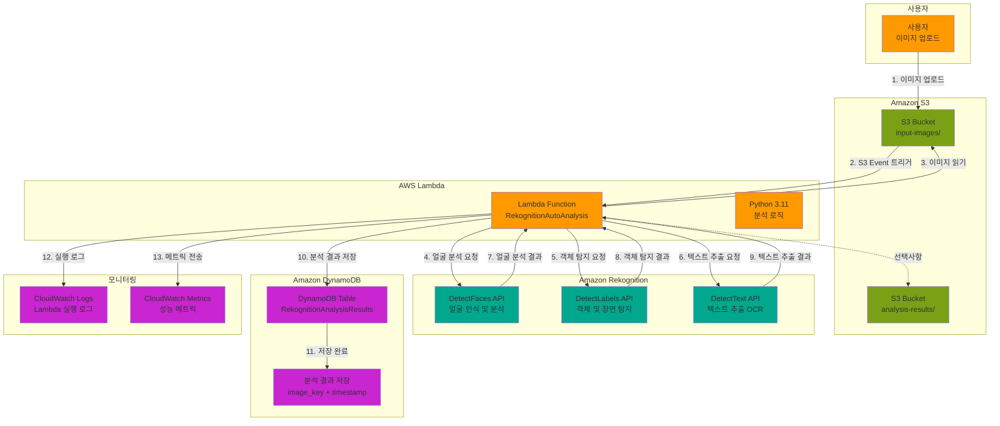

# Week 14-1: Amazon Rekognition 기반 멀티미디어 분석 시스템 아키텍처

## 📊 전체 아키텍처 다이어그램



## 🔄 워크플로우 상세

### Phase 1: 이미지 업로드 및 트리거

#### 1단계: 사용자가 이미지 업로드
```
사용자 → S3 버킷 (input-images/)
```

**처리 과정**:
1. 사용자가 S3 콘솔 또는 CLI를 통해 이미지 업로드
2. 지원 형식: JPG, PNG, BMP, GIF
3. 최대 파일 크기: 15MB (Rekognition 제한)
4. 폴더 구조: `input-images/` 폴더에 업로드

**업로드 예시**:
```bash
# AWS CLI로 이미지 업로드
aws s3 cp photo.jpg s3://rekognition-lab-bucket/input-images/

# 여러 이미지 업로드
aws s3 sync ./photos/ s3://rekognition-lab-bucket/input-images/
```

#### 2단계: S3 이벤트 트리거
```
S3 ObjectCreated 이벤트 → Lambda 함수 실행
```

**트리거 설정**:
- **이벤트 타입**: `s3:ObjectCreated:*`
- **Prefix 필터**: `input-images/`
- **Suffix 필터**: 없음 (모든 파일)
- **트리거 지연**: 거의 즉시 (1-2초 이내)

**이벤트 페이로드**:
```json
{
  "Records": [{
    "eventName": "ObjectCreated:Put",
    "s3": {
      "bucket": {
        "name": "rekognition-lab-bucket"
      },
      "object": {
        "key": "input-images/photo.jpg",
        "size": 2048576
      }
    }
  }]
}
```

### Phase 2: Lambda 함수 실행 및 이미지 분석

#### 3단계: Lambda 함수 초기화
```
Lambda 함수 시작 → 환경 변수 로드 → Boto3 클라이언트 초기화
```

**초기화 과정**:
```python
import boto3
import os

# AWS 서비스 클라이언트 초기화
rekognition = boto3.client('rekognition', region_name='ap-northeast-2')
dynamodb = boto3.resource('dynamodb', region_name='ap-northeast-2')
s3 = boto3.client('s3', region_name='ap-northeast-2')

# 환경 변수 로드
table_name = os.environ.get('DYNAMODB_TABLE')
```

**Lambda 실행 환경**:
- **런타임**: Python 3.11
- **메모리**: 512MB (기본값, 조정 가능)
- **타임아웃**: 30초 (Rekognition API 호출 시간 고려)
- **동시 실행**: 1000 (기본 계정 제한)

#### 4단계: 얼굴 인식 및 분석
```
Lambda → Rekognition DetectFaces API → 얼굴 속성 분석
```

**API 호출**:
```python
face_response = rekognition.detect_faces(
    Image={
        'S3Object': {
            'Bucket': 'rekognition-lab-bucket',
            'Name': 'input-images/photo.jpg'
        }
    },
    Attributes=['ALL']  # 모든 얼굴 속성 분석
)
```

**분석 결과**:
```json
{
  "FaceDetails": [
    {
      "BoundingBox": {
        "Width": 0.25,
        "Height": 0.35,
        "Left": 0.30,
        "Top": 0.20
      },
      "Confidence": 99.8,
      "Emotions": [
        {"Type": "HAPPY", "Confidence": 95.2},
        {"Type": "CALM", "Confidence": 3.1}
      ],
      "AgeRange": {
        "Low": 25,
        "High": 35
      },
      "Gender": {
        "Value": "Male",
        "Confidence": 98.5
      },
      "Smile": {
        "Value": true,
        "Confidence": 92.3
      },
      "Eyeglasses": {
        "Value": false,
        "Confidence": 99.1
      },
      "EyesOpen": {
        "Value": true,
        "Confidence": 99.8
      },
      "MouthOpen": {
        "Value": false,
        "Confidence": 97.5
      }
    }
  ]
}
```

**얼굴 속성 분석 항목**:
- **위치**: BoundingBox (x, y, width, height)
- **감정**: Happy, Sad, Angry, Confused, Disgusted, Surprised, Calm, Fear
- **연령대**: Low ~ High (예: 25-35세)
- **성별**: Male / Female + 신뢰도
- **표정**: Smile, MouthOpen, EyesOpen
- **액세서리**: Eyeglasses, Sunglasses
- **얼굴 특징**: Beard, Mustache
- **얼굴 품질**: Brightness, Sharpness

#### 5단계: 객체 및 장면 탐지
```
Lambda → Rekognition DetectLabels API → 객체/장면 레이블
```

**API 호출**:
```python
label_response = rekognition.detect_labels(
    Image={
        'S3Object': {
            'Bucket': 'rekognition-lab-bucket',
            'Name': 'input-images/photo.jpg'
        }
    },
    MaxLabels=10,        # 최대 10개 레이블
    MinConfidence=70     # 70% 이상 신뢰도
)
```

**분석 결과**:
```json
{
  "Labels": [
    {
      "Name": "Person",
      "Confidence": 99.5,
      "Instances": [
        {
          "BoundingBox": {
            "Width": 0.30,
            "Height": 0.60,
            "Left": 0.25,
            "Top": 0.15
          },
          "Confidence": 99.5
        }
      ],
      "Parents": [
        {"Name": "Human"}
      ]
    },
    {
      "Name": "Car",
      "Confidence": 98.2,
      "Instances": [
        {
          "BoundingBox": {
            "Width": 0.40,
            "Height": 0.25,
            "Left": 0.50,
            "Top": 0.60
          },
          "Confidence": 98.2
        }
      ],
      "Parents": [
        {"Name": "Vehicle"},
        {"Name": "Transportation"}
      ]
    },
    {
      "Name": "Urban",
      "Confidence": 97.8,
      "Instances": []
    },
    {
      "Name": "Outdoors",
      "Confidence": 96.5,
      "Instances": []
    }
  ]
}
```

**레이블 유형**:
- **객체 레이블**: 구체적인 물체 (Person, Car, Building)
- **장면 레이블**: 전체 장면 (Urban, Outdoors, Indoor)
- **활동 레이블**: 행동 (Running, Swimming, Dancing)
- **개념 레이블**: 추상적 개념 (Nature, Technology)

**계층 구조**:
```
Vehicle (부모)
  └─ Car (자식)
      └─ Sedan (손자)
```

#### 6단계: 텍스트 추출 (OCR)
```
Lambda → Rekognition DetectText API → 텍스트 인식
```

**API 호출**:
```python
text_response = rekognition.detect_text(
    Image={
        'S3Object': {
            'Bucket': 'rekognition-lab-bucket',
            'Name': 'input-images/photo.jpg'
        }
    }
)
```

**분석 결과**:
```json
{
  "TextDetections": [
    {
      "DetectedText": "COFFEE SHOP",
      "Type": "LINE",
      "Id": 0,
      "Confidence": 99.2,
      "Geometry": {
        "BoundingBox": {
          "Width": 0.35,
          "Height": 0.08,
          "Left": 0.30,
          "Top": 0.20
        },
        "Polygon": [
          {"X": 0.30, "Y": 0.20},
          {"X": 0.65, "Y": 0.20},
          {"X": 0.65, "Y": 0.28},
          {"X": 0.30, "Y": 0.28}
        ]
      }
    },
    {
      "DetectedText": "COFFEE",
      "Type": "WORD",
      "Id": 1,
      "ParentId": 0,
      "Confidence": 99.5,
      "Geometry": {
        "BoundingBox": {
          "Width": 0.15,
          "Height": 0.08,
          "Left": 0.30,
          "Top": 0.20
        }
      }
    },
    {
      "DetectedText": "SHOP",
      "Type": "WORD",
      "Id": 2,
      "ParentId": 0,
      "Confidence": 98.9,
      "Geometry": {
        "BoundingBox": {
          "Width": 0.12,
          "Height": 0.08,
          "Left": 0.48,
          "Top": 0.20
        }
      }
    }
  ]
}
```

**텍스트 유형**:
- **LINE**: 한 줄의 텍스트 (문장, 제목)
- **WORD**: 개별 단어

**지원 언어**:
- 영어, 한국어, 일본어, 중국어 (간체/번체)
- 아랍어, 러시아어, 독일어, 프랑스어
- 스페인어, 이탈리아어, 포르투갈어

### Phase 3: 결과 저장 및 로깅

#### 7단계: 분석 결과 통합
```
Lambda → 3개 API 결과 병합 → JSON 구조화
```

**결과 통합 코드**:
```python
results = {
    'bucket': bucket,
    'key': key,
    'timestamp': datetime.now().isoformat(),
    'analyses': {
        'faces': {
            'count': len(face_response['FaceDetails']),
            'details': face_response['FaceDetails']
        },
        'labels': {
            'count': len(label_response['Labels']),
            'details': label_response['Labels']
        },
        'text': {
            'count': len(text_response['TextDetections']),
            'details': text_response['TextDetections']
        }
    }
}
```

#### 8단계: DynamoDB에 결과 저장
```
Lambda → DynamoDB PutItem → 분석 결과 영구 저장
```

**DynamoDB 항목 구조**:
```json
{
  "image_key": "input-images/photo.jpg",
  "timestamp": "2024-02-07T10:30:00.123Z",
  "bucket": "rekognition-lab-bucket",
  "analyses": "{...JSON string...}",
  "face_count": 2,
  "label_count": 15,
  "text_count": 5
}
```

**저장 코드**:
```python
table = dynamodb.Table('RekognitionAnalysisResults')
table.put_item(
    Item={
        'image_key': key,
        'timestamp': results['timestamp'],
        'bucket': bucket,
        'analyses': json.dumps(results['analyses']),
        'face_count': results['analyses']['faces']['count'],
        'label_count': results['analyses']['labels']['count'],
        'text_count': results['analyses']['text']['count']
    }
)
```

#### 9단계: CloudWatch 로깅
```
Lambda → CloudWatch Logs → 실행 로그 저장
```

**로그 예시**:
```
START RequestId: abc-123-def-456 Version: $LATEST
Processing image: rekognition-lab-bucket/input-images/photo.jpg
Detected 2 faces
Detected 15 labels
Detected 5 text items
Results saved to DynamoDB: RekognitionAnalysisResults
END RequestId: abc-123-def-456
REPORT RequestId: abc-123-def-456
Duration: 2345.67 ms
Billed Duration: 2346 ms
Memory Size: 512 MB
Max Memory Used: 128 MB
```


#### 10단계: CloudWatch 메트릭 전송
```
Lambda → CloudWatch Metrics → 성능 지표 기록
```

**전송 메트릭**:
```python
cloudwatch = boto3.client('cloudwatch', region_name='ap-northeast-2')

cloudwatch.put_metric_data(
    Namespace='RekognitionAnalysis',
    MetricData=[
        {
            'MetricName': 'FaceCount',
            'Value': face_count,
            'Unit': 'Count',
            'Timestamp': datetime.now()
        },
        {
            'MetricName': 'LabelCount',
            'Value': label_count,
            'Unit': 'Count'
        },
        {
            'MetricName': 'ProcessingTime',
            'Value': processing_time_ms,
            'Unit': 'Milliseconds'
        }
    ]
)
```

**메트릭 유형**:
- **FaceCount**: 감지된 얼굴 수
- **LabelCount**: 감지된 레이블 수
- **TextCount**: 추출된 텍스트 수
- **ProcessingTime**: Lambda 실행 시간
- **RekognitionAPILatency**: Rekognition API 응답 시간
- **ErrorCount**: 오류 발생 횟수

---

## 🏗️ 주요 구성 요소

### 1. Amazon S3 (Simple Storage Service)

**역할**: 이미지 저장 및 이벤트 트리거

**버킷 구조**:
```
rekognition-lab-bucket/
├── input-images/          # 원본 이미지 업로드
│   ├── photo1.jpg
│   ├── photo2.png
│   └── document.jpg
└── analysis-results/      # 분석 결과 JSON (선택사항)
    ├── photo1-result.json
    └── photo2-result.json
```

**S3 이벤트 알림 설정**:
```json
{
  "LambdaFunctionConfigurations": [
    {
      "Id": "RekognitionTrigger",
      "LambdaFunctionArn": "arn:aws:lambda:ap-northeast-2:123456789012:function:RekognitionAutoAnalysis",
      "Events": ["s3:ObjectCreated:*"],
      "Filter": {
        "Key": {
          "FilterRules": [
            {
              "Name": "prefix",
              "Value": "input-images/"
            }
          ]
        }
      }
    }
  ]
}
```

**보안 설정**:
- **버킷 정책**: Lambda 함수에만 읽기 권한 부여
- **암호화**: SSE-S3 (서버 측 암호화)
- **버전 관리**: 활성화 (이미지 복구 가능)
- **수명 주기 정책**: 90일 후 Glacier로 이동


### 2. AWS Lambda

**역할**: 이미지 분석 오케스트레이션

**함수 설정**:
```python
# 함수명: RekognitionAutoAnalysis
# 런타임: Python 3.11
# 메모리: 512MB
# 타임아웃: 30초
# 환경 변수:
#   - DYNAMODB_TABLE: RekognitionAnalysisResults
#   - AWS_REGION: ap-northeast-2
```

**Lambda 함수 코드 구조**:
```python
import boto3
import json
from datetime import datetime

rekognition = boto3.client('rekognition')
dynamodb = boto3.resource('dynamodb')
s3 = boto3.client('s3')

def lambda_handler(event, context):
    # 1. S3 이벤트에서 버킷과 키 추출
    bucket = event['Records'][0]['s3']['bucket']['name']
    key = event['Records'][0]['s3']['object']['key']
    
    # 2. Rekognition API 호출
    face_response = detect_faces(bucket, key)
    label_response = detect_labels(bucket, key)
    text_response = detect_text(bucket, key)
    
    # 3. 결과 통합
    results = combine_results(face_response, label_response, text_response)
    
    # 4. DynamoDB에 저장
    save_to_dynamodb(bucket, key, results)
    
    # 5. CloudWatch 메트릭 전송
    send_metrics(results)
    
    return {
        'statusCode': 200,
        'body': json.dumps('Analysis completed successfully')
    }
```

**IAM 역할 권한**:
```json
{
  "Version": "2012-10-17",
  "Statement": [
    {
      "Effect": "Allow",
      "Action": [
        "s3:GetObject"
      ],
      "Resource": "arn:aws:s3:::rekognition-lab-bucket/input-images/*"
    },
    {
      "Effect": "Allow",
      "Action": [
        "rekognition:DetectFaces",
        "rekognition:DetectLabels",
        "rekognition:DetectText"
      ],
      "Resource": "*"
    },
    {
      "Effect": "Allow",
      "Action": [
        "dynamodb:PutItem"
      ],
      "Resource": "arn:aws:dynamodb:ap-northeast-2:*:table/RekognitionAnalysisResults"
    },
    {
      "Effect": "Allow",
      "Action": [
        "logs:CreateLogGroup",
        "logs:CreateLogStream",
        "logs:PutLogEvents"
      ],
      "Resource": "arn:aws:logs:*:*:*"
    },
    {
      "Effect": "Allow",
      "Action": [
        "cloudwatch:PutMetricData"
      ],
      "Resource": "*"
    }
  ]
}
```


### 3. Amazon Rekognition

**역할**: 이미지 분석 AI 서비스

#### 3.1 DetectFaces API

**기능**: 얼굴 인식 및 속성 분석

**분석 가능한 속성**:
- **위치 정보**: BoundingBox (얼굴 위치)
- **감정 분석**: 8가지 감정 (Happy, Sad, Angry, Confused, Disgusted, Surprised, Calm, Fear)
- **연령대 추정**: Low ~ High (예: 25-35세)
- **성별 추정**: Male / Female + 신뢰도
- **표정 분석**: Smile, MouthOpen, EyesOpen
- **액세서리**: Eyeglasses, Sunglasses
- **얼굴 특징**: Beard, Mustache
- **얼굴 품질**: Brightness, Sharpness
- **얼굴 방향**: Pose (Pitch, Roll, Yaw)

**API 제한**:
- 최대 이미지 크기: 15MB
- 지원 형식: JPEG, PNG
- 최대 얼굴 수: 100개
- 최소 얼굴 크기: 40x40 픽셀

#### 3.2 DetectLabels API

**기능**: 객체 및 장면 탐지

**레이블 카테고리**:
- **객체**: Person, Car, Building, Tree, Animal
- **장면**: Urban, Outdoors, Indoor, Beach, Mountain
- **활동**: Running, Swimming, Dancing, Reading
- **개념**: Nature, Technology, Food, Sports

**레이블 계층 구조**:
```
Transportation (부모)
  └─ Vehicle (자식)
      ├─ Car (손자)
      │   ├─ Sedan
      │   └─ SUV
      └─ Motorcycle
```

**API 제한**:
- 최대 레이블 수: 1000개 (기본 10개)
- 최소 신뢰도: 0-100% (기본 55%)
- 인스턴스 위치: BoundingBox 포함

#### 3.3 DetectText API

**기능**: 텍스트 추출 (OCR)

**지원 언어**:
- 라틴 문자: 영어, 스페인어, 프랑스어, 독일어, 이탈리아어, 포르투갈어
- 아시아 문자: 한국어, 일본어, 중국어 (간체/번체)
- 기타: 아랍어, 러시아어

**텍스트 유형**:
- **LINE**: 한 줄의 텍스트 (문장, 제목)
- **WORD**: 개별 단어

**API 제한**:
- 최대 텍스트 수: 100개
- 최소 텍스트 크기: 15 픽셀 높이
- 최소 신뢰도: 50%


### 4. Amazon DynamoDB

**역할**: 분석 결과 영구 저장

**테이블 스키마**:
```json
{
  "TableName": "RekognitionAnalysisResults",
  "KeySchema": [
    {
      "AttributeName": "image_key",
      "KeyType": "HASH"
    },
    {
      "AttributeName": "timestamp",
      "KeyType": "RANGE"
    }
  ],
  "AttributeDefinitions": [
    {
      "AttributeName": "image_key",
      "AttributeType": "S"
    },
    {
      "AttributeName": "timestamp",
      "AttributeType": "S"
    }
  ],
  "BillingMode": "PAY_PER_REQUEST"
}
```

**항목 예시**:
```json
{
  "image_key": "input-images/photo.jpg",
  "timestamp": "2024-02-07T10:30:00.123Z",
  "bucket": "rekognition-lab-bucket",
  "analyses": {
    "faces": {
      "count": 2,
      "details": [...]
    },
    "labels": {
      "count": 15,
      "details": [...]
    },
    "text": {
      "count": 5,
      "details": [...]
    }
  },
  "face_count": 2,
  "label_count": 15,
  "text_count": 5,
  "processing_time_ms": 2345
}
```

**인덱스 설계**:
- **Primary Key**: image_key (HASH) + timestamp (RANGE)
- **GSI**: bucket-timestamp-index (버킷별 시간순 조회)
- **LSI**: image_key-face_count-index (얼굴 수별 정렬)

**쿼리 패턴**:
```python
# 특정 이미지의 모든 분석 결과 조회
response = table.query(
    KeyConditionExpression=Key('image_key').eq('input-images/photo.jpg')
)

# 최근 분석 결과 조회
response = table.query(
    IndexName='bucket-timestamp-index',
    KeyConditionExpression=Key('bucket').eq('rekognition-lab-bucket'),
    ScanIndexForward=False,
    Limit=10
)
```

---

## 💡 Rekognition의 핵심 장점

### 1. 사전 학습된 AI 모델
- **즉시 사용 가능**: 모델 학습 불필요
- **지속적 개선**: AWS가 자동으로 모델 업데이트
- **높은 정확도**: 수백만 개의 이미지로 학습된 모델

### 2. 서버리스 아키텍처
- **인프라 관리 불필요**: 서버 프로비저닝 없음
- **자동 확장**: 트래픽에 따라 자동 스케일링
- **고가용성**: AWS 관리형 서비스

### 3. 다양한 분석 기능
- **얼굴 분석**: 감정, 연령, 성별, 표정
- **객체 탐지**: 수천 개의 객체 및 장면 인식
- **텍스트 추출**: 다국어 OCR 지원
- **얼굴 비교**: 얼굴 유사도 분석
- **유명인 인식**: 수천 명의 유명인 자동 인식

### 4. 비용 효율성
- **사용한 만큼만 지불**: 분석한 이미지 수만큼 과금
- **무료 티어**: 월 5,000개 이미지 무료 (첫 12개월)
- **대량 할인**: 사용량 증가 시 자동 할인


---

## 💰 비용 최적화

### 1. Rekognition API 비용

**DetectFaces API**:
- 처음 1백만 이미지: $1.00 / 1,000 이미지
- 다음 9백만 이미지: $0.80 / 1,000 이미지
- 1천만 이미지 이상: $0.60 / 1,000 이미지

**DetectLabels API**:
- 처음 1백만 이미지: $1.00 / 1,000 이미지
- 다음 9백만 이미지: $0.80 / 1,000 이미지
- 1천만 이미지 이상: $0.60 / 1,000 이미지

**DetectText API**:
- 처음 1백만 이미지: $1.50 / 1,000 이미지
- 다음 9백만 이미지: $1.20 / 1,000 이미지
- 1천만 이미지 이상: $0.90 / 1,000 이미지

### 2. 시나리오별 비용 계산

#### 시나리오 1: 소규모 실습 (100개 이미지)
```
DetectFaces: 100 × $0.001 = $0.10
DetectLabels: 100 × $0.001 = $0.10
DetectText: 100 × $0.0015 = $0.15
Lambda: 100 × $0.0000002 × 512MB × 3초 = $0.0003
DynamoDB: 100 × $0.00000125 = $0.000125
S3: 100 × 2MB × $0.023/GB = $0.0046

총 비용: 약 $0.36
```

#### 시나리오 2: 중규모 프로젝트 (10,000개 이미지/월)
```
DetectFaces: 10,000 × $0.001 = $10.00
DetectLabels: 10,000 × $0.001 = $10.00
DetectText: 10,000 × $0.0015 = $15.00
Lambda: 10,000 × $0.0000002 × 512MB × 3초 = $0.03
DynamoDB: 10,000 × $0.00000125 = $0.0125
S3: 10,000 × 2MB × $0.023/GB = $0.46

총 비용: 약 $35.50/월
```

#### 시나리오 3: 대규모 서비스 (1,000,000개 이미지/월)
```
DetectFaces: 1,000,000 × $0.001 = $1,000.00
DetectLabels: 1,000,000 × $0.001 = $1,000.00
DetectText: 1,000,000 × $0.0015 = $1,500.00
Lambda: 1,000,000 × $0.0000002 × 512MB × 3초 = $3.00
DynamoDB: 1,000,000 × $0.00000125 = $1.25
S3: 1,000,000 × 2MB × $0.023/GB = $46.00

총 비용: 약 $3,550/월
```

### 3. 비용 절감 전략

#### A. 필요한 API만 호출
```python
# ❌ 모든 API 호출 (비용 높음)
face_response = rekognition.detect_faces(...)
label_response = rekognition.detect_labels(...)
text_response = rekognition.detect_text(...)

# ✅ 필요한 API만 호출 (비용 절감)
if image_type == 'portrait':
    face_response = rekognition.detect_faces(...)
elif image_type == 'document':
    text_response = rekognition.detect_text(...)
else:
    label_response = rekognition.detect_labels(...)
```

#### B. 신뢰도 임계값 조정
```python
# 신뢰도 임계값을 높여 불필요한 결과 제거
label_response = rekognition.detect_labels(
    Image={'S3Object': {'Bucket': bucket, 'Name': key}},
    MaxLabels=10,        # 최대 10개로 제한
    MinConfidence=80     # 80% 이상만 반환 (기본 55%)
)
```

#### C. 이미지 크기 최적화
```python
# 이미지 리사이징으로 처리 시간 및 비용 절감
from PIL import Image
import io

def resize_image(image_bytes, max_size=1920):
    img = Image.open(io.BytesIO(image_bytes))
    if max(img.size) > max_size:
        img.thumbnail((max_size, max_size))
    return img
```

#### D. 배치 처리
```python
# 여러 이미지를 배치로 처리하여 Lambda 호출 횟수 감소
def process_batch(image_keys):
    results = []
    for key in image_keys:
        result = analyze_image(key)
        results.append(result)
    return results
```


---

## 🔒 보안 및 권한

### 1. IAM 정책 설계

#### Lambda 실행 역할
```json
{
  "Version": "2012-10-17",
  "Statement": [
    {
      "Sid": "S3ReadAccess",
      "Effect": "Allow",
      "Action": [
        "s3:GetObject",
        "s3:GetObjectVersion"
      ],
      "Resource": "arn:aws:s3:::rekognition-lab-bucket/input-images/*"
    },
    {
      "Sid": "RekognitionAccess",
      "Effect": "Allow",
      "Action": [
        "rekognition:DetectFaces",
        "rekognition:DetectLabels",
        "rekognition:DetectText"
      ],
      "Resource": "*"
    },
    {
      "Sid": "DynamoDBWriteAccess",
      "Effect": "Allow",
      "Action": [
        "dynamodb:PutItem",
        "dynamodb:UpdateItem"
      ],
      "Resource": "arn:aws:dynamodb:ap-northeast-2:*:table/RekognitionAnalysisResults"
    },
    {
      "Sid": "CloudWatchLogsAccess",
      "Effect": "Allow",
      "Action": [
        "logs:CreateLogGroup",
        "logs:CreateLogStream",
        "logs:PutLogEvents"
      ],
      "Resource": "arn:aws:logs:ap-northeast-2:*:log-group:/aws/lambda/RekognitionAutoAnalysis:*"
    },
    {
      "Sid": "CloudWatchMetricsAccess",
      "Effect": "Allow",
      "Action": [
        "cloudwatch:PutMetricData"
      ],
      "Resource": "*",
      "Condition": {
        "StringEquals": {
          "cloudwatch:namespace": "RekognitionAnalysis"
        }
      }
    }
  ]
}
```

### 2. S3 버킷 정책

```json
{
  "Version": "2012-10-17",
  "Statement": [
    {
      "Sid": "LambdaReadAccess",
      "Effect": "Allow",
      "Principal": {
        "AWS": "arn:aws:iam::123456789012:role/RekognitionLambdaRole"
      },
      "Action": [
        "s3:GetObject"
      ],
      "Resource": "arn:aws:s3:::rekognition-lab-bucket/input-images/*"
    },
    {
      "Sid": "DenyUnencryptedObjectUploads",
      "Effect": "Deny",
      "Principal": "*",
      "Action": "s3:PutObject",
      "Resource": "arn:aws:s3:::rekognition-lab-bucket/*",
      "Condition": {
        "StringNotEquals": {
          "s3:x-amz-server-side-encryption": "AES256"
        }
      }
    }
  ]
}
```

### 3. 데이터 보호

#### 전송 중 암호화
- **S3 → Lambda**: HTTPS 사용
- **Lambda → Rekognition**: HTTPS 사용
- **Lambda → DynamoDB**: HTTPS 사용

#### 저장 시 암호화
- **S3**: SSE-S3 (AES-256)
- **DynamoDB**: AWS 관리형 키 (KMS)
- **CloudWatch Logs**: 기본 암호화

#### 개인정보 보호
```python
# 민감한 정보 마스킹
def mask_sensitive_data(text):
    # 이메일 마스킹
    text = re.sub(r'\b[A-Za-z0-9._%+-]+@[A-Za-z0-9.-]+\.[A-Z|a-z]{2,}\b', 
                  '***@***.***', text)
    # 전화번호 마스킹
    text = re.sub(r'\b\d{3}-\d{4}-\d{4}\b', '***-****-****', text)
    # 주민등록번호 마스킹
    text = re.sub(r'\b\d{6}-\d{7}\b', '******-*******', text)
    return text
```


---

## 🔧 문제 해결

### 1. Lambda 타임아웃 오류

**문제**: Lambda 함수가 30초 내에 완료되지 않음

**원인**:
- 대용량 이미지 처리 (15MB에 가까운 이미지)
- 여러 Rekognition API 동시 호출
- 네트워크 지연

**해결 방법**:
```python
# 1. 타임아웃 증가 (최대 15분)
# Lambda 설정에서 Timeout을 60초로 증가

# 2. 이미지 크기 확인 및 제한
def check_image_size(bucket, key):
    response = s3.head_object(Bucket=bucket, Key=key)
    size_mb = response['ContentLength'] / (1024 * 1024)
    
    if size_mb > 10:
        raise ValueError(f'Image too large: {size_mb}MB (max 10MB)')
    
    return size_mb

# 3. 병렬 처리 대신 순차 처리
face_response = detect_faces(bucket, key)
label_response = detect_labels(bucket, key)
text_response = detect_text(bucket, key)
```

### 2. Rekognition API 오류

**문제**: "InvalidImageFormatException" 오류 발생

**원인**:
- 지원하지 않는 이미지 형식 (GIF, BMP)
- 손상된 이미지 파일
- 이미지 크기 초과 (15MB)

**해결 방법**:
```python
import imghdr

def validate_image(bucket, key):
    # 이미지 형식 확인
    obj = s3.get_object(Bucket=bucket, Key=key)
    image_data = obj['Body'].read()
    
    image_type = imghdr.what(None, h=image_data)
    
    if image_type not in ['jpeg', 'png']:
        raise ValueError(f'Unsupported image format: {image_type}')
    
    # 이미지 크기 확인
    size_mb = len(image_data) / (1024 * 1024)
    if size_mb > 15:
        raise ValueError(f'Image too large: {size_mb}MB')
    
    return True
```

### 3. DynamoDB 쓰기 오류

**문제**: "ProvisionedThroughputExceededException" 오류

**원인**:
- 프로비저닝된 용량 초과
- 대량의 동시 쓰기 요청

**해결 방법**:
```python
# 1. On-Demand 모드 사용 (권장)
# DynamoDB 테이블을 PAY_PER_REQUEST 모드로 변경

# 2. 재시도 로직 구현
import time
from botocore.exceptions import ClientError

def save_with_retry(table, item, max_retries=3):
    for attempt in range(max_retries):
        try:
            table.put_item(Item=item)
            return True
        except ClientError as e:
            if e.response['Error']['Code'] == 'ProvisionedThroughputExceededException':
                if attempt < max_retries - 1:
                    time.sleep(2 ** attempt)  # 지수 백오프
                    continue
            raise
    return False
```

### 4. S3 이벤트 중복 트리거

**문제**: 동일한 이미지에 대해 Lambda가 여러 번 실행됨

**원인**:
- S3 이벤트 알림의 at-least-once 전달 보장
- 네트워크 재시도

**해결 방법**:
```python
# 멱등성 보장 - DynamoDB 조건부 쓰기
def save_idempotent(table, image_key, timestamp, data):
    try:
        table.put_item(
            Item={
                'image_key': image_key,
                'timestamp': timestamp,
                'data': data
            },
            ConditionExpression='attribute_not_exists(image_key) AND attribute_not_exists(timestamp)'
        )
        return True
    except ClientError as e:
        if e.response['Error']['Code'] == 'ConditionalCheckFailedException':
            print(f'Item already exists: {image_key}')
            return False
        raise
```

### 5. 얼굴 인식 실패

**문제**: DetectFaces API가 얼굴을 감지하지 못함

**원인**:
- 얼굴이 너무 작음 (40x40 픽셀 미만)
- 얼굴이 가려짐 (마스크, 선글라스)
- 이미지 품질 낮음 (흐릿함, 어두움)

**해결 방법**:
```python
# 1. 이미지 품질 확인
def check_image_quality(face_details):
    for face in face_details:
        quality = face.get('Quality', {})
        brightness = quality.get('Brightness', 0)
        sharpness = quality.get('Sharpness', 0)
        
        if brightness < 40:
            print('Warning: Image too dark')
        if sharpness < 50:
            print('Warning: Image too blurry')

# 2. 최소 신뢰도 조정
face_response = rekognition.detect_faces(
    Image={'S3Object': {'Bucket': bucket, 'Name': key}},
    Attributes=['ALL']
)

# 신뢰도 낮은 결과 필터링
high_confidence_faces = [
    face for face in face_response['FaceDetails']
    if face['Confidence'] > 90
]
```


---

## 🚀 프로덕션 개선 사항

### 1. 성능 최적화

#### A. 이미지 전처리
```python
from PIL import Image
import io

def optimize_image(image_bytes, max_size=1920, quality=85):
    """이미지 크기 및 품질 최적화"""
    img = Image.open(io.BytesIO(image_bytes))
    
    # 크기 조정
    if max(img.size) > max_size:
        img.thumbnail((max_size, max_size), Image.LANCZOS)
    
    # JPEG 변환 및 압축
    output = io.BytesIO()
    img.convert('RGB').save(output, format='JPEG', quality=quality, optimize=True)
    
    return output.getvalue()
```

#### B. 캐싱 전략
```python
import hashlib
from functools import lru_cache

@lru_cache(maxsize=100)
def get_cached_analysis(image_hash):
    """이미지 해시 기반 캐싱"""
    table = dynamodb.Table('RekognitionAnalysisResults')
    response = table.query(
        IndexName='image_hash-index',
        KeyConditionExpression=Key('image_hash').eq(image_hash)
    )
    
    if response['Items']:
        return response['Items'][0]
    return None

def calculate_image_hash(bucket, key):
    """이미지 해시 계산"""
    obj = s3.get_object(Bucket=bucket, Key=key)
    image_data = obj['Body'].read()
    return hashlib.sha256(image_data).hexdigest()
```

#### C. 배치 처리
```python
def process_batch(image_keys, batch_size=10):
    """여러 이미지 배치 처리"""
    results = []
    
    for i in range(0, len(image_keys), batch_size):
        batch = image_keys[i:i+batch_size]
        
        # 병렬 처리
        with concurrent.futures.ThreadPoolExecutor(max_workers=5) as executor:
            futures = [executor.submit(analyze_image, key) for key in batch]
            batch_results = [f.result() for f in concurrent.futures.as_completed(futures)]
        
        results.extend(batch_results)
    
    return results
```

### 2. 모니터링 및 알림

#### A. CloudWatch 대시보드
```python
# 커스텀 메트릭 전송
def send_custom_metrics(face_count, label_count, processing_time):
    cloudwatch = boto3.client('cloudwatch')
    
    cloudwatch.put_metric_data(
        Namespace='RekognitionAnalysis',
        MetricData=[
            {
                'MetricName': 'FaceCount',
                'Value': face_count,
                'Unit': 'Count',
                'Dimensions': [
                    {'Name': 'Environment', 'Value': 'Production'}
                ]
            },
            {
                'MetricName': 'ProcessingTime',
                'Value': processing_time,
                'Unit': 'Milliseconds',
                'StatisticValues': {
                    'SampleCount': 1,
                    'Sum': processing_time,
                    'Minimum': processing_time,
                    'Maximum': processing_time
                }
            }
        ]
    )
```

#### B. SNS 알림
```python
def send_alert(message, severity='INFO'):
    """오류 발생 시 SNS 알림"""
    sns = boto3.client('sns')
    
    topic_arn = os.environ.get('SNS_TOPIC_ARN')
    
    sns.publish(
        TopicArn=topic_arn,
        Subject=f'[{severity}] Rekognition Analysis Alert',
        Message=message,
        MessageAttributes={
            'severity': {
                'DataType': 'String',
                'StringValue': severity
            }
        }
    )
```

### 3. 오류 처리 및 복원력

#### A. Dead Letter Queue (DLQ)
```python
# Lambda 함수에 DLQ 설정
# 실패한 이벤트를 SQS 큐로 전송하여 재처리
```

#### B. Circuit Breaker 패턴
```python
class CircuitBreaker:
    def __init__(self, failure_threshold=5, timeout=60):
        self.failure_count = 0
        self.failure_threshold = failure_threshold
        self.timeout = timeout
        self.last_failure_time = None
        self.state = 'CLOSED'  # CLOSED, OPEN, HALF_OPEN
    
    def call(self, func, *args, **kwargs):
        if self.state == 'OPEN':
            if time.time() - self.last_failure_time > self.timeout:
                self.state = 'HALF_OPEN'
            else:
                raise Exception('Circuit breaker is OPEN')
        
        try:
            result = func(*args, **kwargs)
            self.on_success()
            return result
        except Exception as e:
            self.on_failure()
            raise
    
    def on_success(self):
        self.failure_count = 0
        self.state = 'CLOSED'
    
    def on_failure(self):
        self.failure_count += 1
        self.last_failure_time = time.time()
        
        if self.failure_count >= self.failure_threshold:
            self.state = 'OPEN'
```

### 4. 보안 강화

#### A. VPC 엔드포인트 사용
```python
# Lambda를 VPC 내부에 배치하고 VPC 엔드포인트 사용
# - S3 VPC Endpoint (Gateway)
# - Rekognition VPC Endpoint (Interface)
# - DynamoDB VPC Endpoint (Gateway)
```

#### B. 암호화 강화
```python
# KMS 키를 사용한 S3 암호화
s3.put_object(
    Bucket=bucket,
    Key=key,
    Body=image_data,
    ServerSideEncryption='aws:kms',
    SSEKMSKeyId='arn:aws:kms:ap-northeast-2:123456789012:key/xxx'
)
```


---

## 📚 참고 자료

### AWS 공식 문서

#### Amazon Rekognition
- [Amazon Rekognition 개발자 가이드](https://docs.aws.amazon.com/rekognition/latest/dg/what-is.html)
- [DetectFaces API 레퍼런스](https://docs.aws.amazon.com/rekognition/latest/dg/API_DetectFaces.html)
- [DetectLabels API 레퍼런스](https://docs.aws.amazon.com/rekognition/latest/dg/API_DetectLabels.html)
- [DetectText API 레퍼런스](https://docs.aws.amazon.com/rekognition/latest/dg/API_DetectText.html)
- [Rekognition 모범 사례](https://docs.aws.amazon.com/rekognition/latest/dg/best-practices.html)

#### AWS Lambda
- [Lambda 개발자 가이드](https://docs.aws.amazon.com/lambda/latest/dg/welcome.html)
- [Lambda와 S3 통합](https://docs.aws.amazon.com/lambda/latest/dg/with-s3.html)
- [Lambda 성능 최적화](https://docs.aws.amazon.com/lambda/latest/dg/best-practices.html)

#### Amazon S3
- [S3 이벤트 알림](https://docs.aws.amazon.com/AmazonS3/latest/userguide/NotificationHowTo.html)
- [S3 보안 모범 사례](https://docs.aws.amazon.com/AmazonS3/latest/userguide/security-best-practices.html)

#### Amazon DynamoDB
- [DynamoDB 개발자 가이드](https://docs.aws.amazon.com/amazondynamodb/latest/developerguide/Introduction.html)
- [DynamoDB 모범 사례](https://docs.aws.amazon.com/amazondynamodb/latest/developerguide/best-practices.html)

### 블로그 및 튜토리얼
- [Building a Serverless Image Recognition System](https://aws.amazon.com/blogs/machine-learning/)
- [Rekognition을 활용한 실시간 이미지 분석](https://aws.amazon.com/blogs/aws/)
- [Lambda와 Rekognition 통합 패턴](https://aws.amazon.com/blogs/compute/)

### 샘플 코드
- [AWS Samples - Rekognition](https://github.com/aws-samples/amazon-rekognition-code-samples)
- [Serverless Image Processing](https://github.com/aws-samples/serverless-image-processing)

---

## 🎓 학습 경로

### 초급 (1-2주)
1. **AWS 기초**
   - AWS 계정 생성 및 IAM 설정
   - S3 버킷 생성 및 파일 업로드
   - Lambda 함수 기본 개념

2. **Rekognition 기초**
   - Rekognition 콘솔 탐색
   - DetectFaces API 테스트
   - DetectLabels API 테스트

3. **실습 프로젝트**
   - 간단한 얼굴 인식 Lambda 함수 작성
   - S3 이벤트 트리거 설정
   - CloudWatch 로그 확인

### 중급 (2-3주)
1. **아키텍처 설계**
   - 서버리스 아키텍처 패턴 학습
   - 이벤트 기반 처리 이해
   - DynamoDB 데이터 모델링

2. **고급 Rekognition 기능**
   - 얼굴 비교 (CompareFaces)
   - 유명인 인식 (RecognizeCelebrities)
   - 커스텀 레이블 (Custom Labels)

3. **성능 최적화**
   - Lambda 메모리 및 타임아웃 튜닝
   - 이미지 전처리 및 최적화
   - 배치 처리 구현

### 고급 (3-4주)
1. **프로덕션 준비**
   - 모니터링 및 알림 설정
   - 오류 처리 및 재시도 로직
   - 보안 강화 (VPC, KMS)

2. **확장성 및 비용 최적화**
   - Auto Scaling 설정
   - 비용 분석 및 최적화
   - 캐싱 전략 구현

3. **실전 프로젝트**
   - 실시간 이미지 분석 시스템 구축
   - 대용량 이미지 처리 파이프라인
   - 멀티 리전 배포

---

## 📝 용어 정리

### AI/ML 용어
- **Computer Vision**: 컴퓨터가 이미지나 비디오를 이해하고 분석하는 기술
- **Object Detection**: 이미지에서 객체를 찾아내고 위치를 파악하는 기술
- **OCR (Optical Character Recognition)**: 이미지에서 텍스트를 추출하는 기술
- **Confidence Score**: AI 모델이 예측 결과에 대해 가지는 신뢰도 (0-100%)
- **Bounding Box**: 객체나 얼굴의 위치를 나타내는 사각형 좌표

### AWS 용어
- **Serverless**: 서버 관리 없이 코드를 실행하는 아키텍처
- **Event-Driven**: 이벤트 발생 시 자동으로 처리가 시작되는 방식
- **Lambda Function**: AWS의 서버리스 컴퓨팅 서비스
- **S3 Event Notification**: S3 버킷에서 발생하는 이벤트 알림
- **DynamoDB**: AWS의 NoSQL 데이터베이스 서비스

### Rekognition 용어
- **Face Detection**: 이미지에서 얼굴을 찾아내는 기능
- **Label Detection**: 이미지에서 객체와 장면을 인식하는 기능
- **Text Detection**: 이미지에서 텍스트를 추출하는 기능
- **Face Attributes**: 얼굴의 속성 (감정, 연령, 성별 등)
- **Instance**: 감지된 객체의 개별 인스턴스 (위치 정보 포함)

---

## 🔄 버전 히스토리

### Version 1.0.0 (2024-02-07)
- 초기 아키텍처 다이어그램 작성
- 3가지 Rekognition API 통합 (DetectFaces, DetectLabels, DetectText)
- S3 이벤트 트리거 기반 자동 분석
- DynamoDB 결과 저장
- CloudWatch 로깅 및 메트릭

### 주요 기능
- ✅ 자동 이미지 분석 파이프라인
- ✅ 얼굴 인식 및 속성 분석
- ✅ 객체 및 장면 탐지
- ✅ 텍스트 추출 (OCR)
- ✅ 분석 결과 영구 저장
- ✅ 실시간 모니터링

### 개선 예정
- [ ] 실시간 스트리밍 비디오 분석
- [ ] 커스텀 레이블 학습 및 적용
- [ ] 얼굴 비교 및 검색 기능
- [ ] 멀티 리전 배포
- [ ] API Gateway를 통한 REST API 제공

---

**문서 버전**: 1.0.0  
**최종 업데이트**: 2024-02-07  
**작성자**: AWS 실습 가이드 팀  
**검토자**: 클라우드 아키텍트 팀

