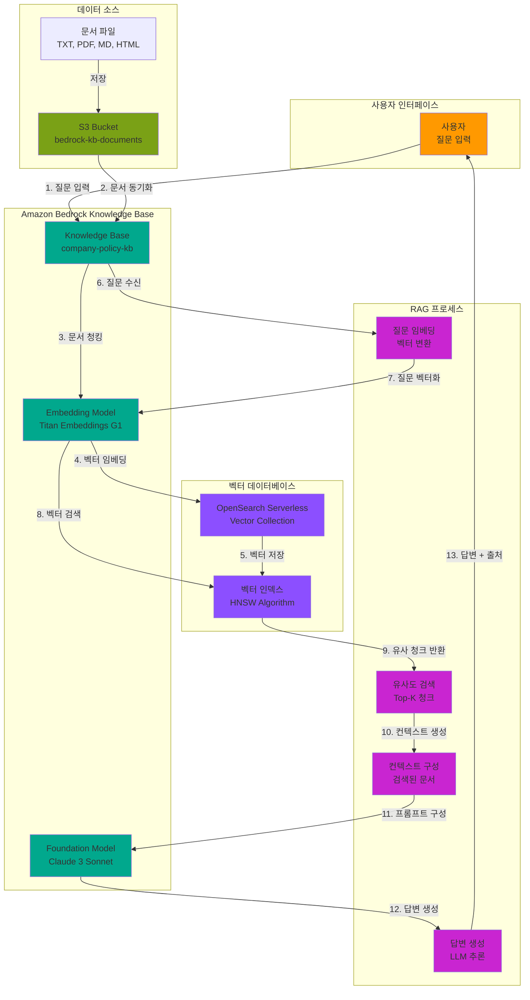

# Week 14-2: Amazon Bedrock Knowledge Bases 기반 RAG 아키텍처

## 📊 전체 아키텍처 다이어그램



## 🔄 RAG 워크플로우 상세

### Phase 1: 데이터 준비 및 인덱싱

#### 1단계: 문서 업로드
```
사용자 → S3 버킷 (bedrock-kb-documents/documents/)
```

**처리 과정**:
1. 사용자가 회사 정책 문서를 S3 버킷에 업로드
2. 지원 형식: TXT, PDF, MD, HTML, DOC, DOCX, CSV
3. 폴더 구조로 문서 분류 가능

**문서 예시**:
```
회사 휴가 정책
- 연차 휴가: 신입 15일, 3년 이상 20일, 5년 이상 25일
- 병가: 연간 10일, 의사 진단서 필요
- 경조사 휴가: 본인 결혼 5일, 직계 가족 3일
```

#### 2단계: 데이터 소스 동기화
```
Knowledge Base → S3 버킷 스캔 → 문서 읽기
```

**처리 과정**:
1. Knowledge Base가 S3 버킷의 모든 파일 스캔
2. 각 문서를 읽어 텍스트 추출
3. 메타데이터 수집 (파일명, 경로, 수정일)
4. 동기화 상태 추적 (In progress → Completed)

#### 3단계: 문서 청킹 (Chunking)
```
전체 문서 → 작은 청크로 분할 (300 토큰 단위)
```

**청킹 전략**:
- **기본 크기**: 300 토큰 (약 200-250 단어)
- **오버랩**: 50 토큰 (문맥 유지)
- **분할 기준**: 문단, 문장 경계 우선

**청킹 예시**:
```
원본 문서 (1000 토큰):
┌─────────────────────────────────┐
│ 회사 휴가 정책 전체 문서        │
│ (연차, 병가, 경조사 등)         │
└─────────────────────────────────┘
         ↓ 청킹
┌──────────┐ ┌──────────┐ ┌──────────┐
│ Chunk 1  │ │ Chunk 2  │ │ Chunk 3  │
│ 연차 휴가│ │ 병가     │ │ 경조사   │
│ (300토큰)│ │ (300토큰)│ │ (300토큰)│
└──────────┘ └──────────┘ └──────────┘
```

#### 4단계: 벡터 임베딩 생성
```
각 청크 → Titan Embeddings G1 → 1024차원 벡터
```

**임베딩 프로세스**:
1. 각 청크를 Titan Embeddings G1 모델에 입력
2. 텍스트를 1024차원 숫자 배열로 변환
3. 의미가 유사한 텍스트는 벡터 공간에서 가까운 위치에 배치

**벡터 표현 예시**:
```
"신입 사원의 연차 휴가는 15일입니다"
↓ 임베딩
[0.234, -0.567, 0.891, ..., 0.123] (1024차원)

"3년 이상 근속자는 20일의 연차를 받습니다"
↓ 임베딩
[0.245, -0.543, 0.876, ..., 0.134] (1024차원)
→ 위 벡터와 가까운 위치 (유사한 의미)

"회사 주차장 이용 규칙"
↓ 임베딩
[-0.678, 0.234, -0.456, ..., -0.789] (1024차원)
→ 위 벡터들과 먼 위치 (다른 의미)
```

#### 5단계: 벡터 데이터베이스 저장
```
벡터 + 메타데이터 → OpenSearch Serverless → HNSW 인덱스
```

**저장 구조**:
```json
{
  "vector": [0.234, -0.567, ...],
  "text": "신입 사원의 연차 휴가는 15일입니다",
  "metadata": {
    "source": "s3://bedrock-kb-documents/documents/company-policy.txt",
    "chunk_id": "chunk-001",
    "document_id": "doc-123"
  }
}
```

**HNSW 인덱스**:
- Hierarchical Navigable Small World 알고리즘
- 빠른 근사 최근접 이웃 검색 (ANN)
- 검색 속도: 밀리초 단위


### Phase 2: 질문 처리 및 답변 생성

#### 6단계: 사용자 질문 수신
```
사용자 → Knowledge Base → "신입 사원의 연차 휴가는 며칠인가요?"
```

**질문 예시**:
- 간단한 질문: "신입 사원의 연차 휴가는 며칠인가요?"
- 복잡한 질문: "5년 이상 근속한 직원이 결혼하면 총 며칠의 휴가를 사용할 수 있나요?"
- 문서 외 질문: "재택근무 정책은 어떻게 되나요?"

#### 7단계: 질문 벡터화
```
질문 텍스트 → Titan Embeddings G1 → 질문 벡터
```

**처리 과정**:
1. 사용자 질문을 동일한 임베딩 모델에 입력
2. 질문을 1024차원 벡터로 변환
3. 문서 벡터와 동일한 벡터 공간에 매핑

**질문 벡터 예시**:
```
"신입 사원의 연차 휴가는 며칠인가요?"
↓ 임베딩
[0.241, -0.559, 0.884, ..., 0.129] (1024차원)
```

#### 8단계: 유사도 검색
```
질문 벡터 → OpenSearch Serverless → 코사인 유사도 계산 → Top-K 청크
```

**검색 알고리즘**:
- **코사인 유사도**: 두 벡터 간의 각도 계산
- **유사도 범위**: 0 (완전 다름) ~ 1 (완전 동일)
- **Top-K 선택**: 기본 K=5 (상위 5개 청크)

**검색 결과 예시**:
```
Rank 1: 유사도 0.92
"신입 사원: 연간 15일"

Rank 2: 유사도 0.87
"3년 이상 근속: 연간 20일"

Rank 3: 유사도 0.85
"5년 이상 근속: 연간 25일"

Rank 4: 유사도 0.78
"휴가 신청 방법: 사내 포털에서 최소 3일 전 신청"

Rank 5: 유사도 0.72
"병가: 연간 10일까지 사용 가능"
```


#### 9단계: 컨텍스트 구성
```
Top-K 청크 → 컨텍스트 문서 생성 → 프롬프트 구성
```

**컨텍스트 구성 예시**:
```
다음 문서를 참고하여 질문에 답변하세요:

[문서 1 - 유사도: 0.92]
신입 사원: 연간 15일
3년 이상 근속: 연간 20일
5년 이상 근속: 연간 25일

[문서 2 - 유사도: 0.87]
휴가 신청 방법:
- 사내 포털에서 최소 3일 전 신청
- 팀장 승인 필요

질문: 신입 사원의 연차 휴가는 며칠인가요?

답변:
```

#### 10단계: LLM 답변 생성
```
프롬프트 → Claude 3 Sonnet → 답변 생성
```

**LLM 추론 과정**:
1. 프롬프트와 컨텍스트 분석
2. 관련 정보 추출
3. 자연어 답변 생성
4. 출처(Source Attribution) 포함

**답변 예시**:
```
신입 사원의 연차 휴가는 연간 15일입니다.

[출처]
- 문서: company-policy.txt
- 청크: chunk-001
- 유사도: 0.92
```

#### 11단계: 답변 반환
```
답변 + 출처 → 사용자
```

**최종 응답 구조**:
```json
{
  "answer": "신입 사원의 연차 휴가는 연간 15일입니다.",
  "sources": [
    {
      "document": "s3://bedrock-kb-documents/documents/company-policy.txt",
      "chunk_id": "chunk-001",
      "similarity_score": 0.92,
      "text": "신입 사원: 연간 15일"
    }
  ],
  "confidence": "high"
}
```

## 🏗️ 주요 구성 요소

### 1. Amazon Bedrock Knowledge Base
**역할**: RAG 시스템의 중앙 오케스트레이터

**주요 기능**:
- 데이터 소스 관리 및 동기화
- 문서 청킹 및 임베딩 조율
- 질문 처리 및 검색 조율
- LLM 통합 및 답변 생성

**설정 옵션**:
- Knowledge Base 이름 및 설명
- IAM 역할 (자동 생성 또는 기존 역할 사용)
- 데이터 소스 구성
- 임베딩 모델 선택
- 벡터 데이터베이스 설정


### 2. S3 버킷 (데이터 소스)
**역할**: 문서 저장소

**지원 형식**:
- 텍스트: TXT, MD
- 문서: PDF, DOC, DOCX
- 데이터: CSV, XLS, XLSX
- 웹: HTML

**폴더 구조 예시**:
```
bedrock-kb-documents/
├── documents/
│   ├── company-policy.txt
│   ├── employee-handbook.pdf
│   ├── benefits-guide.md
│   └── faq.html
└── archived/
    └── old-policies/
```

**메타데이터 활용**:
- 파일명으로 문서 분류
- 폴더 구조로 카테고리 관리
- S3 태그로 추가 메타데이터 저장

### 3. Titan Embeddings G1 (임베딩 모델)
**역할**: 텍스트를 벡터로 변환

**모델 특성**:
- **벡터 차원**: 1024
- **최대 입력**: 8,192 토큰
- **언어 지원**: 영어, 한국어 등 100개 이상 언어
- **처리 속도**: 밀리초 단위

**대안 모델**:
- **Cohere Embed Multilingual**: 1536차원, 높은 정확도
- **Cohere Embed English**: 1024차원, 영어 특화

**비용**:
- Titan Embeddings G1: 1,000 토큰당 $0.0001
- 100만 토큰 처리 시 약 $0.10

### 4. OpenSearch Serverless (벡터 데이터베이스)
**역할**: 벡터 저장 및 검색

**주요 기능**:
- 벡터 인덱싱 (HNSW 알고리즘)
- 빠른 유사도 검색 (밀리초 단위)
- 자동 스케일링
- 완전 관리형 서비스

**컬렉션 구성**:
- **인덱스 이름**: bedrock-knowledge-base-default-index
- **벡터 필드**: bedrock-knowledge-base-default-vector
- **메타데이터 필드**: AMAZON_BEDROCK_METADATA, AMAZON_BEDROCK_TEXT_CHUNK

**검색 설정**:
- **알고리즘**: HNSW (Hierarchical Navigable Small World)
- **거리 메트릭**: 코사인 유사도
- **Top-K**: 기본 5개 (조정 가능)

**비용**:
- OpenSearch Serverless: 시간당 $0.24 (4 OCU 기준)
- 월 약 $175 (24/7 운영 시)


### 5. Claude 3 Sonnet (Foundation Model)
**역할**: 답변 생성

**모델 특성**:
- **컨텍스트 윈도우**: 200,000 토큰
- **출력 길이**: 최대 4,096 토큰
- **언어 지원**: 한국어 우수
- **응답 속도**: 빠름 (1-2초)

**대안 모델**:
- **Claude 3 Opus**: 최고 품질, 복잡한 질문 처리
- **Claude 3 Haiku**: 가장 빠름, 간단한 질문
- **Titan Text**: AWS 자체 모델, 비용 효율적

**프롬프트 구조**:
```
System: 당신은 회사 정책 전문가입니다. 제공된 문서만을 기반으로 정확하게 답변하세요.

Context: [검색된 문서 청크들]

User: [사용자 질문]


**비용**:
- Claude 3 Sonnet: 1,000 입력 토큰당 $0.003, 1,000 출력 토큰당 $0.015
- 1,000 질문 처리 시 약 $5-10 (질문 길이에 따라)

## 🎯 RAG의 핵심 장점

### 1. 환각 방지 (Hallucination Prevention)
**문제**: 일반 LLM은 학습 데이터에 없는 정보를 그럴듯하게 지어낼 수 있음

**RAG 해결책**:
- 검색된 문서만을 기반으로 답변 생성
- 문서에 없는 정보는 "모른다"고 답변
- Source Attribution으로 답변 근거 제공

**예시**:
```
질문: "재택근무 정책은 어떻게 되나요?"

일반 LLM 답변 (환각):
"주 2회 재택근무가 가능하며, 사전 승인이 필요합니다."
→ 문서에 없는 정보를 지어냄

RAG 답변 (정확):
"제공된 문서에는 재택근무 정책에 대한 정보가 없습니다."
→ 문서 기반으로만 답변
```

### 2. 최신 정보 활용
**문제**: LLM은 학습 시점 이후의 정보를 알 수 없음

**RAG 해결책**:
- S3 버킷에 최신 문서 업로드
- 동기화로 즉시 Knowledge Base 업데이트
- 재학습 없이 최신 정보 반영

**시나리오**:
```
2024년 1월: 휴가 정책 변경
→ S3에 새 정책 문서 업로드
→ Knowledge Base 동기화 (2-3분)
→ 즉시 새 정책으로 답변 가능
```


### 3. 기업 내부 데이터 활용
**문제**: LLM은 기업 내부 문서나 개인 데이터에 접근 불가

**RAG 해결책**:
- 기업 문서를 S3에 안전하게 저장
- Knowledge Base로 내부 데이터 검색
- 보안 및 권한 관리 가능

**활용 사례**:
- 회사 정책 및 규정
- 제품 매뉴얼 및 FAQ
- 내부 프로세스 문서
- 법률 계약서 및 판례

### 4. 답변 신뢰성 향상
**문제**: LLM 답변의 출처를 알 수 없음

**RAG 해결책**:
- Source Attribution으로 답변 근거 제공
- 문서 청크와 유사도 점수 표시
- 사용자가 원본 문서 확인 가능

**신뢰성 지표**:
```
답변: "신입 사원의 연차 휴가는 15일입니다."

출처:
- 문서: company-policy.txt
- 청크: "신입 사원: 연간 15일"
- 유사도: 0.92 (매우 높음)
- 위치: 1단락, 연차 휴가 섹션
```

## 📋 벡터 검색 원리 상세

### 코사인 유사도 계산

**수식**:
```
similarity = (A · B) / (||A|| × ||B||)

A: 질문 벡터
B: 문서 청크 벡터
· : 내적 (dot product)
||A||: 벡터 A의 크기 (magnitude)
```

**계산 예시**:
```
질문 벡터 A = [0.5, 0.3, 0.8]
문서 벡터 B = [0.6, 0.4, 0.7]

A · B = (0.5×0.6) + (0.3×0.4) + (0.8×0.7) = 0.3 + 0.12 + 0.56 = 0.98
||A|| = √(0.5² + 0.3² + 0.8²) = √0.98 = 0.99
||B|| = √(0.6² + 0.4² + 0.7²) = √1.01 = 1.00

similarity = 0.98 / (0.99 × 1.00) = 0.99 (매우 유사)
```


### HNSW 알고리즘

**Hierarchical Navigable Small World**:
- 계층적 그래프 구조로 벡터 인덱싱
- 빠른 근사 최근접 이웃 검색 (ANN)
- 검색 속도: O(log N)
- 정확도: 95% 이상

**검색 과정**:
```
1. 최상위 계층에서 시작
2. 가장 가까운 노드로 이동
3. 하위 계층으로 내려가며 반복
4. 최하위 계층에서 Top-K 선택
```

**성능**:
- 100만 벡터: 1-2ms 검색 시간
- 1억 벡터: 5-10ms 검색 시간
- 메모리 효율적: 벡터당 약 100 바이트

## 💡 사용 사례

### 1. 고객 지원 챗봇
**시나리오**: 제품 매뉴얼 기반 자동 응답

**구현**:
- S3에 제품 매뉴얼 업로드 (PDF, HTML)
- Knowledge Base 생성 및 동기화
- 챗봇 인터페이스 연동

**효과**:
- 24/7 자동 응답
- 고객 대기 시간 90% 감소
- 상담원 업무 부담 50% 감소
- 고객 만족도 향상

### 2. 기업 내부 검색
**시나리오**: 사내 문서 통합 검색

**구현**:
- 정책, 프로세스, 가이드 문서 통합
- 직원이 자연어로 질문
- 관련 문서와 답변 제공

**효과**:
- 정보 검색 시간 80% 단축
- 신입 사원 온보딩 시간 50% 감소
- 문서 활용도 3배 증가


### 3. 법률/의료 문서 분석
**시나리오**: 전문 분야 지식 검색

**구현**:
- 판례, 논문, 가이드라인 저장
- 전문가가 관련 사례 검색
- 의사결정 지원

**효과**:
- 사례 검색 시간 70% 단축
- 의사결정 정확도 향상
- 전문가 생산성 2배 증가

### 4. 교육 및 학습 지원
**시나리오**: 개인화된 학습 도우미

**구현**:
- 교재, 강의 자료, 참고 문헌 저장
- 학생 질문에 맞춤 답변
- 추가 학습 자료 추천

**효과**:
- 학습 효율 40% 향상
- 교사 질문 응답 시간 60% 감소
- 학생 만족도 증가

## 🎯 모범 사례

### 1. 문서 준비
**청킹 최적화**:
- 문서를 논리적 단위로 구성 (섹션, 문단)
- 각 청크가 독립적으로 이해 가능하도록 작성
- 중요 정보는 청크 시작 부분에 배치

**메타데이터 활용**:
- 파일명으로 문서 분류
- 폴더 구조로 카테고리 관리
- S3 태그로 추가 정보 저장

**문서 품질**:
- 명확하고 간결한 문장 사용
- 중복 정보 제거
- 정기적인 문서 업데이트

### 2. 검색 최적화
**Top-K 조정**:
- 간단한 질문: K=3-5
- 복잡한 질문: K=5-10
- 매우 복잡한 질문: K=10-20

**유사도 임계값**:
- 높은 정확도 필요: 0.8 이상만 사용
- 일반적인 경우: 0.7 이상
- 넓은 검색: 0.6 이상


### 3. 프롬프트 엔지니어링
**시스템 프롬프트**:
```
당신은 [도메인] 전문가입니다.
제공된 문서만을 기반으로 정확하게 답변하세요.
문서에 없는 정보는 "문서에 해당 정보가 없습니다"라고 답변하세요.
답변은 간결하고 명확하게 작성하세요.
```

**컨텍스트 구성**:
- 관련성 높은 청크를 먼저 배치
- 각 청크의 출처 명시
- 유사도 점수 포함

**답변 형식 지정**:
- 구조화된 답변 요청
- 불릿 포인트 사용
- 출처 인용 필수

### 4. 모니터링 및 개선
**메트릭 추적**:
- 질문 수 및 응답 시간
- 유사도 점수 분포
- 답변 만족도
- 문서 활용도

**지속적 개선**:
- 자주 묻는 질문 분석
- 낮은 유사도 질문 검토
- 문서 갭 식별 및 보완
- 사용자 피드백 반영

## 💰 비용 최적화

### 총 예상 비용 (월 기준)

**시나리오 1: 소규모 (1,000 질문/월)**
```
임베딩 비용:
- 문서 인덱싱: 100만 토큰 × $0.0001 = $0.10
- 질문 임베딩: 1,000 질문 × 50 토큰 × $0.0001 = $0.005

벡터 DB 비용:
- OpenSearch Serverless: $175/월 (24/7 운영)

LLM 비용:
- Claude 3 Sonnet: 1,000 질문 × $0.01 = $10

총 비용: $185/월
```

**시나리오 2: 중규모 (10,000 질문/월)**
```
임베딩 비용:
- 문서 인덱싱: 500만 토큰 × $0.0001 = $0.50
- 질문 임베딩: 10,000 질문 × 50 토큰 × $0.0001 = $0.05

벡터 DB 비용:
- OpenSearch Serverless: $175/월 (24/7 운영)

LLM 비용:
- Claude 3 Sonnet: 10,000 질문 × $0.01 = $100

총 비용: $275.55/월
```

**시나리오 3: 대규모 (100,000 질문/월)**
```
임베딩 비용:
- 문서 인덱싱: 1,000만 토큰 × $0.0001 = $1.00
- 질문 임베딩: 100,000 질문 × 50 토큰 × $0.0001 = $0.50

벡터 DB 비용:
- OpenSearch Serverless: $350/월 (8 OCU로 확장)

LLM 비용:
- Claude 3 Sonnet: 100,000 질문 × $0.01 = $1,000

총 비용: $1,351.50/월
```

### 비용 최적화 전략

#### 1. 임베딩 비용 절감
**청킹 최적화**:
- 불필요한 중복 제거
- 최적 청크 크기 설정 (200-400 토큰)
- 증분 동기화 (변경된 문서만 재인덱싱)

**배치 처리**:
- 여러 문서를 한 번에 임베딩
- 오프피크 시간에 인덱싱 수행

#### 2. 벡터 DB 비용 절감
**OCU 최적화**:
- 사용량에 따라 OCU 조정
- 개발/테스트 환경은 최소 OCU 사용
- 프로덕션만 24/7 운영

**데이터 정리**:
- 오래된 문서 아카이빙
- 사용하지 않는 인덱스 삭제
- 정기적인 데이터 정리

#### 3. LLM 비용 절감
**모델 선택**:
- 간단한 질문: Claude 3 Haiku ($0.00025/1K 토큰)
- 복잡한 질문: Claude 3 Sonnet
- 매우 복잡한 질문: Claude 3 Opus

**프롬프트 최적화**:
- 불필요한 컨텍스트 제거
- 간결한 시스템 프롬프트
- 출력 길이 제한

**캐싱 활용**:
- 자주 묻는 질문 캐싱
- 유사한 질문 그룹화
- Redis/ElastiCache로 답변 캐싱

#### 4. 아키텍처 최적화
**하이브리드 검색**:
- 키워드 검색 + 벡터 검색 조합
- 간단한 질문은 키워드 검색만 사용
- 복잡한 질문만 벡터 검색 사용

**계층적 검색**:
- 1단계: 빠른 필터링 (키워드)
- 2단계: 정밀 검색 (벡터)
- 3단계: LLM 답변 생성

## 🔒 보안 및 권한

### IAM 역할 및 정책

#### Knowledge Base 서비스 역할
```json
{
  "Version": "2012-10-17",
  "Statement": [
    {
      "Effect": "Allow",
      "Action": [
        "s3:GetObject",
        "s3:ListBucket"
      ],
      "Resource": [
        "arn:aws:s3:::bedrock-kb-documents",
        "arn:aws:s3:::bedrock-kb-documents/*"
      ]
    },
    {
      "Effect": "Allow",
      "Action": [
        "bedrock:InvokeModel"
      ],
      "Resource": [
        "arn:aws:bedrock:*::foundation-model/amazon.titan-embed-text-v1",
        "arn:aws:bedrock:*::foundation-model/anthropic.claude-3-sonnet-*"
      ]
    },
    {
      "Effect": "Allow",
      "Action": [
        "aoss:APIAccessAll"
      ],
      "Resource": [
        "arn:aws:aoss:ap-northeast-2:*:collection/*"
      ]
    }
  ]
}
```

#### OpenSearch Serverless 데이터 액세스 정책
```json
[
  {
    "Rules": [
      {
        "Resource": [
          "collection/bedrock-kb-collection"
        ],
        "Permission": [
          "aoss:CreateCollectionItems",
          "aoss:DeleteCollectionItems",
          "aoss:UpdateCollectionItems",
          "aoss:DescribeCollectionItems"
        ],
        "ResourceType": "collection"
      },
      {
        "Resource": [
          "index/bedrock-kb-collection/*"
        ],
        "Permission": [
          "aoss:CreateIndex",
          "aoss:DeleteIndex",
          "aoss:UpdateIndex",
          "aoss:DescribeIndex",
          "aoss:ReadDocument",
          "aoss:WriteDocument"
        ],
        "ResourceType": "index"
      }
    ],
    "Principal": [
      "arn:aws:iam::ACCOUNT_ID:role/AmazonBedrockExecutionRoleForKnowledgeBase"
    ],
    "Description": "Bedrock Knowledge Base access"
  }
]
```

### 보안 모범 사례

#### 1. 데이터 암호화
**전송 중 암호화**:
- HTTPS/TLS 1.2 이상 사용
- S3 버킷 전송 암호화 강제
- OpenSearch Serverless 자동 암호화

**저장 시 암호화**:
- S3 버킷 SSE-S3 또는 SSE-KMS 암호화
- OpenSearch Serverless 자동 암호화
- KMS 키로 추가 보안 강화

#### 2. 접근 제어
**최소 권한 원칙**:
- 필요한 권한만 부여
- 리소스별 세분화된 권한
- 정기적인 권한 검토

**네트워크 격리**:
- VPC 엔드포인트 사용
- 프라이빗 서브넷 배치
- 보안 그룹으로 트래픽 제한

#### 3. 감사 및 모니터링
**CloudTrail 로깅**:
- 모든 API 호출 기록
- S3 버킷 액세스 로그
- Knowledge Base 사용 로그

**CloudWatch 알람**:
- 비정상적인 API 호출 감지
- 비용 임계값 초과 알림
- 오류율 모니터링


## 🔧 문제 해결

### 일반적인 문제

#### 1. 동기화 실패
**증상**: Knowledge Base 동기화가 "Failed" 상태

**원인**:
- S3 버킷 권한 부족
- 지원하지 않는 파일 형식
- 파일 크기 초과 (50MB 제한)
- 네트워크 연결 문제

**해결 방법**:
```bash
# 1. IAM 역할 권한 확인
aws iam get-role-policy \
  --role-name AmazonBedrockExecutionRoleForKnowledgeBase \
  --policy-name BedrockKBPolicy

# 2. S3 버킷 접근 테스트
aws s3 ls s3://bedrock-kb-documents/documents/

# 3. 파일 형식 및 크기 확인
aws s3 ls s3://bedrock-kb-documents/documents/ --recursive --human-readable

# 4. 동기화 재시도
aws bedrock-agent start-ingestion-job \
  --knowledge-base-id KB_ID \
  --data-source-id DS_ID
```

#### 2. 검색 결과 없음
**증상**: 질문에 대한 답변이 "문서에 정보가 없습니다"

**원인**:
- 문서가 인덱싱되지 않음
- 질문과 문서의 언어 불일치
- 청킹 설정 문제
- 유사도 임계값이 너무 높음

**해결 방법**:
```bash
# 1. 인덱스 상태 확인
aws opensearchserverless list-collections

# 2. 벡터 수 확인
# OpenSearch Dashboards에서 확인:
GET bedrock-knowledge-base-default-index/_count

# 3. 샘플 검색 테스트
POST bedrock-knowledge-base-default-index/_search
{
  "query": {
    "match": {
      "AMAZON_BEDROCK_TEXT_CHUNK": "휴가"
    }
  }
}

# 4. Knowledge Base 재동기화
```

#### 3. 느린 응답 시간
**증상**: 답변 생성에 10초 이상 소요

**원인**:
- OpenSearch Serverless OCU 부족
- 너무 많은 Top-K 청크
- 큰 문서 청크 크기
- LLM 컨텍스트 윈도우 초과

**해결 방법**:
```python
# 1. Top-K 줄이기
retrieval_config = {
    "vectorSearchConfiguration": {
        "numberOfResults": 3  # 5 → 3으로 감소
    }
}

# 2. 청크 크기 최적화
chunking_config = {
    "chunkingStrategy": "FIXED_SIZE",
    "fixedSizeChunkingConfiguration": {
        "maxTokens": 200,  # 300 → 200으로 감소
        "overlapPercentage": 10  # 20 → 10으로 감소
    }
}

# 3. OCU 증가
# OpenSearch Serverless 콘솔에서 OCU 조정
```

#### 4. 부정확한 답변
**증상**: LLM이 문서와 다른 답변 생성

**원인**:
- 프롬프트 엔지니어링 부족
- 검색된 청크가 관련 없음
- LLM 환각 (Hallucination)
- 컨텍스트 윈도우 초과

**해결 방법**:
```python
# 1. 시스템 프롬프트 강화
system_prompt = """
당신은 회사 정책 전문가입니다.
다음 규칙을 반드시 준수하세요:
1. 제공된 문서만을 기반으로 답변하세요
2. 문서에 없는 정보는 절대 추측하지 마세요
3. 확실하지 않으면 "문서에 해당 정보가 없습니다"라고 답변하세요
4. 답변은 간결하고 명확하게 작성하세요
5. 출처를 명시하세요
"""

# 2. 유사도 임계값 설정
if similarity_score < 0.7:
    return "관련 문서를 찾을 수 없습니다"

# 3. 답변 검증 로직 추가
def validate_answer(answer, context):
    # 답변이 컨텍스트에 포함된 정보인지 확인
    for chunk in context:
        if answer_text in chunk['text']:
            return True
    return False
```

#### 5. 비용 초과
**증상**: 예상보다 높은 AWS 비용

**원인**:
- OpenSearch Serverless 24/7 운영
- 불필요한 문서 재인덱싱
- 과도한 LLM 호출
- 큰 컨텍스트 윈도우

**해결 방법**:
```bash
# 1. 비용 분석
aws ce get-cost-and-usage \
  --time-period Start=2024-01-01,End=2024-01-31 \
  --granularity MONTHLY \
  --metrics BlendedCost \
  --group-by Type=SERVICE

# 2. OpenSearch Serverless OCU 최적화
# 개발 환경: 최소 OCU (2)
# 프로덕션: 필요한 만큼만 (4-8)

# 3. 캐싱 구현
# Redis/ElastiCache로 자주 묻는 질문 캐싱

# 4. 배치 처리
# 여러 질문을 한 번에 처리하여 API 호출 최소화
```

### 디버깅 도구

#### CloudWatch Logs 확인
```bash
# Knowledge Base 로그 그룹
aws logs tail /aws/bedrock/knowledgebases/KB_ID --follow

# 오류 필터링
aws logs filter-log-events \
  --log-group-name /aws/bedrock/knowledgebases/KB_ID \
  --filter-pattern "ERROR"
```

#### OpenSearch Dashboards 활용
```
1. OpenSearch Serverless 콘솔 접속
2. 컬렉션 선택
3. OpenSearch Dashboards URL 클릭
4. Dev Tools에서 쿼리 실행:

GET bedrock-knowledge-base-default-index/_search
{
  "query": {
    "match_all": {}
  },
  "size": 10
}
```

#### Bedrock 모델 호출 테스트
```python
import boto3
import json

bedrock = boto3.client('bedrock-runtime', region_name='ap-northeast-2')

# 직접 모델 호출 테스트
response = bedrock.invoke_model(
    modelId='anthropic.claude-3-sonnet-20240229-v1:0',
    body=json.dumps({
        "anthropic_version": "bedrock-2023-05-31",
        "max_tokens": 1024,
        "messages": [
            {
                "role": "user",
                "content": "테스트 질문"
            }
        ]
    })
)

print(json.loads(response['body'].read()))
```


## 🚀 프로덕션 개선 사항

### 1. 고급 검색 기능

#### 하이브리드 검색
```python
# 키워드 검색 + 벡터 검색 조합
def hybrid_search(query, kb_id):
    # 1. 키워드 검색 (빠른 필터링)
    keyword_results = opensearch.search(
        index='bedrock-kb-index',
        body={
            "query": {
                "match": {
                    "text": query
                }
            }
        }
    )
    
    # 2. 벡터 검색 (정밀 검색)
    vector_results = bedrock.retrieve(
        knowledgeBaseId=kb_id,
        retrievalQuery={'text': query},
        retrievalConfiguration={
            'vectorSearchConfiguration': {
                'numberOfResults': 5
            }
        }
    )
    
    # 3. 결과 병합 및 재순위화
    combined_results = merge_and_rerank(
        keyword_results,
        vector_results
    )
    
    return combined_results
```

#### 메타데이터 필터링
```python
# 문서 카테고리, 날짜 등으로 필터링
retrieval_config = {
    "vectorSearchConfiguration": {
        "numberOfResults": 5,
        "filter": {
            "equals": {
                "key": "category",
                "value": "휴가정책"
            }
        }
    }
}
```

#### 재순위화 (Re-ranking)
```python
# Cross-encoder 모델로 재순위화
from sentence_transformers import CrossEncoder

reranker = CrossEncoder('cross-encoder/ms-marco-MiniLM-L-6-v2')

def rerank_results(query, results):
    # 질문-문서 쌍 생성
    pairs = [[query, r['text']] for r in results]
    
    # 재순위화 점수 계산
    scores = reranker.predict(pairs)
    
    # 점수 기준 정렬
    ranked_results = sorted(
        zip(results, scores),
        key=lambda x: x[1],
        reverse=True
    )
    
    return [r[0] for r in ranked_results]
```

### 2. 답변 품질 향상

#### 다단계 추론
```python
# Chain-of-Thought 프롬프팅
system_prompt = """
질문에 답변하기 전에 다음 단계를 따르세요:
1. 질문을 분석하고 핵심 키워드를 식별하세요
2. 제공된 문서에서 관련 정보를 찾으세요
3. 정보를 종합하여 논리적으로 답변을 구성하세요
4. 답변의 근거를 명시하세요
"""
```

#### 답변 검증
```python
def validate_answer(answer, context, query):
    # 1. 환각 감지
    if not is_grounded_in_context(answer, context):
        return "문서에 해당 정보가 없습니다"
    
    # 2. 관련성 확인
    relevance_score = calculate_relevance(answer, query)
    if relevance_score < 0.7:
        return "질문과 관련된 정보를 찾을 수 없습니다"
    
    # 3. 일관성 검사
    if has_contradictions(answer, context):
        return "문서에 일관되지 않은 정보가 있습니다"
    
    return answer
```

#### 출처 추적 강화
```python
# 답변의 각 문장에 출처 매핑
def add_citations(answer, sources):
    sentences = split_into_sentences(answer)
    cited_answer = []
    
    for sentence in sentences:
        # 문장과 가장 관련 있는 출처 찾기
        best_source = find_best_source(sentence, sources)
        
        # 인용 추가
        cited_sentence = f"{sentence} [출처: {best_source['document']}]"
        cited_answer.append(cited_sentence)
    
    return " ".join(cited_answer)
```

### 3. 사용자 경험 개선

#### 스트리밍 응답
```python
# 답변을 실시간으로 스트리밍
def stream_answer(query, kb_id):
    response = bedrock.retrieve_and_generate(
        input={'text': query},
        retrieveAndGenerateConfiguration={
            'type': 'KNOWLEDGE_BASE',
            'knowledgeBaseConfiguration': {
                'knowledgeBaseId': kb_id,
                'modelArn': 'arn:aws:bedrock:...:claude-3-sonnet',
                'generationConfiguration': {
                    'inferenceConfig': {
                        'textInferenceConfig': {
                            'temperature': 0.7,
                            'topP': 0.9,
                            'maxTokens': 2048
                        }
                    }
                }
            }
        }
    )
    
    # 스트리밍 처리
    for chunk in response['output']['text']:
        yield chunk
```

#### 대화 컨텍스트 유지
```python
# 이전 대화 기록 활용
conversation_history = []

def chat_with_context(query, kb_id):
    # 대화 기록 추가
    conversation_history.append({
        'role': 'user',
        'content': query
    })
    
    # 컨텍스트 포함 프롬프트 구성
    full_prompt = build_prompt_with_history(
        query,
        conversation_history
    )
    
    # 답변 생성
    answer = generate_answer(full_prompt, kb_id)
    
    # 답변 기록
    conversation_history.append({
        'role': 'assistant',
        'content': answer
    })
    
    return answer
```

#### 추천 질문 생성
```python
# 현재 답변 기반 추천 질문 생성
def generate_follow_up_questions(answer, context):
    prompt = f"""
    다음 답변을 읽은 사용자가 궁금해할 만한 
    후속 질문 3개를 생성하세요:
    
    답변: {answer}
    
    후속 질문:
    """
    
    follow_ups = llm.generate(prompt)
    return follow_ups
```

### 4. 모니터링 및 분석

#### 사용자 피드백 수집
```python
# 답변 만족도 추적
def collect_feedback(query, answer, rating):
    feedback = {
        'timestamp': datetime.now(),
        'query': query,
        'answer': answer,
        'rating': rating,  # 1-5
        'sources_used': extract_sources(answer)
    }
    
    # DynamoDB에 저장
    table.put_item(Item=feedback)
    
    # 낮은 평점 알림
    if rating <= 2:
        send_alert_to_team(feedback)
```

#### A/B 테스트
```python
# 다양한 설정 테스트
def ab_test_retrieval():
    configs = [
        {'top_k': 3, 'temperature': 0.5},
        {'top_k': 5, 'temperature': 0.7},
        {'top_k': 7, 'temperature': 0.9}
    ]
    
    for config in configs:
        results = run_test_queries(config)
        metrics = calculate_metrics(results)
        
        log_experiment(config, metrics)
```

#### 성능 메트릭 추적
```python
# 주요 메트릭 모니터링
metrics = {
    'response_time': [],
    'retrieval_accuracy': [],
    'answer_quality': [],
    'user_satisfaction': [],
    'cost_per_query': []
}

def track_metrics(query, answer, duration, cost):
    metrics['response_time'].append(duration)
    metrics['cost_per_query'].append(cost)
    
    # CloudWatch에 전송
    cloudwatch.put_metric_data(
        Namespace='RAG/KnowledgeBase',
        MetricData=[
            {
                'MetricName': 'ResponseTime',
                'Value': duration,
                'Unit': 'Milliseconds'
            },
            {
                'MetricName': 'CostPerQuery',
                'Value': cost,
                'Unit': 'None'
            }
        ]
    )
```

### 5. 확장성 및 안정성

#### 캐싱 전략
```python
# Redis로 자주 묻는 질문 캐싱
import redis

cache = redis.Redis(host='localhost', port=6379)

def get_cached_answer(query):
    # 캐시 확인
    cached = cache.get(f"answer:{query}")
    if cached:
        return json.loads(cached)
    
    # 캐시 미스 - 새로 생성
    answer = generate_answer(query)
    
    # 캐시 저장 (1시간 TTL)
    cache.setex(
        f"answer:{query}",
        3600,
        json.dumps(answer)
    )
    
    return answer
```

#### 로드 밸런싱
```python
# 여러 Knowledge Base 인스턴스 사용
kb_instances = [
    'kb-id-1',
    'kb-id-2',
    'kb-id-3'
]

def load_balanced_query(query):
    # 라운드 로빈 방식
    kb_id = kb_instances[
        hash(query) % len(kb_instances)
    ]
    
    return query_knowledge_base(query, kb_id)
```

#### 장애 복구
```python
# 재시도 로직 및 폴백
from tenacity import retry, stop_after_attempt, wait_exponential

@retry(
    stop=stop_after_attempt(3),
    wait=wait_exponential(multiplier=1, min=2, max=10)
)
def resilient_query(query, kb_id):
    try:
        return bedrock.retrieve_and_generate(...)
    except Exception as e:
        logger.error(f"Query failed: {e}")
        
        # 폴백: 키워드 검색만 사용
        return fallback_keyword_search(query)
```


## 📚 참고 자료

### AWS 공식 문서
- [Amazon Bedrock Knowledge Bases](https://docs.aws.amazon.com/bedrock/latest/userguide/knowledge-base.html)
- [Amazon Bedrock User Guide](https://docs.aws.amazon.com/bedrock/latest/userguide/what-is-bedrock.html)
- [OpenSearch Serverless](https://docs.aws.amazon.com/opensearch-service/latest/developerguide/serverless.html)
- [Titan Embeddings Models](https://docs.aws.amazon.com/bedrock/latest/userguide/titan-embedding-models.html)
- [Claude 3 Models](https://docs.aws.amazon.com/bedrock/latest/userguide/model-parameters-anthropic-claude-messages.html)

### RAG 개념 및 이론
- [Retrieval-Augmented Generation for Knowledge-Intensive NLP Tasks](https://arxiv.org/abs/2005.11401)
- [RAG 시스템 설계 가이드](https://www.pinecone.io/learn/retrieval-augmented-generation/)
- [벡터 데이터베이스 비교](https://www.datastax.com/guides/what-is-a-vector-database)

### 임베딩 및 벡터 검색
- [Sentence Transformers](https://www.sbert.net/)
- [HNSW 알고리즘 설명](https://arxiv.org/abs/1603.09320)
- [코사인 유사도 vs 유클리드 거리](https://www.pinecone.io/learn/vector-similarity/)

### 프롬프트 엔지니어링
- [Anthropic Prompt Engineering Guide](https://docs.anthropic.com/claude/docs/prompt-engineering)
- [OpenAI Best Practices](https://platform.openai.com/docs/guides/prompt-engineering)
- [Chain-of-Thought Prompting](https://arxiv.org/abs/2201.11903)

### 실전 구현 예시
- [AWS Samples - Bedrock Knowledge Base](https://github.com/aws-samples/amazon-bedrock-samples)
- [LangChain RAG Tutorial](https://python.langchain.com/docs/use_cases/question_answering/)
- [Haystack RAG Pipeline](https://haystack.deepset.ai/tutorials/22_pipeline_with_rag)

### 성능 최적화
- [RAG 시스템 최적화 가이드](https://www.llamaindex.ai/blog/a-cheat-sheet-and-some-recipes-for-building-advanced-rag-803a9d94c41b)
- [벡터 검색 성능 튜닝](https://www.elastic.co/blog/improving-vector-search-performance)
- [LLM 추론 최적화](https://huggingface.co/docs/transformers/main/en/llm_tutorial_optimization)

### 비용 최적화
- [AWS Bedrock 요금](https://aws.amazon.com/bedrock/pricing/)
- [OpenSearch Serverless 요금](https://aws.amazon.com/opensearch-service/pricing/)
- [AI/ML 워크로드 비용 최적화](https://aws.amazon.com/blogs/machine-learning/cost-optimization-for-ml-workloads/)

### 보안 및 규정 준수
- [AWS Bedrock 보안](https://docs.aws.amazon.com/bedrock/latest/userguide/security.html)
- [데이터 프라이버시 가이드](https://aws.amazon.com/compliance/data-privacy/)
- [GDPR 준수 가이드](https://aws.amazon.com/compliance/gdpr-center/)

## 🎓 학습 경로

### 초급 (RAG 입문)
1. **RAG 기본 개념 이해**
   - 벡터 임베딩이란?
   - 유사도 검색 원리
   - LLM과 검색의 결합

2. **간단한 RAG 구현**
   - LangChain으로 RAG 구축
   - 로컬 벡터 DB 사용
   - 기본 프롬프트 작성

3. **AWS Bedrock 시작**
   - Knowledge Base 생성
   - 문서 업로드 및 동기화
   - 간단한 질문 테스트

### 중급 (실전 활용)
1. **고급 검색 기법**
   - 하이브리드 검색 구현
   - 메타데이터 필터링
   - 재순위화 적용

2. **프롬프트 엔지니어링**
   - 시스템 프롬프트 최적화
   - Few-shot 학습
   - Chain-of-Thought

3. **성능 최적화**
   - 청킹 전략 개선
   - 캐싱 구현
   - 비용 최적화

### 고급 (프로덕션 배포)
1. **아키텍처 설계**
   - 확장 가능한 시스템 설계
   - 마이크로서비스 아키텍처
   - 멀티 테넌시

2. **모니터링 및 운영**
   - 메트릭 수집 및 분석
   - A/B 테스트
   - 장애 대응

3. **고급 기능 구현**
   - 다국어 지원
   - 멀티모달 RAG
   - 에이전트 통합

## 🔄 버전 히스토리

### v1.0.0 (2024-02-07)
- 초기 아키텍처 다이어그램 생성
- RAG 워크플로우 상세 설명
- 주요 구성 요소 문서화
- 비용 분석 및 최적화 전략
- 보안 및 권한 가이드
- 문제 해결 섹션
- 프로덕션 개선 사항
- 참고 자료 및 학습 경로

### 향후 업데이트 계획
- [ ] 멀티모달 RAG 지원 (이미지, 비디오)
- [ ] 에이전트 기반 RAG 통합
- [ ] 실시간 문서 업데이트 파이프라인
- [ ] 고급 평가 메트릭 추가
- [ ] 다국어 지원 강화

---

**마지막 업데이트**: 2024-02-07  
**작성자**: AWS 실습 가이드 팀  
**버전**: 1.0.0  
**문서 타입**: 아키텍처 다이어그램 및 기술 문서

**관련 실습 가이드**: `public/content/week14/14-2-bedrock-knowledge-bases-rag.md`

**피드백 및 문의**: 이 문서에 대한 피드백이나 개선 제안이 있으시면 GitHub Issues를 통해 알려주세요.

---

## 📝 용어 정리

### RAG (Retrieval-Augmented Generation)
검색 증강 생성. 외부 지식 베이스에서 관련 정보를 검색하여 LLM의 답변 생성을 보강하는 기술.

### 임베딩 (Embedding)
텍스트를 고차원 벡터로 변환하는 과정. 의미가 유사한 텍스트는 벡터 공간에서 가까운 위치에 배치됨.

### 청킹 (Chunking)
긴 문서를 작은 단위로 분할하는 과정. 각 청크는 독립적으로 검색 가능.

### 벡터 데이터베이스
벡터 임베딩을 저장하고 유사도 검색을 수행하는 특수 데이터베이스.

### 코사인 유사도 (Cosine Similarity)
두 벡터 간의 각도를 측정하여 유사도를 계산하는 방법. 0(완전 다름) ~ 1(완전 동일).

### HNSW (Hierarchical Navigable Small World)
빠른 근사 최근접 이웃 검색을 위한 그래프 기반 알고리즘.

### Foundation Model
대규모 데이터로 사전 학습된 범용 AI 모델. Claude, GPT 등.

### 환각 (Hallucination)
LLM이 학습 데이터에 없는 정보를 그럴듯하게 지어내는 현상.

### Source Attribution
답변의 출처를 명시하여 신뢰성을 높이는 기법.

### Top-K
유사도가 가장 높은 상위 K개의 결과를 선택하는 방법.

### OCU (OpenSearch Compute Unit)
OpenSearch Serverless의 컴퓨팅 용량 단위. 1 OCU = 6GB 메모리.

### 프롬프트 엔지니어링
LLM에게 효과적인 지시를 작성하여 원하는 결과를 얻는 기술.

### Chain-of-Thought
LLM이 단계별로 추론하도록 유도하는 프롬프팅 기법.

### Few-shot Learning
몇 가지 예시를 제공하여 LLM의 성능을 향상시키는 방법.

### 재순위화 (Re-ranking)
초기 검색 결과를 더 정교한 모델로 재평가하여 순위를 조정하는 과정.

---

**이 문서는 Week 14-2 실습 가이드의 보조 자료입니다.**
