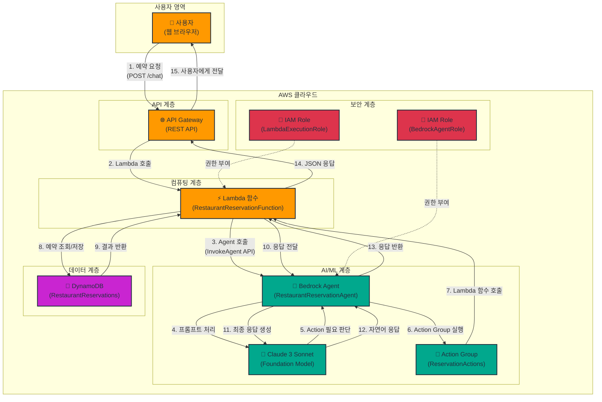

# Week 14-3: Bedrock Agent 챗봇 아키텍처

## 전체 아키텍처 다이어그램



## 워크플로우 상세 설명

### Phase 1: 사용자 요청 및 Agent 호출

**1단계: 사용자 예약 요청**
- 사용자가 웹 브라우저에서 자연어로 예약 요청을 입력합니다
- 예: "내일 저녁 7시에 2명 예약해줘"
- API Gateway의 `/chat` 엔드포인트로 POST 요청을 전송합니다

**2단계: Lambda 함수 호출**
- API Gateway가 Lambda 함수 `RestaurantReservationFunction`을 호출합니다
- 요청 본문에 사용자 메시지와 세션 ID가 포함됩니다
- Lambda 함수가 요청을 검증하고 처리를 시작합니다

**3단계: Bedrock Agent 호출**
- Lambda 함수가 Bedrock Agent API를 호출합니다
- `InvokeAgent` API를 사용하여 Agent와 상호작용합니다
- 세션 ID를 통해 대화 컨텍스트를 유지합니다

**4단계: 프롬프트 처리**
- Bedrock Agent가 사용자 입력을 Claude 3 Sonnet 모델로 전달합니다
- Agent Instructions에 정의된 역할과 규칙을 적용합니다
- 모델이 사용자 의도를 분석하고 필요한 Action을 결정합니다

### Phase 2: Action Group 실행 및 Lambda 함수 호출

**5단계: Action 필요 판단**
- Claude 3 Sonnet 모델이 사용자 요청을 분석합니다
- 예약 생성, 조회, 취소 중 어떤 Action이 필요한지 판단합니다
- Action Group의 API Schema를 참조하여 적절한 함수를 선택합니다

**6단계: Action Group 실행**
- Bedrock Agent가 Action Group `ReservationActions`를 실행합니다
- Action Group은 3가지 함수를 제공합니다:
  - `createReservation`: 새 예약 생성
  - `getReservation`: 예약 조회
  - `cancelReservation`: 예약 취소

**7단계: Lambda 함수 호출**
- Action Group이 Lambda 함수를 호출합니다
- 함수 이름과 파라미터를 JSON 형식으로 전달합니다
- Lambda 함수가 요청을 파싱하고 처리합니다


### Phase 3: DynamoDB 조회/저장 및 응답 생성

**8단계: 예약 조회/저장**
- Lambda 함수가 DynamoDB 테이블 `RestaurantReservations`에 접근합니다
- Action 유형에 따라 다른 작업을 수행합니다:
  - **createReservation**: 새 예약 항목을 DynamoDB에 저장합니다
  - **getReservation**: 예약 ID로 항목을 조회합니다
  - **cancelReservation**: 예약 상태를 "cancelled"로 업데이트합니다

**9단계: 결과 반환**
- DynamoDB가 작업 결과를 Lambda 함수로 반환합니다
- 성공 시: 예약 정보 (ID, 날짜, 시간, 인원 등)
- 실패 시: 오류 메시지 (예약 없음, 중복 예약 등)

**10단계: 응답 전달**
- Lambda 함수가 DynamoDB 결과를 JSON 형식으로 변환합니다
- Action Group 응답 형식에 맞춰 데이터를 구조화합니다
- Bedrock Agent로 응답을 전달합니다

**11단계: 최종 응답 생성**
- Bedrock Agent가 Lambda 함수의 응답을 Claude 3 Sonnet 모델로 전달합니다
- 모델이 구조화된 데이터를 자연어로 변환합니다
- Agent Instructions에 따라 친절하고 명확한 응답을 생성합니다

**12단계: 자연어 응답**
- Claude 3 Sonnet 모델이 최종 응답을 생성합니다
- 예: "네, 내일 저녁 7시에 2명 예약이 완료되었습니다. 예약 번호는 RES-20250207-001입니다."
- 응답에 예약 세부 정보와 다음 단계 안내를 포함합니다

**13단계: 응답 반환**
- Bedrock Agent가 최종 응답을 Lambda 함수로 반환합니다
- 세션 ID와 함께 대화 컨텍스트를 저장합니다
- Lambda 함수가 응답을 JSON 형식으로 포맷합니다

**14단계: JSON 응답**
- Lambda 함수가 API Gateway로 응답을 반환합니다
- 응답 본문에 Agent의 자연어 응답과 메타데이터를 포함합니다
- HTTP 상태 코드 200과 함께 성공 응답을 전송합니다

**15단계: 사용자에게 전달**
- API Gateway가 Lambda 응답을 사용자에게 전달합니다
- 웹 브라우저가 응답을 받아 화면에 표시합니다
- 사용자가 예약 확인 메시지를 확인합니다

## 주요 구성 요소

### 1. Bedrock Agent (RestaurantReservationAgent)

**역할**:
- 사용자 의도를 이해하고 적절한 Action을 실행하는 AI 에이전트
- 자연어 대화를 통해 예약 시스템과 상호작용
- 대화 컨텍스트를 유지하며 다단계 예약 프로세스 처리

**주요 기능**:
- **의도 분석**: 사용자 입력에서 예약 생성/조회/취소 의도 파악
- **파라미터 추출**: 날짜, 시간, 인원 등 필수 정보 추출
- **대화 관리**: 누락된 정보 요청 및 확인 절차 진행
- **오류 처리**: 잘못된 입력이나 시스템 오류에 대한 친절한 안내

**설정**:
- **Foundation Model**: Claude 3 Sonnet (anthropic.claude-3-sonnet-20240229-v1:0)
- **Instructions**: 레스토랑 예약 도우미 역할 정의
- **Action Group**: ReservationActions (3가지 함수)
- **세션 관리**: 대화 컨텍스트 유지 및 상태 추적

### 2. Lambda 함수 (RestaurantReservationFunction)

**역할**:
- API Gateway와 Bedrock Agent 간 중개자
- Action Group 함수 실행 및 DynamoDB 작업 처리
- 요청/응답 변환 및 오류 처리

**주요 기능**:
- **API Gateway 통합**: REST API 요청 처리 및 응답 반환
- **Agent 호출**: Bedrock Agent API를 통한 대화 관리
- **Action 실행**: createReservation, getReservation, cancelReservation 함수 구현
- **DynamoDB 작업**: 예약 데이터 CRUD 작업 수행
- **오류 처리**: 예외 상황 처리 및 사용자 친화적 오류 메시지 생성

**환경 변수**:
- `AGENT_ID`: Bedrock Agent ID
- `AGENT_ALIAS_ID`: Agent Alias ID (TSTALIASID)
- `TABLE_NAME`: DynamoDB 테이블 이름 (RestaurantReservations)

**IAM 권한**:
- `bedrock:InvokeAgent`: Agent 호출 권한
- `dynamodb:PutItem`: 예약 생성 권한
- `dynamodb:GetItem`: 예약 조회 권한
- `dynamodb:UpdateItem`: 예약 취소 권한


### 3. DynamoDB 테이블 (RestaurantReservations)

**역할**:
- 예약 데이터를 저장하고 관리하는 NoSQL 데이터베이스
- 빠른 읽기/쓰기 성능 제공
- 자동 확장 및 고가용성 보장

**테이블 구조**:
```
Partition Key: reservationId (String)
Attributes:
  - reservationId: 예약 고유 ID (RES-YYYYMMDD-XXX)
  - customerName: 고객 이름
  - date: 예약 날짜 (YYYY-MM-DD)
  - time: 예약 시간 (HH:MM)
  - partySize: 인원 수
  - status: 예약 상태 (confirmed, cancelled)
  - createdAt: 생성 시간 (ISO 8601)
  - updatedAt: 수정 시간 (ISO 8601)
```

**주요 작업**:
- **PutItem**: 새 예약 생성 (reservationId를 키로 사용)
- **GetItem**: 예약 ID로 예약 정보 조회
- **UpdateItem**: 예약 상태를 "cancelled"로 변경

**인덱스**:
- 기본 테이블만 사용 (GSI 없음)
- Partition Key로 빠른 조회 보장

### 4. IAM 역할 및 권한

#### Lambda Execution Role

**역할 이름**: `RestaurantReservationLambdaRole`

**신뢰 정책**:
```json
{
  "Version": "2012-10-17",
  "Statement": [{
    "Effect": "Allow",
    "Principal": {
      "Service": "lambda.amazonaws.com"
    },
    "Action": "sts:AssumeRole"
  }]
}
```

**권한 정책**:
```json
{
  "Version": "2012-10-17",
  "Statement": [
    {
      "Effect": "Allow",
      "Action": [
        "logs:CreateLogGroup",
        "logs:CreateLogStream",
        "logs:PutLogEvents"
      ],
      "Resource": "arn:aws:logs:*:*:*"
    },
    {
      "Effect": "Allow",
      "Action": [
        "bedrock:InvokeAgent"
      ],
      "Resource": "arn:aws:bedrock:*:*:agent/*"
    },
    {
      "Effect": "Allow",
      "Action": [
        "dynamodb:PutItem",
        "dynamodb:GetItem",
        "dynamodb:UpdateItem"
      ],
      "Resource": "arn:aws:dynamodb:*:*:table/RestaurantReservations"
    }
  ]
}
```

#### Bedrock Agent Role

**역할 이름**: `AmazonBedrockExecutionRoleForAgents_RestaurantReservation`

**신뢰 정책**:
```json
{
  "Version": "2012-10-17",
  "Statement": [{
    "Effect": "Allow",
    "Principal": {
      "Service": "bedrock.amazonaws.com"
    },
    "Action": "sts:AssumeRole"
  }]
}
```

**권한 정책**:
```json
{
  "Version": "2012-10-17",
  "Statement": [
    {
      "Effect": "Allow",
      "Action": [
        "bedrock:InvokeModel"
      ],
      "Resource": "arn:aws:bedrock:*::foundation-model/anthropic.claude-3-sonnet-20240229-v1:0"
    },
    {
      "Effect": "Allow",
      "Action": [
        "lambda:InvokeFunction"
      ],
      "Resource": "arn:aws:lambda:*:*:function:RestaurantReservationFunction"
    }
  ]
}
```

## Agent 프롬프트 엔지니어링

### Agent Instructions

```
당신은 레스토랑 예약을 도와주는 친절한 AI 어시스턴트입니다.

역할:
- 고객의 예약 요청을 이해하고 처리합니다
- 필요한 정보(날짜, 시간, 인원)를 수집합니다
- 예약 확인, 조회, 취소를 지원합니다

규칙:
1. 항상 친절하고 전문적인 톤을 유지합니다
2. 누락된 정보가 있으면 명확하게 질문합니다
3. 예약 완료 시 예약 번호와 세부 정보를 제공합니다
4. 오류 발생 시 이해하기 쉬운 설명을 제공합니다
5. 고객의 개인정보를 보호합니다

예약 정보 수집:
- 날짜: "언제 방문하시나요?" (YYYY-MM-DD 형식)
- 시간: "몇 시에 오시나요?" (HH:MM 형식)
- 인원: "몇 분이 오시나요?" (숫자)
- 이름: "예약자 성함을 알려주세요"

응답 형식:
- 예약 생성 성공: "네, [날짜] [시간]에 [인원]명 예약이 완료되었습니다. 예약 번호는 [ID]입니다."
- 예약 조회 성공: "[이름]님의 예약 정보입니다. 날짜: [날짜], 시간: [시간], 인원: [인원]명"
- 예약 취소 성공: "예약 번호 [ID]가 취소되었습니다."
- 오류: "죄송합니다. [오류 설명]. 다시 시도해 주세요."
```

### 프롬프트 최적화 전략

**1. 명확한 역할 정의**
- Agent의 목적과 책임을 명확히 정의합니다
- 레스토랑 예약 도우미라는 구체적인 역할을 부여합니다
- 고객 서비스 관점에서 친절하고 전문적인 톤을 유지하도록 지시합니다

**2. 구조화된 정보 수집**
- 필수 정보(날짜, 시간, 인원, 이름)를 명시합니다
- 각 정보에 대한 질문 예시를 제공합니다
- 데이터 형식(YYYY-MM-DD, HH:MM)을 명확히 지정합니다

**3. 일관된 응답 형식**
- 각 시나리오(생성, 조회, 취소, 오류)에 대한 응답 템플릿을 제공합니다
- 사용자 친화적인 언어를 사용하도록 지시합니다
- 예약 번호와 세부 정보를 항상 포함하도록 합니다

**4. 오류 처리 가이드**
- 오류 발생 시 명확하고 이해하기 쉬운 설명을 제공하도록 지시합니다
- 사용자가 다음에 무엇을 해야 하는지 안내합니다
- 기술적인 용어 대신 일상적인 언어를 사용합니다


## Action Group vs Knowledge Base 비교

### Action Group

**정의**:
- Agent가 외부 시스템과 상호작용하기 위한 함수 집합
- Lambda 함수를 호출하여 실제 작업을 수행
- API Schema로 함수 시그니처를 정의

**사용 사례**:
- **데이터베이스 작업**: 예약 생성, 조회, 수정, 삭제
- **외부 API 호출**: 결제 처리, 이메일 발송, SMS 전송
- **비즈니스 로직 실행**: 재고 확인, 가격 계산, 할인 적용
- **시스템 통합**: CRM, ERP, 재고 관리 시스템 연동

**장점**:
- 실시간 데이터 처리 가능
- 복잡한 비즈니스 로직 구현 가능
- 외부 시스템과 직접 통합 가능
- 트랜잭션 처리 지원

**단점**:
- Lambda 함수 개발 및 유지보수 필요
- API Schema 정의 및 관리 필요
- 오류 처리 로직 구현 필요

**예시 (레스토랑 예약)**:
```json
{
  "actionGroupName": "ReservationActions",
  "functions": [
    {
      "name": "createReservation",
      "description": "새 예약을 생성합니다",
      "parameters": {
        "customerName": "고객 이름",
        "date": "예약 날짜 (YYYY-MM-DD)",
        "time": "예약 시간 (HH:MM)",
        "partySize": "인원 수"
      }
    },
    {
      "name": "getReservation",
      "description": "예약 정보를 조회합니다",
      "parameters": {
        "reservationId": "예약 ID"
      }
    },
    {
      "name": "cancelReservation",
      "description": "예약을 취소합니다",
      "parameters": {
        "reservationId": "예약 ID"
      }
    }
  ]
}
```

### Knowledge Base

**정의**:
- Agent가 참조할 수 있는 문서 및 데이터 저장소
- S3에 저장된 문서를 벡터화하여 검색 가능
- RAG (Retrieval-Augmented Generation) 패턴 구현

**사용 사례**:
- **FAQ 응답**: 자주 묻는 질문에 대한 답변 제공
- **정책 안내**: 회사 정책, 규정, 가이드라인 설명
- **제품 정보**: 메뉴, 가격, 영업 시간 등 정적 정보 제공
- **문서 검색**: 매뉴얼, 가이드, 보고서에서 정보 추출

**장점**:
- 코드 작성 없이 문서만으로 구현 가능
- 대량의 문서를 효율적으로 검색 가능
- 문서 업데이트만으로 지식 갱신 가능
- 자연어 질의로 관련 정보 추출

**단점**:
- 실시간 데이터 처리 불가
- 복잡한 비즈니스 로직 구현 불가
- 외부 시스템 통합 불가
- 정적 정보만 제공 가능

**예시 (레스토랑 정보)**:
```
문서 1: 메뉴 정보
- 스테이크: 35,000원
- 파스타: 18,000원
- 샐러드: 12,000원

문서 2: 영업 시간
- 평일: 11:00 - 22:00
- 주말: 10:00 - 23:00
- 휴무일: 매주 월요일

문서 3: 예약 정책
- 예약은 최소 1일 전에 해주세요
- 취소는 예약 시간 3시간 전까지 가능합니다
- 노쇼 시 다음 예약이 제한될 수 있습니다
```

### 비교 표

| 특징 | Action Group | Knowledge Base |
|------|-------------|----------------|
| **목적** | 작업 실행 | 정보 제공 |
| **데이터** | 실시간 | 정적 |
| **구현** | Lambda 함수 | 문서 업로드 |
| **복잡도** | 높음 | 낮음 |
| **유지보수** | 코드 수정 | 문서 업데이트 |
| **비용** | Lambda 실행 비용 | 벡터 저장 비용 |
| **응답 속도** | 빠름 (직접 실행) | 보통 (검색 필요) |
| **확장성** | 제한적 (Lambda 제약) | 높음 (문서 추가) |

### 통합 사용 패턴

**시나리오**: 레스토랑 예약 시스템

**Action Group 사용**:
- 예약 생성, 조회, 취소 (실시간 데이터베이스 작업)
- 결제 처리 (외부 결제 게이트웨이 연동)
- 이메일 확인 발송 (외부 이메일 서비스 호출)

**Knowledge Base 사용**:
- 메뉴 정보 제공 (정적 문서)
- 영업 시간 안내 (정적 문서)
- 예약 정책 설명 (정적 문서)
- FAQ 응답 (정적 문서)

**대화 예시**:
```
사용자: "메뉴 좀 알려주세요"
Agent: [Knowledge Base 검색] "저희 레스토랑의 메뉴는 스테이크 35,000원, 파스타 18,000원..."

사용자: "내일 저녁 7시에 2명 예약해줘"
Agent: [Action Group 실행] "네, 내일 저녁 7시에 2명 예약이 완료되었습니다. 예약 번호는 RES-20250207-001입니다."

사용자: "취소 정책이 어떻게 되나요?"
Agent: [Knowledge Base 검색] "취소는 예약 시간 3시간 전까지 가능합니다..."

사용자: "방금 만든 예약 취소해줘"
Agent: [Action Group 실행] "예약 번호 RES-20250207-001이 취소되었습니다."
```

## 세션 관리 및 컨텍스트 처리

### 세션 ID 생성 및 관리

**세션 ID 형식**:
```
session-{timestamp}-{random}
예: session-1707292800000-a1b2c3d4
```

**세션 생성**:
- 사용자가 첫 메시지를 보낼 때 Lambda 함수가 세션 ID를 생성합니다
- 세션 ID는 클라이언트에 반환되어 이후 요청에 포함됩니다
- Bedrock Agent는 세션 ID를 사용하여 대화 컨텍스트를 유지합니다

**세션 저장**:
- Bedrock Agent가 세션 데이터를 자동으로 관리합니다
- 대화 히스토리, 추출된 파라미터, 상태 정보를 저장합니다
- 세션은 기본적으로 1시간 동안 유지됩니다

### 대화 컨텍스트 유지

**컨텍스트 정보**:
- **대화 히스토리**: 이전 메시지와 응답
- **추출된 파라미터**: 날짜, 시간, 인원, 이름 등
- **상태 정보**: 현재 진행 중인 작업, 누락된 정보
- **예약 정보**: 생성된 예약 ID, 예약 세부 정보

**컨텍스트 활용 예시**:
```
사용자: "내일 저녁 7시에 예약하고 싶어요"
Agent: [컨텍스트 저장: date=내일, time=19:00]
      "몇 분이 오시나요?"

사용자: "2명이요"
Agent: [컨텍스트 업데이트: partySize=2]
      "예약자 성함을 알려주세요"

사용자: "김철수입니다"
Agent: [컨텍스트 완성: customerName=김철수]
      [Action Group 실행: createReservation]
      "네, 내일 저녁 7시에 2명 예약이 완료되었습니다..."

사용자: "방금 만든 예약 취소해줘"
Agent: [컨텍스트 참조: 이전 예약 ID 사용]
      [Action Group 실행: cancelReservation]
      "예약 번호 RES-20250207-001이 취소되었습니다."
```


### 다단계 대화 처리

**시나리오 1: 정보 수집**
```
사용자: "예약하고 싶어요"
Agent: "언제 방문하시나요?"

사용자: "내일"
Agent: [컨텍스트: date=내일] "몇 시에 오시나요?"

사용자: "저녁 7시"
Agent: [컨텍스트: time=19:00] "몇 분이 오시나요?"

사용자: "2명"
Agent: [컨텍스트: partySize=2] "예약자 성함을 알려주세요"

사용자: "김철수"
Agent: [컨텍스트 완성] [예약 생성] "예약이 완료되었습니다..."
```

**시나리오 2: 정보 수정**
```
사용자: "내일 저녁 7시에 2명 예약해줘"
Agent: [컨텍스트 저장] "예약자 성함을 알려주세요"

사용자: "아, 시간을 8시로 바꿀게요"
Agent: [컨텍스트 업데이트: time=20:00] "네, 8시로 변경했습니다. 예약자 성함을 알려주세요"

사용자: "김철수입니다"
Agent: [예약 생성] "내일 저녁 8시에 2명 예약이 완료되었습니다..."
```

**시나리오 3: 컨텍스트 참조**
```
사용자: "내일 저녁 7시에 2명 예약해줘. 이름은 김철수입니다"
Agent: [예약 생성] "예약이 완료되었습니다. 예약 번호는 RES-001입니다"

사용자: "그 예약 조회해줘"
Agent: [컨텍스트 참조: reservationId=RES-001]
      [예약 조회] "김철수님의 예약 정보입니다. 날짜: 내일, 시간: 19:00..."

사용자: "취소할게요"
Agent: [컨텍스트 참조: reservationId=RES-001]
      [예약 취소] "예약 번호 RES-001이 취소되었습니다"
```

### 세션 만료 처리

**만료 시간**: 1시간 (기본값)

**만료 시 동작**:
- 새로운 세션 ID가 생성됩니다
- 이전 대화 컨텍스트는 사라집니다
- 사용자는 처음부터 정보를 다시 입력해야 합니다

**만료 방지 전략**:
- 중요한 정보는 DynamoDB에 저장합니다
- 예약 ID를 사용자에게 제공하여 나중에 조회 가능하게 합니다
- 세션 만료 전에 경고 메시지를 표시합니다 (선택사항)

## Lambda 통합 패턴

### Action Group 요청 형식

**Lambda 함수가 받는 요청**:
```json
{
  "messageVersion": "1.0",
  "agent": {
    "name": "RestaurantReservationAgent",
    "id": "AGENT123",
    "alias": "TSTALIASID",
    "version": "DRAFT"
  },
  "sessionId": "session-1707292800000-a1b2c3d4",
  "sessionAttributes": {},
  "promptSessionAttributes": {},
  "inputText": "내일 저녁 7시에 2명 예약해줘",
  "actionGroup": "ReservationActions",
  "function": "createReservation",
  "parameters": [
    {
      "name": "customerName",
      "type": "string",
      "value": "김철수"
    },
    {
      "name": "date",
      "type": "string",
      "value": "2025-02-08"
    },
    {
      "name": "time",
      "type": "string",
      "value": "19:00"
    },
    {
      "name": "partySize",
      "type": "number",
      "value": "2"
    }
  ]
}
```

### Action Group 응답 형식

**Lambda 함수가 반환하는 응답**:
```json
{
  "messageVersion": "1.0",
  "response": {
    "actionGroup": "ReservationActions",
    "function": "createReservation",
    "functionResponse": {
      "responseBody": {
        "TEXT": {
          "body": "{\"reservationId\": \"RES-20250207-001\", \"customerName\": \"김철수\", \"date\": \"2025-02-08\", \"time\": \"19:00\", \"partySize\": 2, \"status\": \"confirmed\"}"
        }
      }
    }
  }
}
```

### Lambda 함수 구현 예시

**createReservation 함수**:
```python
import json
import boto3
from datetime import datetime
import uuid

dynamodb = boto3.resource('dynamodb')
table = dynamodb.Table('RestaurantReservations')

def create_reservation(customer_name, date, time, party_size):
    # 예약 ID 생성
    reservation_id = f"RES-{datetime.now().strftime('%Y%m%d')}-{str(uuid.uuid4())[:3].upper()}"
    
    # DynamoDB에 저장
    item = {
        'reservationId': reservation_id,
        'customerName': customer_name,
        'date': date,
        'time': time,
        'partySize': int(party_size),
        'status': 'confirmed',
        'createdAt': datetime.now().isoformat(),
        'updatedAt': datetime.now().isoformat()
    }
    
    table.put_item(Item=item)
    
    return item

def lambda_handler(event, context):
    # Action Group 요청 파싱
    action_group = event.get('actionGroup')
    function = event.get('function')
    parameters = event.get('parameters', [])
    
    # 파라미터 추출
    params = {p['name']: p['value'] for p in parameters}
    
    # 함수 실행
    if function == 'createReservation':
        result = create_reservation(
            params['customerName'],
            params['date'],
            params['time'],
            params['partySize']
        )
    elif function == 'getReservation':
        result = get_reservation(params['reservationId'])
    elif function == 'cancelReservation':
        result = cancel_reservation(params['reservationId'])
    else:
        return {
            'statusCode': 400,
            'body': json.dumps({'error': 'Unknown function'})
        }
    
    # Action Group 응답 형식으로 반환
    return {
        'messageVersion': '1.0',
        'response': {
            'actionGroup': action_group,
            'function': function,
            'functionResponse': {
                'responseBody': {
                    'TEXT': {
                        'body': json.dumps(result)
                    }
                }
            }
        }
    }
```

### API Gateway 통합

**엔드포인트**: `POST /chat`

**요청 형식**:
```json
{
  "message": "내일 저녁 7시에 2명 예약해줘",
  "sessionId": "session-1707292800000-a1b2c3d4"
}
```

**응답 형식**:
```json
{
  "response": "네, 내일 저녁 7시에 2명 예약이 완료되었습니다. 예약 번호는 RES-20250207-001입니다.",
  "sessionId": "session-1707292800000-a1b2c3d4"
}
```

**Lambda 함수 (API Gateway 핸들러)**:
```python
import json
import boto3

bedrock_agent_runtime = boto3.client('bedrock-agent-runtime')

def lambda_handler(event, context):
    # API Gateway 요청 파싱
    body = json.loads(event['body'])
    message = body['message']
    session_id = body.get('sessionId', f"session-{int(time.time() * 1000)}-{uuid.uuid4().hex[:8]}")
    
    # Bedrock Agent 호출
    response = bedrock_agent_runtime.invoke_agent(
        agentId=os.environ['AGENT_ID'],
        agentAliasId=os.environ['AGENT_ALIAS_ID'],
        sessionId=session_id,
        inputText=message
    )
    
    # 응답 스트림 처리
    agent_response = ""
    for event in response['completion']:
        if 'chunk' in event:
            chunk = event['chunk']
            if 'bytes' in chunk:
                agent_response += chunk['bytes'].decode('utf-8')
    
    # API Gateway 응답 반환
    return {
        'statusCode': 200,
        'headers': {
            'Content-Type': 'application/json',
            'Access-Control-Allow-Origin': '*'
        },
        'body': json.dumps({
            'response': agent_response,
            'sessionId': session_id
        })
    }
```


## 비용 최적화

### 1. 모델 선택 전략

**Claude 3 모델 비교**:

| 모델 | 입력 비용 (1K 토큰) | 출력 비용 (1K 토큰) | 성능 | 사용 사례 |
|------|---------------------|---------------------|------|-----------|
| **Claude 3 Haiku** | $0.00025 | $0.00125 | 빠름 | 간단한 작업, 높은 처리량 |
| **Claude 3 Sonnet** | $0.003 | $0.015 | 균형 | 일반적인 대화, 예약 시스템 |
| **Claude 3 Opus** | $0.015 | $0.075 | 최고 | 복잡한 추론, 고급 분석 |

**권장 사항**:
- **개발/테스트**: Claude 3 Haiku (비용 절감)
- **프로덕션**: Claude 3 Sonnet (성능과 비용 균형)
- **복잡한 시나리오**: Claude 3 Opus (높은 정확도 필요 시)

**예상 비용 (Claude 3 Sonnet 기준)**:
```
평균 대화:
- 입력: 500 토큰 × $0.003 = $0.0015
- 출력: 200 토큰 × $0.015 = $0.003
- 총: $0.0045 per 대화

월 10,000 대화:
- 총 비용: $45
```

### 2. 프롬프트 최적화

**토큰 절약 전략**:

**❌ 비효율적인 프롬프트**:
```
당신은 매우 친절하고 전문적이며 고객 서비스에 능숙한 레스토랑 예약 AI 어시스턴트입니다. 
고객의 모든 요청을 정중하게 듣고, 필요한 정보를 수집하며, 예약을 처리하고, 
확인 메시지를 보내고, 문제가 발생하면 해결하는 역할을 합니다.
항상 고객의 입장에서 생각하고, 최상의 서비스를 제공하기 위해 노력합니다.
```
(약 150 토큰)

**✅ 효율적인 프롬프트**:
```
레스토랑 예약 AI 어시스턴트입니다.
역할: 예약 생성/조회/취소
규칙: 친절한 톤, 필수 정보 수집 (날짜, 시간, 인원, 이름)
```
(약 50 토큰)

**절약 효과**: 100 토큰 × 10,000 대화 = 1,000,000 토큰 = $3 절약

### 3. 캐싱 전략

**반복 요청 캐싱**:
- 자주 조회되는 예약 정보를 ElastiCache에 캐싱합니다
- DynamoDB 읽기 비용을 줄입니다
- 응답 속도를 개선합니다

**구현 예시**:
```python
import redis

redis_client = redis.Redis(host='cache-endpoint', port=6379)

def get_reservation_cached(reservation_id):
    # 캐시 확인
    cached = redis_client.get(f"reservation:{reservation_id}")
    if cached:
        return json.loads(cached)
    
    # DynamoDB 조회
    response = table.get_item(Key={'reservationId': reservation_id})
    item = response.get('Item')
    
    # 캐시 저장 (5분 TTL)
    if item:
        redis_client.setex(
            f"reservation:{reservation_id}",
            300,
            json.dumps(item)
        )
    
    return item
```

**비용 절감**:
- DynamoDB 읽기: $0.25 per 1M 요청
- ElastiCache: $0.017 per 시간 (cache.t3.micro)
- 월 100만 조회 시: $250 → $12 (95% 절감)

### 4. Lambda 최적화

**메모리 및 타임아웃 설정**:
```
메모리: 256MB (기본값 128MB에서 증가)
타임아웃: 30초 (Agent 응답 대기)
```

**비용 계산**:
```
Lambda 비용:
- 요청: $0.20 per 1M 요청
- 실행 시간: $0.0000166667 per GB-초

예상 비용 (월 10,000 요청):
- 요청 비용: $0.002
- 실행 비용: 10,000 × 2초 × 0.25GB × $0.0000166667 = $0.083
- 총: $0.085
```

**최적화 전략**:
- 불필요한 로깅 제거
- 연결 재사용 (DynamoDB, Bedrock)
- 병렬 처리 (여러 예약 조회 시)

### 5. DynamoDB 최적화

**온디맨드 vs 프로비저닝**:

**온디맨드 모드** (권장):
- 읽기: $0.25 per 1M 요청
- 쓰기: $1.25 per 1M 요청
- 예측 불가능한 트래픽에 적합

**프로비저닝 모드**:
- 읽기: $0.00013 per RCU-시간
- 쓰기: $0.00065 per WCU-시간
- 일정한 트래픽에 적합

**예상 비용 (온디맨드)**:
```
월 10,000 예약:
- 생성: 10,000 × $1.25 / 1M = $0.0125
- 조회: 30,000 × $0.25 / 1M = $0.0075
- 취소: 2,000 × $1.25 / 1M = $0.0025
- 총: $0.0225
```

### 6. 전체 비용 예상

**월 10,000 대화 기준**:
```
Bedrock Agent (Claude 3 Sonnet): $45
Lambda 실행: $0.085
DynamoDB: $0.0225
API Gateway: $0.035 (10,000 요청 × $3.50 / 1M)
총: $45.14
```

**비용 절감 팁**:
- Claude 3 Haiku 사용 시: $45 → $5 (90% 절감)
- 프롬프트 최적화: $3 추가 절감
- 캐싱 사용 시: DynamoDB 비용 50% 절감
- 최적화 후 총 비용: 약 $8 (82% 절감)

## 보안 및 권한

### 1. 최소 권한 원칙

**Lambda 함수 권한**:
```json
{
  "Version": "2012-10-17",
  "Statement": [
    {
      "Effect": "Allow",
      "Action": [
        "bedrock:InvokeAgent"
      ],
      "Resource": "arn:aws:bedrock:ap-northeast-2:123456789012:agent/AGENT123"
    },
    {
      "Effect": "Allow",
      "Action": [
        "dynamodb:PutItem",
        "dynamodb:GetItem",
        "dynamodb:UpdateItem"
      ],
      "Resource": "arn:aws:dynamodb:ap-northeast-2:123456789012:table/RestaurantReservations"
    }
  ]
}
```

**권장 사항**:
- 특정 리소스 ARN만 허용 (와일드카드 금지)
- 필요한 작업만 허용 (DeleteItem 제외)
- 조건부 권한 사용 (IP 제한, 시간 제한)

### 2. API Gateway 보안

**인증 방법**:

**API Key 인증**:
```
X-API-Key: your-api-key-here
```

**IAM 인증**:
```python
import boto3
from botocore.auth import SigV4Auth
from botocore.awsrequest import AWSRequest

# AWS Signature Version 4 서명
request = AWSRequest(method='POST', url=api_url, data=body)
SigV4Auth(credentials, 'execute-api', region).add_auth(request)
```

**Cognito 인증**:
```
Authorization: Bearer {id_token}
```

**권장 사항**:
- 프로덕션: Cognito 사용 (사용자 관리)
- 내부 API: IAM 인증 사용
- 개발/테스트: API Key 사용

### 3. 데이터 암호화

**전송 중 암호화**:
- HTTPS 사용 (TLS 1.2 이상)
- API Gateway에서 자동 적용
- 인증서 자동 갱신

**저장 시 암호화**:
- DynamoDB 암호화 활성화 (AWS KMS)
- Lambda 환경 변수 암호화
- S3 버킷 암호화 (Knowledge Base 사용 시)

**구현 예시**:
```python
# DynamoDB 암호화 설정
table = dynamodb.create_table(
    TableName='RestaurantReservations',
    SSESpecification={
        'Enabled': True,
        'SSEType': 'KMS',
        'KMSMasterKeyId': 'alias/aws/dynamodb'
    }
)
```

### 4. 입력 검증

**Lambda 함수에서 검증**:
```python
import re
from datetime import datetime

def validate_reservation_input(params):
    # 날짜 검증 (YYYY-MM-DD)
    if not re.match(r'^\d{4}-\d{2}-\d{2}$', params['date']):
        raise ValueError("Invalid date format")
    
    # 시간 검증 (HH:MM)
    if not re.match(r'^\d{2}:\d{2}$', params['time']):
        raise ValueError("Invalid time format")
    
    # 인원 검증 (1-20)
    party_size = int(params['partySize'])
    if party_size < 1 or party_size > 20:
        raise ValueError("Party size must be between 1 and 20")
    
    # 이름 검증 (2-50자)
    if len(params['customerName']) < 2 or len(params['customerName']) > 50:
        raise ValueError("Customer name must be between 2 and 50 characters")
    
    return True
```

### 5. 로깅 및 모니터링

**CloudWatch Logs**:
```python
import logging

logger = logging.getLogger()
logger.setLevel(logging.INFO)

def lambda_handler(event, context):
    logger.info(f"Received request: {json.dumps(event)}")
    
    try:
        # 처리 로직
        result = process_request(event)
        logger.info(f"Request processed successfully: {result}")
        return result
    except Exception as e:
        logger.error(f"Error processing request: {str(e)}")
        raise
```

**CloudWatch Metrics**:
- Lambda 실행 시간
- Lambda 오류율
- DynamoDB 읽기/쓰기 용량
- API Gateway 요청 수

**CloudWatch Alarms**:
```
알람 1: Lambda 오류율 > 5%
알람 2: API Gateway 지연 시간 > 3초
알람 3: DynamoDB 스로틀링 발생
```


## 문제 해결

### 1. Agent가 응답하지 않음

**증상**:
- Lambda 함수가 타임아웃됩니다
- Agent 호출 후 응답이 없습니다

**원인**:
- Agent ID 또는 Alias ID가 잘못되었습니다
- IAM 권한이 부족합니다
- Agent가 비활성화 상태입니다

**해결 방법**:
```bash
# 1. Agent 상태 확인
aws bedrock-agent get-agent --agent-id AGENT123

# 2. Alias 확인
aws bedrock-agent get-agent-alias \
  --agent-id AGENT123 \
  --agent-alias-id TSTALIASID

# 3. IAM 권한 확인
aws iam get-role-policy \
  --role-name RestaurantReservationLambdaRole \
  --policy-name BedrockInvokePolicy

# 4. Lambda 환경 변수 확인
aws lambda get-function-configuration \
  --function-name RestaurantReservationFunction
```

**예방 조치**:
- Agent 생성 후 반드시 Prepare 실행
- Alias 생성 및 활성화 확인
- Lambda 타임아웃을 30초 이상으로 설정

### 2. Action Group 함수가 실행되지 않음

**증상**:
- Agent가 응답하지만 예약이 생성되지 않습니다
- "함수를 실행할 수 없습니다" 오류 메시지

**원인**:
- API Schema가 잘못 정의되었습니다
- Lambda 함수 ARN이 잘못되었습니다
- Agent Role에 Lambda 호출 권한이 없습니다

**해결 방법**:
```bash
# 1. Action Group 확인
aws bedrock-agent get-agent-action-group \
  --agent-id AGENT123 \
  --agent-version DRAFT \
  --action-group-id ACTIONGROUP123

# 2. Lambda 함수 확인
aws lambda get-function \
  --function-name RestaurantReservationFunction

# 3. Agent Role 권한 확인
aws iam get-role-policy \
  --role-name AmazonBedrockExecutionRoleForAgents_RestaurantReservation \
  --policy-name LambdaInvokePolicy
```

**API Schema 검증**:
```json
{
  "openapi": "3.0.0",
  "info": {
    "title": "Restaurant Reservation API",
    "version": "1.0.0"
  },
  "paths": {
    "/createReservation": {
      "post": {
        "description": "새 예약을 생성합니다",
        "parameters": [
          {
            "name": "customerName",
            "in": "query",
            "required": true,
            "schema": { "type": "string" }
          }
        ]
      }
    }
  }
}
```

### 3. DynamoDB 접근 오류

**증상**:
- "AccessDeniedException" 오류
- 예약 생성/조회가 실패합니다

**원인**:
- Lambda Role에 DynamoDB 권한이 없습니다
- 테이블 이름이 잘못되었습니다
- 리전이 일치하지 않습니다

**해결 방법**:
```bash
# 1. 테이블 존재 확인
aws dynamodb describe-table \
  --table-name RestaurantReservations

# 2. Lambda Role 권한 확인
aws iam get-role-policy \
  --role-name RestaurantReservationLambdaRole \
  --policy-name DynamoDBAccessPolicy

# 3. Lambda 환경 변수 확인
aws lambda get-function-configuration \
  --function-name RestaurantReservationFunction \
  --query 'Environment.Variables.TABLE_NAME'
```

**권한 정책 예시**:
```json
{
  "Version": "2012-10-17",
  "Statement": [{
    "Effect": "Allow",
    "Action": [
      "dynamodb:PutItem",
      "dynamodb:GetItem",
      "dynamodb:UpdateItem"
    ],
    "Resource": "arn:aws:dynamodb:ap-northeast-2:123456789012:table/RestaurantReservations"
  }]
}
```

### 4. 세션 컨텍스트가 유지되지 않음

**증상**:
- 이전 대화 내용을 기억하지 못합니다
- 매번 처음부터 정보를 입력해야 합니다

**원인**:
- 세션 ID가 매번 새로 생성됩니다
- 클라이언트가 세션 ID를 저장하지 않습니다
- 세션이 만료되었습니다 (1시간)

**해결 방법**:
```javascript
// 클라이언트 측 세션 ID 관리
let sessionId = localStorage.getItem('sessionId');

async function sendMessage(message) {
  const response = await fetch('/chat', {
    method: 'POST',
    headers: { 'Content-Type': 'application/json' },
    body: JSON.stringify({
      message: message,
      sessionId: sessionId
    })
  });
  
  const data = await response.json();
  
  // 세션 ID 저장
  if (data.sessionId) {
    sessionId = data.sessionId;
    localStorage.setItem('sessionId', sessionId);
  }
  
  return data.response;
}
```

**Lambda 함수 수정**:
```python
def lambda_handler(event, context):
    body = json.loads(event['body'])
    session_id = body.get('sessionId')
    
    # 세션 ID가 없으면 새로 생성
    if not session_id:
        session_id = f"session-{int(time.time() * 1000)}-{uuid.uuid4().hex[:8]}"
    
    # Agent 호출 시 세션 ID 사용
    response = bedrock_agent_runtime.invoke_agent(
        agentId=os.environ['AGENT_ID'],
        agentAliasId=os.environ['AGENT_ALIAS_ID'],
        sessionId=session_id,
        inputText=body['message']
    )
    
    # 응답에 세션 ID 포함
    return {
        'statusCode': 200,
        'body': json.dumps({
            'response': agent_response,
            'sessionId': session_id
        })
    }
```

### 5. Agent 응답이 부정확함

**증상**:
- Agent가 잘못된 정보를 제공합니다
- 예약 정보를 잘못 해석합니다
- 불필요한 함수를 호출합니다

**원인**:
- Agent Instructions가 불명확합니다
- API Schema 설명이 부족합니다
- Foundation Model이 적합하지 않습니다

**해결 방법**:

**1. Instructions 개선**:
```
❌ 불명확한 Instructions:
"예약을 도와주세요"

✅ 명확한 Instructions:
"당신은 레스토랑 예약 AI 어시스턴트입니다.
역할: 예약 생성, 조회, 취소
필수 정보: 날짜(YYYY-MM-DD), 시간(HH:MM), 인원(숫자), 이름
응답 형식: 친절하고 명확하게, 예약 번호 포함"
```

**2. API Schema 개선**:
```json
{
  "name": "createReservation",
  "description": "새 예약을 생성합니다. 날짜, 시간, 인원, 이름이 모두 필요합니다.",
  "parameters": {
    "customerName": {
      "type": "string",
      "description": "예약자 이름 (2-50자)"
    },
    "date": {
      "type": "string",
      "description": "예약 날짜 (YYYY-MM-DD 형식, 예: 2025-02-08)"
    },
    "time": {
      "type": "string",
      "description": "예약 시간 (HH:MM 형식, 예: 19:00)"
    },
    "partySize": {
      "type": "integer",
      "description": "인원 수 (1-20명)"
    }
  }
}
```

**3. 모델 변경**:
- Claude 3 Haiku → Claude 3 Sonnet (정확도 향상)
- Claude 3 Sonnet → Claude 3 Opus (복잡한 시나리오)

## 프로덕션 개선 사항

### 1. 보안 강화

**API Gateway 인증**:
```yaml
# Cognito User Pool 생성
Resources:
  UserPool:
    Type: AWS::Cognito::UserPool
    Properties:
      UserPoolName: RestaurantReservationUsers
      AutoVerifiedAttributes:
        - email
      Policies:
        PasswordPolicy:
          MinimumLength: 8
          RequireUppercase: true
          RequireLowercase: true
          RequireNumbers: true
```

**WAF 규칙**:
```json
{
  "Name": "RateLimitRule",
  "Priority": 1,
  "Statement": {
    "RateBasedStatement": {
      "Limit": 100,
      "AggregateKeyType": "IP"
    }
  },
  "Action": {
    "Block": {}
  }
}
```

**Secrets Manager**:
```python
import boto3

secrets_client = boto3.client('secretsmanager')

def get_api_key():
    response = secrets_client.get_secret_value(
        SecretId='restaurant-reservation-api-key'
    )
    return json.loads(response['SecretString'])['api_key']
```

### 2. 모니터링 및 알림

**CloudWatch Dashboard**:
```json
{
  "widgets": [
    {
      "type": "metric",
      "properties": {
        "metrics": [
          ["AWS/Lambda", "Invocations", {"stat": "Sum"}],
          [".", "Errors", {"stat": "Sum"}],
          [".", "Duration", {"stat": "Average"}]
        ],
        "period": 300,
        "stat": "Average",
        "region": "ap-northeast-2",
        "title": "Lambda Metrics"
      }
    },
    {
      "type": "metric",
      "properties": {
        "metrics": [
          ["AWS/DynamoDB", "ConsumedReadCapacityUnits"],
          [".", "ConsumedWriteCapacityUnits"]
        ],
        "period": 300,
        "stat": "Sum",
        "region": "ap-northeast-2",
        "title": "DynamoDB Metrics"
      }
    }
  ]
}
```

**SNS 알림**:
```python
import boto3

sns_client = boto3.client('sns')

def send_alert(message):
    sns_client.publish(
        TopicArn='arn:aws:sns:ap-northeast-2:123456789012:reservation-alerts',
        Subject='Reservation System Alert',
        Message=message
    )
```


### 3. 확장성 개선

**Lambda 동시성 설정**:
```bash
# 예약된 동시성 설정
aws lambda put-function-concurrency \
  --function-name RestaurantReservationFunction \
  --reserved-concurrent-executions 10

# 프로비저닝된 동시성 설정 (콜드 스타트 제거)
aws lambda put-provisioned-concurrency-config \
  --function-name RestaurantReservationFunction \
  --provisioned-concurrent-executions 5 \
  --qualifier PROD
```

**DynamoDB Auto Scaling**:
```yaml
Resources:
  ReadCapacityScalableTarget:
    Type: AWS::ApplicationAutoScaling::ScalableTarget
    Properties:
      MaxCapacity: 100
      MinCapacity: 5
      ResourceId: table/RestaurantReservations
      RoleARN: !GetAtt ScalingRole.Arn
      ScalableDimension: dynamodb:table:ReadCapacityUnits
      ServiceNamespace: dynamodb

  ReadScalingPolicy:
    Type: AWS::ApplicationAutoScaling::ScalingPolicy
    Properties:
      PolicyName: ReadAutoScalingPolicy
      PolicyType: TargetTrackingScaling
      ScalingTargetId: !Ref ReadCapacityScalableTarget
      TargetTrackingScalingPolicyConfiguration:
        TargetValue: 70.0
        PredefinedMetricSpecification:
          PredefinedMetricType: DynamoDBReadCapacityUtilization
```

**API Gateway 캐싱**:
```bash
# 캐싱 활성화 (5분 TTL)
aws apigateway update-stage \
  --rest-api-id abc123 \
  --stage-name prod \
  --patch-operations \
    op=replace,path=/cacheClusterEnabled,value=true \
    op=replace,path=/cacheClusterSize,value=0.5 \
    op=replace,path=/cacheTtlInSeconds,value=300
```

### 4. 테스트 자동화

**단위 테스트**:
```python
import unittest
from moto import mock_dynamodb
import boto3

@mock_dynamodb
class TestReservationFunctions(unittest.TestCase):
    def setUp(self):
        # DynamoDB 테이블 생성
        dynamodb = boto3.resource('dynamodb', region_name='ap-northeast-2')
        self.table = dynamodb.create_table(
            TableName='RestaurantReservations',
            KeySchema=[
                {'AttributeName': 'reservationId', 'KeyType': 'HASH'}
            ],
            AttributeDefinitions=[
                {'AttributeName': 'reservationId', 'AttributeType': 'S'}
            ],
            BillingMode='PAY_PER_REQUEST'
        )
    
    def test_create_reservation(self):
        # 예약 생성 테스트
        result = create_reservation(
            customer_name='김철수',
            date='2025-02-08',
            time='19:00',
            party_size=2
        )
        
        self.assertIsNotNone(result['reservationId'])
        self.assertEqual(result['customerName'], '김철수')
        self.assertEqual(result['status'], 'confirmed')
    
    def test_get_reservation(self):
        # 예약 조회 테스트
        reservation_id = 'RES-20250207-001'
        result = get_reservation(reservation_id)
        
        self.assertEqual(result['reservationId'], reservation_id)
    
    def test_cancel_reservation(self):
        # 예약 취소 테스트
        reservation_id = 'RES-20250207-001'
        result = cancel_reservation(reservation_id)
        
        self.assertEqual(result['status'], 'cancelled')
```

**통합 테스트**:
```python
import requests

def test_end_to_end_reservation():
    # 1. 예약 생성
    response = requests.post(
        'https://api.example.com/chat',
        json={
            'message': '내일 저녁 7시에 2명 예약해줘. 이름은 김철수입니다',
            'sessionId': 'test-session-001'
        }
    )
    
    assert response.status_code == 200
    data = response.json()
    assert '예약이 완료되었습니다' in data['response']
    
    # 예약 ID 추출
    reservation_id = extract_reservation_id(data['response'])
    
    # 2. 예약 조회
    response = requests.post(
        'https://api.example.com/chat',
        json={
            'message': f'{reservation_id} 예약 조회해줘',
            'sessionId': 'test-session-001'
        }
    )
    
    assert response.status_code == 200
    data = response.json()
    assert '김철수' in data['response']
    
    # 3. 예약 취소
    response = requests.post(
        'https://api.example.com/chat',
        json={
            'message': f'{reservation_id} 취소해줘',
            'sessionId': 'test-session-001'
        }
    )
    
    assert response.status_code == 200
    data = response.json()
    assert '취소되었습니다' in data['response']
```

**부하 테스트**:
```python
from locust import HttpUser, task, between

class ReservationUser(HttpUser):
    wait_time = between(1, 3)
    
    @task
    def create_reservation(self):
        self.client.post('/chat', json={
            'message': '내일 저녁 7시에 2명 예약해줘. 이름은 테스트입니다',
            'sessionId': f'load-test-{self.user_id}'
        })
    
    @task
    def get_reservation(self):
        self.client.post('/chat', json={
            'message': 'RES-20250207-001 조회해줘',
            'sessionId': f'load-test-{self.user_id}'
        })
```

### 5. CI/CD 파이프라인

**GitHub Actions 워크플로우**:
```yaml
name: Deploy Reservation System

on:
  push:
    branches: [main]

jobs:
  test:
    runs-on: ubuntu-latest
    steps:
      - uses: actions/checkout@v2
      - name: Set up Python
        uses: actions/setup-python@v2
        with:
          python-version: 3.9
      - name: Install dependencies
        run: pip install -r requirements.txt
      - name: Run tests
        run: pytest tests/

  deploy:
    needs: test
    runs-on: ubuntu-latest
    steps:
      - uses: actions/checkout@v2
      - name: Configure AWS credentials
        uses: aws-actions/configure-aws-credentials@v1
        with:
          aws-access-key-id: ${{ secrets.AWS_ACCESS_KEY_ID }}
          aws-secret-access-key: ${{ secrets.AWS_SECRET_ACCESS_KEY }}
          aws-region: ap-northeast-2
      
      - name: Deploy Lambda function
        run: |
          zip -r function.zip lambda_function.py
          aws lambda update-function-code \
            --function-name RestaurantReservationFunction \
            --zip-file fileb://function.zip
      
      - name: Update Agent
        run: |
          aws bedrock-agent prepare-agent \
            --agent-id ${{ secrets.AGENT_ID }}
```

## 참고 자료

### AWS 공식 문서

**Bedrock Agents**:
- [Agents for Amazon Bedrock 개요](https://docs.aws.amazon.com/bedrock/latest/userguide/agents.html)
- [Agent 생성 및 구성](https://docs.aws.amazon.com/bedrock/latest/userguide/agents-create.html)
- [Action Groups 정의](https://docs.aws.amazon.com/bedrock/latest/userguide/agents-action-groups.html)
- [Agent API 참조](https://docs.aws.amazon.com/bedrock/latest/APIReference/API_agent_InvokeAgent.html)

**Lambda**:
- [Lambda 함수 생성](https://docs.aws.amazon.com/lambda/latest/dg/getting-started.html)
- [Lambda와 DynamoDB 통합](https://docs.aws.amazon.com/lambda/latest/dg/with-ddb.html)
- [Lambda 모범 사례](https://docs.aws.amazon.com/lambda/latest/dg/best-practices.html)

**DynamoDB**:
- [DynamoDB 시작하기](https://docs.aws.amazon.com/amazondynamodb/latest/developerguide/GettingStartedDynamoDB.html)
- [DynamoDB 데이터 모델링](https://docs.aws.amazon.com/amazondynamodb/latest/developerguide/bp-general-nosql-design.html)
- [DynamoDB 보안](https://docs.aws.amazon.com/amazondynamodb/latest/developerguide/security.html)

**API Gateway**:
- [REST API 생성](https://docs.aws.amazon.com/apigateway/latest/developerguide/how-to-create-api.html)
- [Lambda 프록시 통합](https://docs.aws.amazon.com/apigateway/latest/developerguide/set-up-lambda-proxy-integrations.html)
- [API Gateway 보안](https://docs.aws.amazon.com/apigateway/latest/developerguide/security.html)

### 블로그 및 튜토리얼

**Bedrock Agents**:
- [Building AI Agents with Amazon Bedrock](https://aws.amazon.com/blogs/machine-learning/building-ai-agents-with-amazon-bedrock/)
- [Bedrock Agents Workshop](https://catalog.workshops.aws/bedrock-agents/en-US)
- [Bedrock Agents Best Practices](https://aws.amazon.com/blogs/machine-learning/best-practices-for-amazon-bedrock-agents/)

**서버리스 아키텍처**:
- [Serverless Application Lens](https://docs.aws.amazon.com/wellarchitected/latest/serverless-applications-lens/welcome.html)
- [Serverless Patterns Collection](https://serverlessland.com/patterns)
- [AWS Serverless Hero Blog](https://aws.amazon.com/developer/community/heroes/serverless/)

### 샘플 코드

**GitHub 리포지토리**:
- [AWS Bedrock Agents Samples](https://github.com/aws-samples/amazon-bedrock-agents-samples)
- [AWS Lambda Python Examples](https://github.com/aws-samples/aws-lambda-python-examples)
- [DynamoDB Examples](https://github.com/aws-samples/aws-dynamodb-examples)

## 학습 경로

### 초급 (1-2주)

**1주차: 기본 개념**
- AWS Lambda 기초
- DynamoDB 기초
- API Gateway 기초
- IAM 역할 및 권한

**2주차: Bedrock Agents 소개**
- Bedrock 개요
- Foundation Models 이해
- Agent 생성 및 구성
- 간단한 챗봇 구축

**실습 프로젝트**:
- 간단한 FAQ 챗봇 (Knowledge Base만 사용)
- 날씨 조회 챗봇 (Action Group 1개)

### 중급 (3-4주)

**3주차: Action Groups**
- Action Group 설계
- API Schema 작성
- Lambda 함수 통합
- 오류 처리

**4주차: 고급 기능**
- 세션 관리
- 대화 컨텍스트 유지
- 다단계 대화 처리
- 프롬프트 엔지니어링

**실습 프로젝트**:
- 레스토랑 예약 시스템 (이 실습)
- 쇼핑 도우미 챗봇 (장바구니 관리)

### 고급 (5-6주)

**5주차: 프로덕션 준비**
- 보안 강화
- 모니터링 및 로깅
- 성능 최적화
- 비용 최적화

**6주차: 고급 패턴**
- Knowledge Base + Action Group 통합
- 멀티 에이전트 시스템
- 외부 API 통합
- 실시간 데이터 처리

**실습 프로젝트**:
- 고객 지원 시스템 (FAQ + 티켓 생성)
- 여행 계획 도우미 (항공권 + 호텔 + 렌터카)


## 용어 정리

### Bedrock 관련 용어

**Agent (에이전트)**:
- 사용자와 자연어로 대화하며 작업을 수행하는 AI 시스템
- Foundation Model, Instructions, Action Groups로 구성
- 대화 컨텍스트를 유지하며 다단계 작업 처리

**Foundation Model (기반 모델)**:
- 대규모 데이터로 사전 학습된 AI 모델
- Claude 3 Sonnet, Claude 3 Haiku, Claude 3 Opus 등
- 자연어 이해 및 생성 능력 제공

**Action Group (액션 그룹)**:
- Agent가 외부 시스템과 상호작용하기 위한 함수 집합
- Lambda 함수를 호출하여 실제 작업 수행
- API Schema로 함수 시그니처 정의

**Knowledge Base (지식 베이스)**:
- Agent가 참조할 수 있는 문서 및 데이터 저장소
- S3에 저장된 문서를 벡터화하여 검색
- RAG (Retrieval-Augmented Generation) 패턴 구현

**Instructions (지시사항)**:
- Agent의 역할, 규칙, 응답 형식을 정의하는 프롬프트
- Agent의 행동과 응답 스타일을 제어
- 프롬프트 엔지니어링의 핵심 요소

**Session (세션)**:
- 사용자와 Agent 간 대화의 연속성을 유지하는 단위
- 세션 ID로 식별되며 대화 히스토리와 컨텍스트 저장
- 기본 만료 시간: 1시간

**Alias (별칭)**:
- Agent의 특정 버전을 가리키는 포인터
- DRAFT, PROD 등의 별칭 사용
- 버전 관리 및 배포 전략에 활용

### Lambda 관련 용어

**Lambda 함수**:
- 서버 관리 없이 코드를 실행하는 서버리스 컴퓨팅 서비스
- 이벤트 기반으로 자동 확장
- 실행 시간만큼만 비용 부과

**Execution Role (실행 역할)**:
- Lambda 함수가 AWS 리소스에 접근하기 위한 IAM 역할
- 최소 권한 원칙 적용
- CloudWatch Logs, DynamoDB, Bedrock 등 접근 권한 포함

**Environment Variables (환경 변수)**:
- Lambda 함수에 전달되는 설정 값
- AGENT_ID, TABLE_NAME 등 저장
- 코드 변경 없이 설정 변경 가능

**Cold Start (콜드 스타트)**:
- Lambda 함수가 처음 실행되거나 오랫동안 실행되지 않았을 때 발생하는 지연
- 컨테이너 초기화 및 코드 로딩 시간 포함
- 프로비저닝된 동시성으로 해결 가능

### DynamoDB 관련 용어

**Partition Key (파티션 키)**:
- 테이블의 기본 키
- 데이터 분산 및 조회에 사용
- reservationId가 파티션 키

**Item (항목)**:
- DynamoDB 테이블의 레코드
- JSON 형식의 속성 집합
- 예약 정보 하나가 하나의 항목

**Attribute (속성)**:
- 항목의 필드
- customerName, date, time 등
- 다양한 데이터 타입 지원 (String, Number, Boolean 등)

**On-Demand Mode (온디맨드 모드)**:
- 사용량에 따라 자동으로 확장되는 용량 모드
- 예측 불가능한 트래픽에 적합
- 요청당 비용 부과

**Provisioned Mode (프로비저닝 모드)**:
- 읽기/쓰기 용량을 미리 설정하는 모드
- 일정한 트래픽에 적합
- 시간당 비용 부과

### API Gateway 관련 용어

**REST API**:
- HTTP 프로토콜 기반의 API
- GET, POST, PUT, DELETE 등 메서드 지원
- Lambda 프록시 통합 사용

**Lambda Proxy Integration (Lambda 프록시 통합)**:
- API Gateway가 요청을 Lambda 함수로 직접 전달하는 방식
- 요청/응답 변환 없이 그대로 전달
- 간단한 설정으로 빠른 구현 가능

**Stage (스테이지)**:
- API의 배포 환경
- dev, test, prod 등으로 구분
- 각 스테이지마다 독립적인 설정 가능

**API Key (API 키)**:
- API 접근을 제어하는 인증 키
- 사용량 제한 및 모니터링에 활용
- X-API-Key 헤더로 전달

### 보안 관련 용어

**IAM Role (IAM 역할)**:
- AWS 리소스에 대한 권한을 정의하는 엔티티
- Lambda, Bedrock Agent 등이 역할을 맡음
- 신뢰 정책과 권한 정책으로 구성

**Trust Policy (신뢰 정책)**:
- 누가 역할을 맡을 수 있는지 정의
- Principal 요소로 신뢰할 주체 지정
- Lambda, Bedrock 서비스 등

**Permission Policy (권한 정책)**:
- 역할이 어떤 작업을 수행할 수 있는지 정의
- Action, Resource, Effect 요소로 구성
- 최소 권한 원칙 적용

**Least Privilege (최소 권한 원칙)**:
- 필요한 최소한의 권한만 부여하는 보안 원칙
- 와일드카드(*) 사용 최소화
- 특정 리소스 ARN만 허용

### 기타 용어

**RAG (Retrieval-Augmented Generation)**:
- 검색 기반 생성 AI 패턴
- 문서에서 관련 정보를 검색한 후 응답 생성
- Knowledge Base에서 사용

**Prompt Engineering (프롬프트 엔지니어링)**:
- AI 모델의 출력을 제어하기 위한 프롬프트 설계 기술
- Instructions 작성 및 최적화
- 토큰 절약 및 정확도 향상

**Token (토큰)**:
- AI 모델이 처리하는 텍스트의 기본 단위
- 약 4자 = 1 토큰 (영어 기준)
- 입력/출력 토큰에 따라 비용 부과

**Context Window (컨텍스트 윈도우)**:
- AI 모델이 한 번에 처리할 수 있는 최대 토큰 수
- Claude 3 Sonnet: 200K 토큰
- 대화 히스토리와 프롬프트 포함

**Serverless (서버리스)**:
- 서버 관리 없이 애플리케이션을 실행하는 아키텍처
- Lambda, API Gateway, DynamoDB 등
- 사용량에 따라 자동 확장 및 비용 부과

## 버전 히스토리

### v1.0.0 (2025-02-07)
- 초기 아키텍처 다이어그램 생성
- 전체 워크플로우 및 구성 요소 설명
- Agent 프롬프트 엔지니어링 가이드
- Action Group vs Knowledge Base 비교
- 세션 관리 및 컨텍스트 처리
- Lambda 통합 패턴
- 비용 최적화 전략
- 보안 및 권한 설정
- 문제 해결 가이드
- 프로덕션 개선 사항
- 참고 자료 및 학습 경로
- 용어 정리

### 주요 특징
- **포괄적인 설명**: 모든 구성 요소와 워크플로우를 상세히 설명
- **실전 예시**: 실제 코드와 설정 예시 제공
- **문제 해결**: 5가지 일반적인 문제와 해결 방법
- **비용 최적화**: 6가지 비용 절감 전략
- **보안 강화**: IAM 정책 및 암호화 설정
- **프로덕션 준비**: 모니터링, 테스트, CI/CD 파이프라인
- **학습 경로**: 초급부터 고급까지 단계별 학습 가이드

### 다음 버전 계획
- 멀티 에이전트 시스템 패턴 추가
- 외부 API 통합 예시 추가
- 실시간 데이터 처리 패턴 추가
- 고급 프롬프트 엔지니어링 기법 추가
- 성능 벤치마크 결과 추가

---

**작성자**: AWS 실습 가이드 팀  
**작성일**: 2025-02-07  
**버전**: 1.0.0  
**문서 유형**: 아키텍처 다이어그램 및 기술 문서

