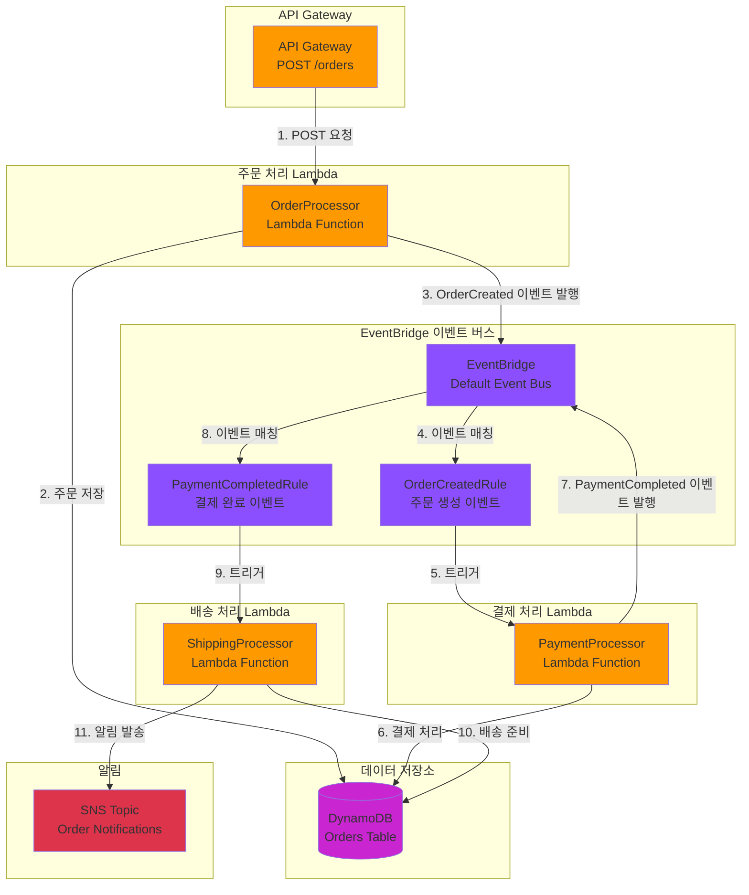

# Week 4-3: EventBridge 주문 처리 시스템 아키텍처

## 📊 전체 아키텍처 다이어그램



## 🔄 이벤트 기반 워크플로우

### 1단계: 주문 생성 (Order Creation)
```
사용자 → API Gateway → OrderProcessor Lambda
```

**처리 과정**:
1. 사용자가 API Gateway를 통해 주문 요청 전송
2. OrderProcessor Lambda가 주문 데이터 검증
3. DynamoDB에 주문 정보 저장 (상태: PENDING)
4. EventBridge에 `OrderCreated` 이벤트 발행

**이벤트 페이로드**:
```json
{
  "source": "order.service",
  "detail-type": "OrderCreated",
  "detail": {
    "orderId": "order-123",
    "userId": "user-456",
    "items": [...],
    "totalAmount": 50000,
    "status": "PENDING"
  }
}
```

### 2단계: 결제 처리 (Payment Processing)
```
EventBridge (OrderCreatedRule) → PaymentProcessor Lambda
```

**처리 과정**:
1. EventBridge가 `OrderCreated` 이벤트 감지
2. OrderCreatedRule이 이벤트 패턴 매칭
3. PaymentProcessor Lambda 자동 트리거
4. 결제 처리 로직 실행 (외부 결제 API 호출)
5. DynamoDB에 주문 상태 업데이트 (상태: PAID)
6. EventBridge에 `PaymentCompleted` 이벤트 발행

**이벤트 페이로드**:
```json
{
  "source": "payment.service",
  "detail-type": "PaymentCompleted",
  "detail": {
    "orderId": "order-123",
    "paymentId": "pay-789",
    "amount": 50000,
    "status": "PAID",
    "paymentMethod": "CARD"
  }
}
```

### 3단계: 배송 준비 (Shipping Preparation)
```
EventBridge (PaymentCompletedRule) → ShippingProcessor Lambda
```

**처리 과정**:
1. EventBridge가 `PaymentCompleted` 이벤트 감지
2. PaymentCompletedRule이 이벤트 패턴 매칭
3. ShippingProcessor Lambda 자동 트리거
4. 배송 정보 생성 및 처리
5. DynamoDB에 주문 상태 업데이트 (상태: SHIPPING)
6. SNS를 통해 고객에게 배송 시작 알림 발송

**알림 메시지**:
```
주문번호: order-123
배송 시작: 2024-02-07
예상 도착: 2024-02-09
배송 추적: tracking-xyz
```

## 🏗️ 주요 구성 요소

### 1. API Gateway
**역할**: RESTful API 엔드포인트 제공

**주요 기능**:
- POST /orders: 주문 생성 API
- 요청 검증 및 인증
- Lambda 프록시 통합
- CORS 설정

**보안**:
- API Key 인증
- IAM 권한 기반 접근 제어
- 요청 제한 (Throttling)

### 2. OrderProcessor Lambda
**역할**: 주문 생성 및 초기 처리

**주요 기능**:
- 주문 데이터 검증
- DynamoDB에 주문 저장
- OrderCreated 이벤트 발행
- 에러 처리 및 로깅

**환경 변수**:
- `ORDERS_TABLE`: DynamoDB 테이블 이름
- `EVENT_BUS_NAME`: EventBridge 이벤트 버스 이름

**IAM 권한**:
- DynamoDB PutItem
- EventBridge PutEvents
- CloudWatch Logs 쓰기

### 3. EventBridge Event Bus
**역할**: 이벤트 라우팅 및 전달

**주요 기능**:
- 이벤트 수신 및 저장
- 규칙 기반 이벤트 필터링
- 대상 서비스로 이벤트 전달
- 이벤트 재시도 및 DLQ 지원

**이벤트 규칙**:

**OrderCreatedRule**:
```json
{
  "source": ["order.service"],
  "detail-type": ["OrderCreated"]
}
```

**PaymentCompletedRule**:
```json
{
  "source": ["payment.service"],
  "detail-type": ["PaymentCompleted"]
}
```

### 4. PaymentProcessor Lambda
**역할**: 결제 처리 및 검증

**주요 기능**:
- 외부 결제 API 연동
- 결제 상태 검증
- 주문 상태 업데이트
- PaymentCompleted 이벤트 발행

**환경 변수**:
- `ORDERS_TABLE`: DynamoDB 테이블 이름
- `PAYMENT_API_URL`: 외부 결제 API URL
- `EVENT_BUS_NAME`: EventBridge 이벤트 버스 이름

**IAM 권한**:
- DynamoDB UpdateItem
- EventBridge PutEvents
- Secrets Manager GetSecretValue (결제 API 키)

### 5. ShippingProcessor Lambda
**역할**: 배송 준비 및 알림

**주요 기능**:
- 배송 정보 생성
- 주문 상태 업데이트
- SNS 알림 발송
- 배송 추적 번호 생성

**환경 변수**:
- `ORDERS_TABLE`: DynamoDB 테이블 이름
- `SNS_TOPIC_ARN`: SNS 토픽 ARN

**IAM 권한**:
- DynamoDB UpdateItem
- SNS Publish
- CloudWatch Logs 쓰기

### 6. DynamoDB Orders Table
**역할**: 주문 데이터 영구 저장

**테이블 구조**:
```
Partition Key: orderId (String)
Sort Key: timestamp (Number)

Attributes:
- userId: String
- items: List
- totalAmount: Number
- status: String (PENDING, PAID, SHIPPING, DELIVERED)
- paymentId: String
- shippingInfo: Map
- createdAt: String
- updatedAt: String
```

**인덱스**:
- GSI: userId-timestamp-index (사용자별 주문 조회)
- GSI: status-timestamp-index (상태별 주문 조회)

### 7. SNS Topic
**역할**: 고객 알림 발송

**주요 기능**:
- 이메일 알림
- SMS 알림
- 모바일 푸시 알림
- 구독자 관리

## 🎯 이벤트 기반 아키텍처의 장점

### 1. 느슨한 결합 (Loose Coupling)
- 각 Lambda 함수는 독립적으로 동작
- 서비스 간 직접 의존성 없음
- 새로운 서비스 추가 용이

**예시**:
```
기존: OrderLambda → PaymentLambda → ShippingLambda (강한 결합)
개선: OrderLambda → EventBridge → PaymentLambda (느슨한 결합)
```

### 2. 확장성 (Scalability)
- 각 Lambda 함수가 독립적으로 스케일링
- 이벤트 버스가 트래픽 급증 처리
- 병렬 처리 가능

**시나리오**:
```
주문 폭주 시:
- OrderLambda: 100개 동시 실행
- PaymentLambda: 50개 동시 실행
- ShippingLambda: 30개 동시 실행
```

### 3. 유연성 (Flexibility)
- 새로운 이벤트 리스너 추가 용이
- 기존 코드 수정 없이 기능 확장
- A/B 테스트 및 점진적 배포

**확장 예시**:
```
새로운 기능 추가:
- InventoryProcessor: 재고 관리
- AnalyticsProcessor: 주문 분석
- FraudDetector: 사기 탐지
→ EventBridge 규칙만 추가하면 됨
```

### 4. 복원력 (Resilience)
- 한 서비스 장애가 전체 시스템에 영향 없음
- 자동 재시도 메커니즘
- Dead Letter Queue로 실패 이벤트 처리

**장애 시나리오**:
```
PaymentLambda 장애 시:
- OrderLambda는 정상 동작
- 이벤트는 EventBridge에 저장
- PaymentLambda 복구 후 자동 재처리
```

## 📋 이벤트 패턴 예시

### OrderCreated 이벤트 패턴
```json
{
  "source": ["order.service"],
  "detail-type": ["OrderCreated"],
  "detail": {
    "status": ["PENDING"]
  }
}
```

### PaymentCompleted 이벤트 패턴
```json
{
  "source": ["payment.service"],
  "detail-type": ["PaymentCompleted"],
  "detail": {
    "status": ["PAID"],
    "amount": [{"numeric": [">", 0]}]
  }
}
```

### 조건부 이벤트 패턴 (고액 주문)
```json
{
  "source": ["order.service"],
  "detail-type": ["OrderCreated"],
  "detail": {
    "totalAmount": [{"numeric": [">=", 100000]}]
  }
}
```

## 🔐 보안 및 권한

### Lambda 실행 역할 (IAM Role)

**OrderProcessor 역할**:
```json
{
  "Version": "2012-10-17",
  "Statement": [
    {
      "Effect": "Allow",
      "Action": [
        "dynamodb:PutItem"
      ],
      "Resource": "arn:aws:dynamodb:*:*:table/Orders"
    },
    {
      "Effect": "Allow",
      "Action": [
        "events:PutEvents"
      ],
      "Resource": "arn:aws:events:*:*:event-bus/default"
    }
  ]
}
```

**PaymentProcessor 역할**:
```json
{
  "Version": "2012-10-17",
  "Statement": [
    {
      "Effect": "Allow",
      "Action": [
        "dynamodb:UpdateItem"
      ],
      "Resource": "arn:aws:dynamodb:*:*:table/Orders"
    },
    {
      "Effect": "Allow",
      "Action": [
        "events:PutEvents"
      ],
      "Resource": "arn:aws:events:*:*:event-bus/default"
    },
    {
      "Effect": "Allow",
      "Action": [
        "secretsmanager:GetSecretValue"
      ],
      "Resource": "arn:aws:secretsmanager:*:*:secret:payment-api-key-*"
    }
  ]
}
```

**ShippingProcessor 역할**:
```json
{
  "Version": "2012-10-17",
  "Statement": [
    {
      "Effect": "Allow",
      "Action": [
        "dynamodb:UpdateItem"
      ],
      "Resource": "arn:aws:dynamodb:*:*:table/Orders"
    },
    {
      "Effect": "Allow",
      "Action": [
        "sns:Publish"
      ],
      "Resource": "arn:aws:sns:*:*:OrderNotifications"
    }
  ]
}
```

### EventBridge 규칙 권한
```json
{
  "Version": "2012-10-17",
  "Statement": [
    {
      "Effect": "Allow",
      "Action": [
        "lambda:InvokeFunction"
      ],
      "Resource": [
        "arn:aws:lambda:*:*:function:PaymentProcessor",
        "arn:aws:lambda:*:*:function:ShippingProcessor"
      ]
    }
  ]
}
```

## 💡 사용 사례

### 1. 전자상거래 주문 처리
- 주문 생성 → 결제 → 배송 → 완료
- 각 단계별 독립적인 처리
- 실시간 상태 업데이트

### 2. 예약 시스템
- 예약 생성 → 확인 → 알림 → 리마인더
- 시간 기반 이벤트 처리
- 취소 및 변경 처리

### 3. 워크플로우 자동화
- 문서 업로드 → 검증 → 승인 → 아카이빙
- 다단계 승인 프로세스
- 조건부 분기 처리

### 4. IoT 데이터 처리
- 센서 데이터 수집 → 분석 → 알림 → 저장
- 실시간 이벤트 스트리밍
- 이상 탐지 및 대응

## 🎯 모범 사례

### 1. 이벤트 설계
- **명확한 이벤트 이름**: `OrderCreated`, `PaymentCompleted`
- **일관된 구조**: source, detail-type, detail
- **버전 관리**: 이벤트 스키마 버전 명시
- **최소 페이로드**: 필요한 정보만 포함

### 2. 에러 처리
- **재시도 정책**: 최대 3회 재시도, 지수 백오프
- **Dead Letter Queue**: 실패 이벤트 저장
- **알림**: 실패 시 SNS 알림 발송
- **로깅**: CloudWatch Logs에 상세 로그 기록

### 3. 모니터링
- **CloudWatch 메트릭**: 이벤트 수, 실패율, 지연 시간
- **X-Ray 추적**: 이벤트 흐름 시각화
- **알람**: 임계값 초과 시 알림
- **대시보드**: 실시간 모니터링 대시보드

### 4. 테스트
- **단위 테스트**: 각 Lambda 함수 독립 테스트
- **통합 테스트**: 이벤트 흐름 전체 테스트
- **부하 테스트**: 대량 이벤트 처리 테스트
- **카오스 엔지니어링**: 장애 시나리오 테스트

## 📊 모니터링 및 로깅

### CloudWatch 메트릭

**EventBridge 메트릭**:
- `Invocations`: 규칙 호출 횟수
- `FailedInvocations`: 실패한 호출 횟수
- `TriggeredRules`: 트리거된 규칙 수
- `ThrottledRules`: 제한된 규칙 수

**Lambda 메트릭**:
- `Invocations`: 함수 호출 횟수
- `Errors`: 오류 발생 횟수
- `Duration`: 실행 시간
- `ConcurrentExecutions`: 동시 실행 수

### CloudWatch Logs Insights 쿼리

**주문 처리 시간 분석**:
```
fields @timestamp, orderId, @duration
| filter @message like /OrderCreated/
| stats avg(@duration) as avg_duration by bin(5m)
```

**실패한 결제 조회**:
```
fields @timestamp, orderId, errorMessage
| filter @message like /PaymentFailed/
| sort @timestamp desc
| limit 20
```

### X-Ray 추적
- 이벤트 흐름 시각화
- 병목 구간 식별
- 서비스 맵 생성
- 성능 분석

## 🔧 문제 해결

### 일반적인 문제

#### 1. 이벤트가 전달되지 않음
**원인**:
- EventBridge 규칙 비활성화
- 이벤트 패턴 불일치
- Lambda 권한 부족

**해결**:
```bash
# 규칙 상태 확인
aws events describe-rule --name OrderCreatedRule

# 이벤트 패턴 테스트
aws events test-event-pattern \
  --event-pattern file://pattern.json \
  --event file://event.json

# Lambda 권한 확인
aws lambda get-policy --function-name PaymentProcessor
```

#### 2. Lambda 함수 실패
**원인**:
- 타임아웃
- 메모리 부족
- 외부 API 오류

**해결**:
```bash
# CloudWatch Logs 확인
aws logs tail /aws/lambda/PaymentProcessor --follow

# 메트릭 확인
aws cloudwatch get-metric-statistics \
  --namespace AWS/Lambda \
  --metric-name Errors \
  --dimensions Name=FunctionName,Value=PaymentProcessor \
  --start-time 2024-02-07T00:00:00Z \
  --end-time 2024-02-07T23:59:59Z \
  --period 3600 \
  --statistics Sum
```

#### 3. DynamoDB 쓰기 제한
**원인**:
- 프로비저닝된 용량 초과
- 핫 파티션

**해결**:
- Auto Scaling 활성화
- On-Demand 모드로 전환
- 파티션 키 재설계

## 💰 비용 최적화

### 1. Lambda 최적화
- **메모리 크기 조정**: 필요한 최소 메모리 사용
- **실행 시간 단축**: 코드 최적화
- **예약된 동시성**: 불필요한 예약 제거

**예상 비용** (월 100만 요청 기준):
```
Lambda 비용:
- 요청: 100만 × $0.0000002 = $0.20
- 실행 시간: 100만 × 200ms × 128MB = $0.42
- 총: $0.62/월
```

### 2. EventBridge 최적화
- **이벤트 필터링**: 불필요한 이벤트 제거
- **배치 처리**: 여러 이벤트 묶어서 처리

**예상 비용** (월 100만 이벤트 기준):
```
EventBridge 비용:
- 이벤트: 100만 × $0.000001 = $1.00/월
```

### 3. DynamoDB 최적화
- **On-Demand 모드**: 예측 불가능한 워크로드
- **TTL 활성화**: 오래된 데이터 자동 삭제
- **압축**: 큰 항목 압축 저장

**예상 비용** (월 100만 요청 기준):
```
DynamoDB 비용 (On-Demand):
- 쓰기: 100만 × $0.00000125 = $1.25
- 읽기: 100만 × $0.00000025 = $0.25
- 저장: 1GB × $0.25 = $0.25
- 총: $1.75/월
```

### 총 예상 비용
```
Lambda: $0.62
EventBridge: $1.00
DynamoDB: $1.75
SNS: $0.50
API Gateway: $3.50
-----------------------
총: $7.37/월 (100만 요청 기준)
```

## 🚀 프로덕션 개선 사항

### 1. 고급 에러 처리
```typescript
// Lambda 함수에 재시도 로직 추가
const retryWithBackoff = async (fn: Function, maxRetries = 3) => {
  for (let i = 0; i < maxRetries; i++) {
    try {
      return await fn();
    } catch (error) {
      if (i === maxRetries - 1) throw error;
      await new Promise(resolve => setTimeout(resolve, Math.pow(2, i) * 1000));
    }
  }
};
```

### 2. 이벤트 검증
```typescript
// 이벤트 스키마 검증
import Ajv from 'ajv';

const ajv = new Ajv();
const schema = {
  type: 'object',
  properties: {
    orderId: { type: 'string' },
    userId: { type: 'string' },
    totalAmount: { type: 'number', minimum: 0 }
  },
  required: ['orderId', 'userId', 'totalAmount']
};

const validate = ajv.compile(schema);
if (!validate(event.detail)) {
  throw new Error('Invalid event schema');
}
```

### 3. 멱등성 보장
```typescript
// DynamoDB Conditional Write로 중복 처리 방지
await dynamodb.putItem({
  TableName: 'Orders',
  Item: order,
  ConditionExpression: 'attribute_not_exists(orderId)'
});
```

### 4. 분산 추적
```typescript
// X-Ray 세그먼트 추가
import AWSXRay from 'aws-xray-sdk-core';

const segment = AWSXRay.getSegment();
const subsegment = segment.addNewSubsegment('PaymentProcessing');
try {
  // 결제 처리 로직
  subsegment.close();
} catch (error) {
  subsegment.addError(error);
  subsegment.close();
  throw error;
}
```

### 5. 서킷 브레이커 패턴
```typescript
// 외부 API 호출 시 서킷 브레이커 적용
import CircuitBreaker from 'opossum';

const breaker = new CircuitBreaker(callPaymentAPI, {
  timeout: 3000,
  errorThresholdPercentage: 50,
  resetTimeout: 30000
});

breaker.fallback(() => ({ status: 'PENDING', message: 'Payment service unavailable' }));
```

## 📚 참고 자료

- [Amazon EventBridge 개발자 가이드](https://docs.aws.amazon.com/eventbridge/)
- [AWS Lambda 모범 사례](https://docs.aws.amazon.com/lambda/latest/dg/best-practices.html)
- [이벤트 기반 아키텍처 패턴](https://aws.amazon.com/event-driven-architecture/)
- [DynamoDB 설계 모범 사례](https://docs.aws.amazon.com/amazondynamodb/latest/developerguide/best-practices.html)

---

**마지막 업데이트**: 2025-02-07  
**실습 가이드**: `public/content/week4/4-3-serverless-api.md`
