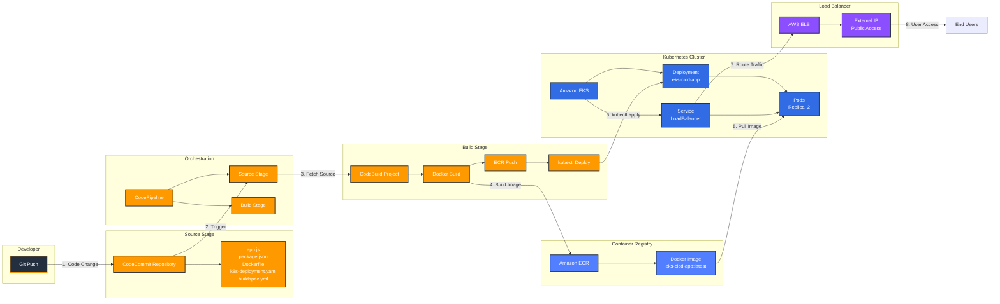

# Week 9-3: CodePipeline EKS 배포 자동화 아키텍처

## 전체 CI/CD 파이프라인 아키텍처



## 상세 워크플로우

### 1단계: 소스 코드 변경 (Developer → CodeCommit)
- 개발자가 코드를 수정하고 Git Push
- CodeCommit 리포지토리에 변경사항 저장
- CloudWatch Events가 변경 감지

### 2단계: 파이프라인 트리거 (CodeCommit → CodePipeline)
- CodePipeline이 자동으로 실행 시작
- Source Stage에서 최신 코드 가져오기
- Build Stage로 아티팩트 전달

### 3단계: Docker 이미지 빌드 (CodeBuild)
- buildspec.yml 실행
- Dockerfile을 사용하여 Docker 이미지 빌드
- 이미지 태그: `{account-id}.dkr.ecr.{region}.amazonaws.com/eks-cicd-app:latest`

### 4단계: ECR에 이미지 푸시 (CodeBuild → ECR)
- Docker 이미지를 Amazon ECR에 푸시
- ECR 리포지토리에 최신 이미지 저장
- 이미지 스캔 및 버전 관리

### 5단계: EKS 배포 (CodeBuild → EKS)
- kubectl 명령으로 Kubernetes 매니페스트 적용
- k8s-deployment.yaml의 이미지 URI 업데이트
- Rolling Update 방식으로 Pod 업데이트

### 6단계: 서비스 노출 (EKS → ELB)
- LoadBalancer Service가 AWS ELB 자동 생성
- ELB가 워커 노드의 NodePort로 트래픽 전달
- 외부 접근 가능한 Public IP 할당

### 7단계: 사용자 접근 (End Users → ELB → Pods)
- 사용자가 ELB의 External IP로 접근
- ELB가 트래픽을 Pod로 분산
- 애플리케이션 응답 반환

## 주요 컴포넌트 설명

### CodeCommit Repository
- **역할**: 소스 코드 버전 관리
- **포함 파일**: 
  - app.js (Node.js 애플리케이션)
  - Dockerfile (이미지 빌드 설정)
  - k8s-deployment.yaml (Kubernetes 매니페스트)
  - buildspec.yml (빌드 및 배포 스크립트)

### CodePipeline
- **역할**: CI/CD 워크플로우 오케스트레이션
- **단계**: 
  - Source Stage (CodeCommit)
  - Build Stage (CodeBuild)
- **트리거**: CloudWatch Events (코드 변경 감지)

### CodeBuild
- **역할**: Docker 이미지 빌드 및 EKS 배포
- **환경**: Amazon Linux 2, Docker 지원
- **권한**: ECR 푸시, EKS 접근, kubectl 실행

### Amazon ECR
- **역할**: Docker 이미지 저장소
- **기능**: 
  - 이미지 버전 관리
  - 이미지 스캔 (보안 취약점 검사)
  - 라이프사이클 정책

### Amazon EKS
- **역할**: Kubernetes 컨트롤 플레인 관리
- **구성**:
  - Deployment: 애플리케이션 Pod 관리
  - Service: LoadBalancer 타입으로 외부 노출
  - Pods: 2개 레플리카로 고가용성 보장

### AWS ELB (Elastic Load Balancer)
- **역할**: 트래픽 분산 및 외부 접근 제공
- **타입**: Classic Load Balancer (자동 생성)
- **기능**: 
  - 헬스 체크
  - 트래픽 분산
  - 고가용성

## 보안 및 권한

### IAM 역할
1. **CodeBuild 역할**:
   - ECR 이미지 푸시 권한
   - EKS 클러스터 접근 권한
   - kubectl 명령 실행 권한

2. **CodePipeline 역할**:
   - CodeCommit 읽기 권한
   - CodeBuild 프로젝트 시작 권한
   - S3 아티팩트 저장 권한

3. **EKS 노드 역할**:
   - ECR 이미지 풀 권한
   - ELB 생성 권한
   - CloudWatch 로그 전송 권한

### 네트워크 보안
- VPC: 격리된 네트워크 환경
- 보안 그룹: 최소 권한 원칙
- 프라이빗 서브넷: 워커 노드 배치
- 퍼블릭 서브넷: ELB 배치

## 배포 전략

### Rolling Update (기본값)
- 새로운 Pod를 점진적으로 생성
- 이전 Pod를 순차적으로 종료
- 무중단 배포 보장
- maxSurge: 25% (최대 추가 Pod 비율)
- maxUnavailable: 25% (최대 사용 불가 Pod 비율)

### 배포 프로세스
1. 새 이미지로 Pod 생성 시작
2. 새 Pod가 Ready 상태가 되면
3. 이전 Pod 하나씩 종료
4. 모든 Pod가 새 버전으로 교체될 때까지 반복

## 모니터링 및 로깅

### CloudWatch Logs
- CodeBuild 빌드 로그
- EKS 컨트롤 플레인 로그
- 애플리케이션 로그

### kubectl 명령어
```bash
# Pod 상태 확인
kubectl get pods

# 배포 상태 확인
kubectl rollout status deployment/eks-cicd-app

# 로그 확인
kubectl logs -f <pod-name>

# Service 확인
kubectl get service eks-cicd-service
```

## 문제 해결

### 일반적인 문제
1. **빌드 실패**: CodeBuild 로그 확인
2. **이미지 푸시 실패**: ECR 권한 확인
3. **배포 실패**: kubectl 권한 및 매니페스트 확인
4. **LoadBalancer Pending**: 보안 그룹 및 서브넷 태그 확인

### 디버깅 명령어
```bash
# 파이프라인 상태 확인
aws codepipeline get-pipeline-state --name week9-3-eks-pipeline

# 빌드 로그 확인
aws codebuild batch-get-builds --ids <build-id>

# EKS 클러스터 상태 확인
aws eks describe-cluster --name <cluster-name>

# Pod 이벤트 확인
kubectl describe pod <pod-name>
```

## 비용 최적화

### 주요 비용 요소
- EKS 클러스터: $0.10/시간
- EC2 워커 노드: t3.medium 2개
- NAT Gateway: $0.045/시간
- ELB: $0.025/시간 + 데이터 전송

### 절약 방법
- 실습 종료 후 즉시 리소스 삭제
- Spot 인스턴스 활용 (프로덕션 제외)
- 적절한 노드 타입 선택
- 클러스터 오토스케일링 설정
